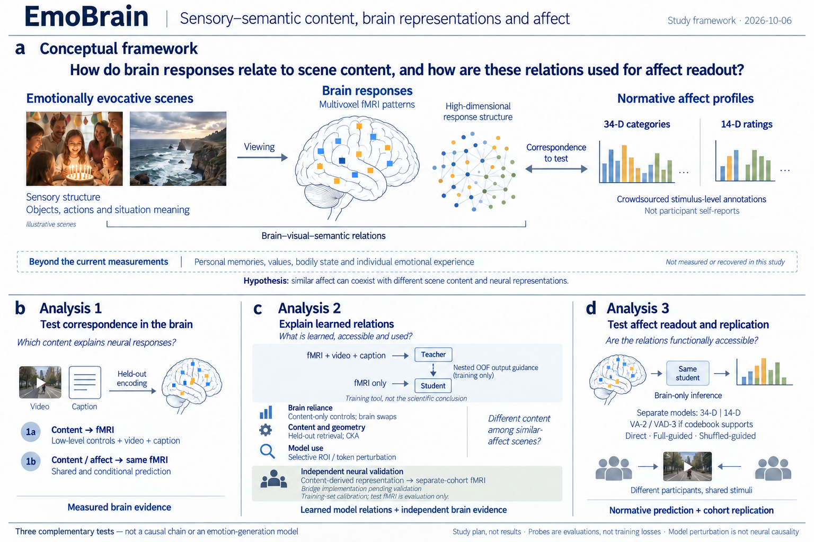

# EmoBrain

_Brain–content relations and normative affect readout · current design imported 2026-10-06_

---

<a id="english"></a>

## 📚 English

[한국어 버전으로 이동](#korean)

### Start here

The single maintained study specification is [docs/current/00_README.md](docs/current/00_README.md).
It supersedes the former H1–H4 argument and earlier server handoff copies as the working design.
Approved principles, proposals and unresolved decisions remain distinct; importing documents does not freeze a protocol.

For contributors and AI agents, read [AGENTS.md](AGENTS.md), then the current specification.
[Implementation status](docs/current/08_IMPLEMENTATION_STATUS.md) records the gap between that design and this repository's code.

### Research question

How are neural responses to emotionally evocative scenes related to their sensory–semantic content,
and how are these brain–content relations learned and used for high-dimensional normative affect readout?

This is a neuroscience study of learned content and model use, not an emotion-decoding leaderboard.
Normative affect annotations are not the scanned participants' self-reports.

### Study overview



_Study plan, not results. Top: the conceptual question connecting scene content, brain-response structure and external normative affect profiles. Bottom: three complementary tests, with teacher–student learning as a supporting tool. All brain illustrations, scene pictures, graphs and bars are illustrative—not measured effects, actual study stimuli or verified affect matches._

Personal memories, values, bodily state and individual experience motivate the broader question but are not directly measured or recovered here; the dashed band marks that boundary. The correspondence arrow is a relation to test, not an established mechanism of emotion generation.

The figure distinguishes correspondence in measured fMRI from information recoverable in a model and information the model uses. The 2d content-side bridge is a proposed implementation pending feasibility validation, with separate training-set calibration; held-out validation fMRI is an evaluation target, never an input to that prediction path. CKA summarizes geometry similarity, not information use. VA/VAD runs require codebook verification. [Full-size image](docs/assets/study_overview.png) · [Figure source, scope and generation prompt](docs/assets/study_overview.md).

| Analysis | Question |
| --- | --- |
| 1a / 1b | Do content and affect annotations explain held-out brain responses, and where do their predictions overlap? |
| 2a–c / 2d | What brain–content relations are learned and used, and are content-related representations supported by independent brain measurements? |
| 3 | Can independent affect targets be read out, and do the effects replicate across participant cohorts? |

Teacher training uses brain + video + descriptive captions. The student receives brain only during training and inference, with nested out-of-fold teacher **output guidance** during training.
Content probes, CKA and selective perturbations are evaluations, not student content-reconstruction losses.
See the [story](docs/current/01_STORY_AND_DESIGN.md) for rationale and interpretation limits.

### Implementation state

The October design is **not yet implemented end to end** in the inherited code.
The existing label-query decoder, log1p-z/MSE training and single-teacher cache are earlier implementations,
not a runnable reference for the current protocol. No full training command is endorsed by this documentation update.

First reconcile the server's actual code and data with the [implementation specification](docs/current/02_IMPLEMENTATION_SPEC.md).
Use the [server prompt](docs/current/SERVER_PROMPT.md) and [action items](docs/current/03_ACTION_ITEMS.md).
Training, preprocessing changes, test-set selection and publication of results are separate actions.

### Repository layout

```text
docs/current/    maintained study design, decisions, actions and implementation status
docs/archive/    superseded research plans and historical review records
docs/reference/ literature and dataset evidence; not an alternative protocol
docs/assets/    maintained overview image and its editable logic / generation prompt
project/        existing code and outputs; migration status is explicit
tools/          existing repository utilities
archive/        pre-existing historical results and literature corpus
external/       pre-existing external references
```

Keep current filenames stable and use Git history instead of new dated copies, ZIPs or all-in-one duplicates.
Do not reorganize raw data, results or external repositories as part of documentation maintenance.
Earlier top-level entry points are retained only as short navigation files.

### Branch workflow

The active working branch is `docs/unify-study-design-20261006`, based on main commit
`a5285044ce417945685e0eb044ac77f68d487af0`.
This branch does not make old results evidence for the new design.
Continue documentation, code and experiment-related work on this branch. Keep main unchanged until experiments have been run, major design decisions and results have been reviewed, and the user explicitly approves a merge. Do not overwrite server work or run jobs merely on checkout.

---

<a id="korean"></a>

## 📚 한국어

[Back to English](#english)

_뇌–내용 관계와 규준 정서 프로필 예측 · 최신 설계 반영일: 2026-10-06_

### 시작하기

현재 연구 설계의 단일 관리 기준은 [docs/current/00_README.md](docs/current/00_README.md)다.
이 문서군이 이전 H1–H4 논증과 과거 서버 전달본을 대체한다.
승인된 원칙, 제안, 미확정 결정은 구분한다. 문서를 옮겼다는 사실만으로 연구 프로토콜이 동결되는 것은 아니다.

기여자와 AI 에이전트는 [AGENTS.md](AGENTS.md)를 먼저 읽고 최신 설계를 확인한다.
[구현 상태](docs/current/08_IMPLEMENTATION_STATUS.md)에는 최신 설계와 현재 저장소 코드 사이의 차이가 기록되어 있다.

### 연구 질문

정서를 유발하는 장면에 대한 뇌 반응은 그 장면의 감각–의미적 내용과 어떻게 관련되는가?
모델은 이러한 뇌–내용 관계를 무엇으로 학습하고, 고차원 규준 정서 프로필을 예측할 때 어떻게 사용하는가?

이 연구는 감정 decoding 성능 순위를 높이는 것이 아니라, 모델이 학습한 내용과 실제 정보 사용을 검정하는 신경과학 연구다.
규준 정서 주석은 fMRI 촬영 참가자의 자기보고가 아니다.

### 연구 개요 그림


_실험 결과가 아닌 연구 계획이다. 상단은 장면 내용·뇌 반응 구조·외부 규준 정서 프로필을 연결하는 개념적 질문이고, 하단은 이를 검정하는 세 분석이다. Teacher–student 학습은 보조 도구로 배치했다. 뇌 그림·장면·그래프·막대는 설명용이며 실제 측정 효과·연구 자극·검증된 정서 유사성 사례가 아니다._

개인 기억·가치·신체 상태·개인 경험은 더 넓은 질문의 배경이지만 현재 직접 측정하거나 복원하지 않는다. 점선 영역이 이 범위를 구분한다. 대응 화살표는 검정할 관계이며 확립된 감정 생성 기전이 아니다.

그림은 실제 fMRI와의 대응, 모델에서 읽을 수 있는 정보, 모델이 사용하는 정보를 구분한다. 2d의 content-side bridge는 실행 가능성 검증 전인 구현 제안이며 training 자극을 이용한 별도 calibration이 필요하다. Held-out 검증 뇌는 평가 대상일 뿐 이 예측 경로의 입력이 아니다. CKA는 표상 구조의 유사성을 요약하며 정보 사용을 입증하지 않는다. VA/VAD 실행은 codebook 확인이 필요하다. [원본 크기 이미지](docs/assets/study_overview.png) · [도식 원본·해석 범위·생성 프롬프트](docs/assets/study_overview.md).

| 분석 | 질문 |
| --- | --- |
| 1a / 1b | 자극 내용과 정서 주석이 학습에서 제외한 자극의 뇌 반응을 설명하는가? 두 예측은 어디에서 중첩되는가? |
| 2a–c / 2d | 어떤 뇌–내용 관계를 학습하고 사용하는가? 내용 관련 표상이 독립적인 뇌 측정에서도 지지되는가? |
| 3 | 정서 target을 각각 독립적으로 예측할 수 있는가? 효과가 서로 다른 참가자 집단에서 재현되는가? |

Teacher는 학습 시 뇌 + 영상 + 서술형 caption을 사용한다. Student는 학습과 추론 모두 뇌만 입력받으며, 학습 중에는 중첩 OOF(out-of-fold) teacher의 **출력 지도**를 받는다.
내용 probe, CKA, 선택적 교란은 평가용 분석이지 student의 내용 복원 학습 loss가 아니다.
설계 근거와 해석의 한계는 [연구 스토리](docs/current/01_STORY_AND_DESIGN.md)에 설명되어 있다.

### 구현 상태

기존 코드에는 10월 설계가 **아직 전체 과정에 걸쳐 구현되어 있지 않다**.
현재의 label-query decoder, log1p-z/MSE 학습, 단일 teacher cache는 이전 구현이며 최신 프로토콜의 실행 가능한 기준 구현이 아니다.
이번 문서 갱신은 전체 학습 명령의 실행을 승인하지 않는다.

먼저 서버의 실제 코드와 데이터를 [구현 사양](docs/current/02_IMPLEMENTATION_SPEC.md)과 대조한다.
[서버 AI 전달문](docs/current/SERVER_PROMPT.md)과 [상세 작업 목록](docs/current/03_ACTION_ITEMS.md)을 참고한다.
학습 실행, 전처리 변경, test set을 이용한 선택, 결과 공개는 문서 정리와 별개의 작업이다.

### 저장소 구성

```text
docs/current/    현재 연구 설계, 결정 기록, 작업 목록, 구현 상태
docs/archive/    대체된 연구 계획과 과거 검토 기록
docs/reference/ 문헌·데이터셋 근거 자료; 별도의 연구 프로토콜이 아님
docs/assets/    현재 Overview 이미지와 수정 가능한 논리 / 생성 프롬프트
project/        기존 코드와 산출물; 최신 설계로의 전환 상태를 명시
tools/          기존 저장소 유틸리티
archive/        기존 과거 결과와 문헌 모음
external/       기존 외부 참고 자료
```

현재 문서의 파일명은 유지하고, 날짜별 사본·ZIP·통합본을 새로 만드는 대신 Git 이력으로 변경을 관리한다.
문서 정리 과정에서 원자료, 결과, 외부 저장소를 재배치하지 않는다.
이전 최상위 진입 문서는 짧은 안내 파일로만 유지한다.

### 브랜치 작업 원칙

현재 작업 브랜치는 `docs/unify-study-design-20261006`이며, main의
`a5285044ce417945685e0eb044ac77f68d487af0` 커밋에서 시작했다.
이 브랜치를 만들었다는 이유로 과거 결과가 최신 설계의 근거가 되는 것은 아니다.
문서·코드·실험 관련 변경은 이 브랜치에서 계속한다. 실험 실행과 주요 설계·결과 검토가 끝나고 사용자가 명시적으로 병합을 승인하기 전까지 main은 변경하지 않는다.
서버의 기존 작업을 덮어쓰거나, 브랜치를 받았다는 이유만으로 작업을 실행하지 않는다.
