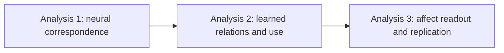
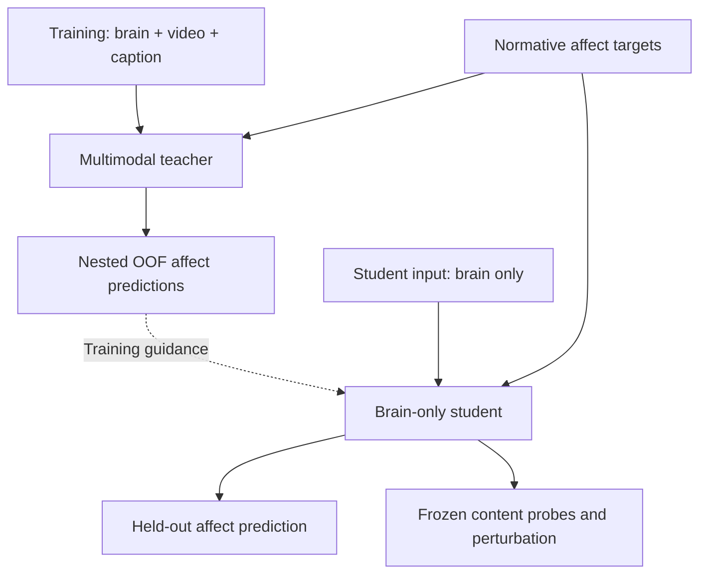

# EmoBrain 서버 AI 전달 통합본

_2026-10-04 · 연구 스토리, 결정 기록, 구현 명세, 전체 작업 목록, 참고문헌, 시작 지시문 · 결과 보고서 아님_

---

이 파일 하나로 전체 패키지를 읽을 수 있다. 아래 내용은 분리 문서의 기계적 통합본이며, 미확정 사항을 승인한 문서가 아니다. 실제 서버 상태와 결과는 감사 후 별도로 보고한다.

- [사용 안내](#readme)
- [연구 스토리와 설계](#story)
- [결정과 정정 기록](#decisions)
- [구현과 분석 명세](#implementation)
- [상세 실행 목록](#actions)
- [참고문헌과 원천 기록](#references)
- [프로젝트 작업 원칙](#instructions)
- [서버 AI 시작 지시문](#server_prompt)

<a id="readme"></a>

## 📚 1. 사용 안내

_2026-10-04 · 연구 스토리부터 구현·분석·논문 완성까지의 전달 패키지 · 결과 보고서가 아닌 실행 계획_

---

### 먼저 알아야 할 것

이 연구는 **감정 예측 성능 경쟁이 아니라, 뇌–장면 내용 관계를 모델이 무엇으로 학습하고 실제 예측에 어떻게 사용하는지 검정하는 연구**다. Teacher는 학습 시 brain + video + caption을 받고, student는 학습·추론 시 fMRI만 입력받는다. Teacher의 출력으로 student를 안내하지만, 그 사실만으로 teacher의 joint representation이 student에 전달되었다고 간주하지 않는다.

세 분석은 다음 질문으로 이어진다.

1. 장면의 시각·의미 표상이 새로운 자극의 뇌 반응을 설명하는가?
2. Teacher와 brain-only student가 어떤 brain–content 관계를 학습하고 사용하는가?
3. 그 표현에서 normative affect profile을 읽을 수 있으며, 다른 참가자 cohort에서도 재현되는가?

실제 서버 코드, 데이터, 학습 로그, 완료된 결과는 이번 전달본 작성 과정에서 확인하지 않았다. 기존 체크리스트의 미체크 상태를 ‘미실행’의 증거로 취급하지 말고, 먼저 서버 현황을 조사한다.

### 읽는 순서

| 순서 | 문서 | 역할 |
|---|---|---|
| 1 | [연구 스토리와 설계](#story) | 무엇을 왜 하는가 |
| 2 | [결정·정정 기록](#decisions) | 확정·제안·미확정 구분 |
| 3 | [구현 명세](#implementation) | 데이터·분할·모델·loss·평가 |
| 4 | [상세 실행 목록](#actions) | 순서·산출물·완료 기준 |
| 5 | [참고문헌과 근거](#references) | 선택의 근거와 한계 |
| 시작 지시 | [서버 AI에 전달할 프롬프트](#server_prompt) | 첫 작업 범위 |

한 파일로 전달하려면 `EmoBrain_Server_Handoff_ALL.md`를 사용한다. 이는 위 문서와 프로젝트 지침을 순서대로 합친 파일이다. 분리본과 내용이 같으며, 분리본이 편집 원본이다.

### 상태와 문서 우선순위

- **유지:** 대화에서 명시한 연구 방향 또는 기존 설계의 핵심 원칙.
- **권고:** 이번 정리에서 제안한 운영 방법. 연구책임자의 승인 또는 사전 정의된 개발 절차가 필요하다.
- **미확정:** 데이터 확인·통계 검토·사용자 선택이 있어야 정할 수 있다.
- **확인:** 원문 또는 로컬 문서에서 확인한 범위. 서버 데이터까지 확인했다는 뜻은 아니다.

현재 사용자의 명시적 결정 → 승인된 freeze manifest → 본 패키지의 확정 원칙 → 기존 문서 순으로 해석한다. 본 패키지에서 ‘권고/미확정’인 내용은 자동 승인된 것으로 바꾸지 않는다. 기존 문서와 충돌하는 누출 방지 및 잘못된 해석은 [결정 기록](#decisions)에 적힌 안전 규칙을 우선한다. 기존 preregistration이 실제 등록되어 있다면 소급 변경하지 말고 amendment와 exploratory 표시를 남긴다.

정리의 원본은 프로젝트 폴더의 `paper_v15.md`, `prereg_v2.md`, `implementation_v2.md`, `action_items_v1.md`, `AGENTS.md`다. 이 파일들은 삭제하거나 덮어쓰지 않았다. 이번 패키지를 만든 날짜를 연구 설계가 이미 동결된 날짜로 취급하지 않는다.

### 서버의 첫 작업

먼저 기존 구현과 결과의 상태를 확인하고, 데이터·분할·OOF 누출 검사를 준비한다. 이어서 개발 데이터 안에서만 작은 brain-only baseline과 encoding pilot을 실행할 수 있는지 판단한다. 미확정 통계·split·replication 규칙을 임의로 확정한 대규모 본실험은 시작하지 않는다.

첫 반환물은 `server_status.md`, `data_audit.md`, `split_audit.md`, `decision_queue.md`, `next_actions.md`다. 각 주장에 실제 경로, 로그, 설정 또는 검사 결과를 붙인다. 보고서 제목만 만들고 내용을 추측해서 채우지 않는다.

### 전달 시 주의

이 패키지에는 원본 fMRI·동영상·caption, 실행 결과, 모델 weight가 포함되어 있지 않다. 서버 AI는 서버의 실제 경로를 찾아 별도 manifest로 기록해야 한다. 로컬 Mac 경로를 서버 경로로 그대로 사용하지 않는다. 이전 이미지 도안도 이번 패키지에서 변경하지 않았으며, 이미지 속 수식이나 gate가 최신 결정 기록보다 우선하지 않는다.

<a id="story"></a>

## 📚 2. 연구 스토리와 설계

_서버 AI가 연구 의도와 해석 경계를 이해하기 위한 설계 문서 · 2026-10-04 · 분석 결과 없음_

---

### 1. Thesis와 central question

#### 논문의 중심 명제

정서를 유발하는 자연 장면에 대한 뇌 반응은 장면의 시공간적 시각 내용과 상황 의미에 체계적으로 연결되어 있을 수 있다. 본 연구는 이 관계가 모델에 학습되는지, brain-only representation에서 읽히는지, 그리고 normative affect readout에 실제 사용되는지를 검정한다.

영문 working thesis:

> Brain responses to emotionally evocative scenes may be systematically related to spatiotemporal visual and situation-semantic content. We test whether these relations are learned, recoverable from brain-only representations, and used by the model for normative affect readout.

영문 central RQ:

> How are neural responses to emotionally evocative scenes related to their sensory–semantic content, and how are these brain–content relations learned and used for high-dimensional normative affect readout?

이는 결과를 미리 선언하는 thesis가 아니라 검정할 주장이다. 연구의 중심은 **뇌**이고, annotation geometry나 decoding score는 뇌–내용 관계를 평가하는 외부 좌표와 기능적 endpoint다.

#### 감정 이론과의 관계

출발점은 ‘기쁨’ 같은 언어적 label이 서로 다른 감각·상황·기억·신체 과정의 결과를 묶을 수 있다는 문제의식이다. 그러나 현재 자료로 감정 전체가 sensory + semantic으로 환원된다고 증명할 수는 없다. 개인 기억, interoception, 실제 주관 경험을 직접 측정하지 않기 때문이다.

Kragel et al.의 visual emotion schema 연구를 개념적 출발점으로 삼되, 특정 visual network의 성공을 곧 인간 감정의 완전한 생성 원리로 확대하지 않는다. Horikawa 연구는 고차원 affect annotation과 뇌 반응을 연결하는 데이터·분석 맥락을 제공한다.[^story-1][^story-2]

‘A와 B가 모두 기쁨으로 평가되고 뇌 반응 일부가 비슷하다’는 결과만으로 그 공통 성분이 순수한 기쁨 code라고 단정하지 않는다. 공유된 시각 내용, 상황 의미, 과제 구조, 자극 순서라는 대안 설명을 함께 다룬다.

#### 연구에서 말하지 않을 것

- fMRI 참가자 개인이 실제로 느낀 감정을 복원했다는 주장
- 34개 category가 독립적인 생물학적 감정 실체라는 주장
- V-JEPA 2는 순수 visual, caption encoder는 순수 semantic이라는 이분법
- Teacher output distillation만으로 joint latent geometry가 전달되었다는 주장
- Attention map 또는 activation patching만으로 인간 뇌의 인과기제를 찾았다는 주장
- 같은 영상의 다른 참가자 cohort를 새로운 자극 분포에 대한 독립 검증이라고 부르는 것

### 2. 논문의 세 단계



#### Analysis 1 — 실제 뇌 반응과 내용의 대응

질문은 ‘어떤 내용 좌표가 held-out 자극의 뇌 반응을 예측하는가?’다. Low-level visual control `L`, frozen video feature `V`, frozen caption feature `S`를 사용해 `L`, `L+V`, `L+V+S`의 cross-validated encoding을 비교한다. `L+S`는 visual의 조건부 기여까지 대칭적으로 보려는 경우의 사전 지정 보조 비교다.

핵심 대비는 `L+V − L`과 `L+V+S − (L+V)`다. 각 모델의 held-out prediction을 비교하며, low-level baseline을 모든 중첩 모델에 유지한다. 이로써 단순한 밝기·색·움직임 통계와 비교한 추가 설명력을 묻는다. Encoding과 decoding은 서로 다른 질문에 답한다.[^story-3]

성공하면 ‘검사한 content representation이 뇌 반응과 대응한다’고 말할 수 있다. 성공만으로 뇌가 해당 network를 구현한다거나 그 정보가 정서 예측에 사용된다고 말할 수는 없다. 다음 분석이 필요한 이유다.

#### Analysis 2 — 모델이 무엇을 학습했고 어디에 사용하는가

이 분석이 논문의 중심이다. Teacher의 입력은 `B+V+S`, student의 입력은 `B`다. Teacher는 학습 시 추가 정보를 제공하는 장치이며, test-time 접근이 없는 정보로 학습을 안내하는 발상은 privileged information/distillation과 연결된다.[^story-4]

다음 세 질문을 분리한다.

1. **Teacher 형성:** video와 caption만으로 해결하지 않고 실제 fMRI에 의존하는가? 올바른 brain–content pairing이 frozen teacher의 표현과 output을 바꾸는가?
2. **Student 내용:** output guidance를 받은 brain-only student에서 visual·semantic 내용이 Direct 및 Shuffled-guided보다 더 잘 읽히는가?
3. **모델 내 사용:** 사전 정의된 일부 brain token/ROI나 내부 경로를 교란했을 때 content retrieval과 affect output이 함께 바뀌는가?

첫째는 matched teacher control과 brain/content swap, 둘째는 low-capacity held-out probe/retrieval, 셋째는 선택적 perturbation/patching으로 조사한다. CKA는 단계별 표상 구조의 유사성을 요약하는 보조 지표다.[^story-5] 각 방법의 양성 결과는 서로 대체되지 않는다.

#### Analysis 3 — 기능적 readout과 재현

앞 단계에서 조사한 brain-only representation으로 고차원 normative affect profile을 얼마나 읽을 수 있는지 평가한다. ‘갑자기 decoding을 추가’하는 것이 아니라, 관찰된 brain–content 관계가 논문의 정서적 질문에 연결되는지를 확인하는 endpoint다.

34-D, 14-D, VA-2, VAD-3는 각각 별도의 모델로 학습한다. 34-D를 mechanistic analysis의 기준으로 삼되 14-D를 배제하지 않는다. VA/VAD는 실제 annotation codebook에 대응 열이 있는지 확인한 뒤 사용한다. 다른 참가자 cohort에서 동일한 분석 규칙을 적용하되, 공유 자극이라는 범위를 명시한다.

### 3. 모델의 역할과 학습 흐름

#### 모델 개요



OOF는 out-of-fold, 즉 해당 자극을 학습하지 않은 teacher의 예측이다. 실제 구현에서는 student의 바깥 test set까지 제외한 nested OOF여야 한다. 전 데이터에서 한 번 만든 OOF cache를 모든 student fold에 재사용하는 것은 허용하지 않는다.

#### Brain pathway

ROI별 fMRI pattern을 작은 token으로 압축하고 participant-specific map으로 공통 token width에 맞춘다. 이 map은 참가자별 측정 좌표 차이를 처리하는 adapter다. 개인 감정이나 성격을 알아낸 module이라는 뜻은 아니다. 향후 brain token에 subject-specific component를 추가하려는 사용자 의도는 유지하되, 현재 normative target만으로 개인 주관성을 학습했다고 해석하지 않는다.

ROI-PCA는 작은 표본에서 파라미터 수를 제한하고 해부학적 위치를 유지하기 위한 후보다. 고분산 방향이 목표 관련 방향과 같다는 보장은 없다. Ridge는 제한된 자료에서 재현 가능한 linear baseline 및 probe로 쓰는 것이며, 뇌가 선형이라는 가정이나 최신성이 선택 이유가 아니다. 대체안은 train-only reduced-rank mapping, direct regularized projection이며 개발 단계에서 제한된 비교만 한다.

#### Video와 caption pathway

Video는 frozen V-JEPA 2 feature, caption은 frozen sentence embedding을 사용한다. V-JEPA 2는 appearance와 temporal content를 함께 담는 후보로 선택하며, object/event 전용 branch를 임의로 두 개 만들지 않는다.[^story-6] Caption은 언어로 명시된 object, action, situation을 별도 관측 관점으로 제공한다.

두 공간은 겹쳐도 된다. 통제할 대상은 ‘겹침 자체’가 아니라 겹친 부분을 각각의 고유한 효과로 이중 계산하거나 모델 차이를 심리 구성개념 차이로 해석하는 오류다. 이를 위해 nested prediction, matched modality ablation, caption-word robustness를 사용한다. Residualization을 주 분석에 강제하면 제거 순서에 따라 의미가 달라지므로 기본 설계에 넣지 않는다.

#### Fusion과 student

기존 설계의 brain-query fusion을 후보 기본안으로 유지한다. Brain token이 query, content token이 key/value가 되고 affect head는 업데이트된 brain-token state를 읽는다. 다만 이 구조도 content 정보를 복사할 수 있으므로 뇌 의존성을 구조만으로 보증하지 않는다. Small fusion과 작은 student encoder를 사용하고, LLM을 기본으로 포함하지 않는다.

Student는 normative target loss와 teacher output guidance만 받는다. Visual, semantic, joint-latent recovery는 사후 평가이며 학습 loss가 아니다. 이 구분이 없으면 ‘visual feature를 복원하도록 학습했으니 visual feature가 읽힌다’는 자명한 결과가 된다. 다만 output guidance 자체도 내용과 상관된 감독이므로, 성공을 완전히 무감독인 발견이라고 부르지 않는다.

### 4. 무엇을 보면 ‘관계를 배웠다’고 말할 수 있는가

#### 사용자가 원하는 직관적인 그림

예를 들어 ‘이 brain pattern에서 케이크와 사람이 있는 영상/설명이 잘 검색되고, 특정 token group을 교란하면 그 검색과 해당 affect profile 예측이 함께 바뀐다’를 보여준다. 여기서 `brain pattern = cake = human = happy`라는 일대일 등식은 만들지 않는다. 같은 object와 상황도 여러 affect profile에 대응할 수 있다.

최종 증거는 다음 네 종류를 연결한 것이다.

- 실제 자극·caption과 독립적인 feature reference
- Teacher/student의 단계별 held-out representation
- 올바른 pairing과 교란 pairing의 차이
- 사전 정의한 부분 개입에 따른 content·affect readout 변화

#### 읽을 수 있음과 사용함의 차이

Probe/retrieval 양성은 해당 representation에서 정보가 읽힌다는 뜻이다. 그것만으로 원래 affect head가 그 정보를 쓰는지는 알 수 없다. Probe capacity와 control task를 제한하는 이유가 여기에 있다.[^story-7]

CKA가 높다는 것은 같은 자극 집합의 전체 geometry가 유사하다는 뜻이다. 특정 ‘cake’ feature를 사용했다거나 두 네트워크가 같은 계산을 한다는 증거가 아니다. 2-D embedding의 예쁜 cluster도 primary evidence로 쓰지 않는다.

선택적 patching과 ROI perturbation은 frozen model의 계산적 의존성을 평가한다. 그러나 corruption이 자연스러운 입력 분포를 벗어날 수 있고, 효과가 특정 feature의 의미 때문인지 일반적인 손상 때문인지 control이 필요하다.[^story-8] 인간 뇌에서 실제 개입한 결과와는 다르다.

#### Whole-state restoration에 관한 정정

Brain swap으로 바꾼 유일한 입력의 전체 pre-fusion brain state를 clean state로 되돌리면, deterministic model은 clean computation으로 돌아가는 것이 당연하다. 최종 latent 전체를 clean latent로 바꾼 경우도 마찬가지다. 이를 독립적인 기전 증거 또는 confirmatory gate로 삼지 않는다.

전체 복원은 구현 QA/positive control로 남긴다. 기전 분석에서는 일부 ROI/token/path만 복원하고, 크기·위치 선택 규칙이 맞는 null과 비교하며 downstream computation을 다시 수행한다. 이 정정은 기존의 무조건적인 restoration gate를 대체한다.

### 5. Text/video shortcut과 brain weight

#### 어떤 실패를 걱정하는가

Teacher가 사실상 `f(B,V,S) ≈ g(V,S)`로 학습해도 teacher 성능과 student distillation 성능은 좋아질 수 있다. 따라서 brain-only inference가 teacher의 뇌 의존성을 증명하지 않는다. Multimodal training에서 modality별 일반화와 최적화 차이가 생길 수 있다는 문헌은 이 위험을 점검할 근거이지, 현재 모델에서 shortcut이 발생했다는 결과는 아니다.[^story-9]

필수 진단은 matched `BVS vs VS`, content를 고정한 held-out brain swap, B-only baseline이다. Caption-only 및 affect-word-only baseline, 감정어 masking sensitivity는 직접 label-word 의존을 점검한다. Brain swap의 성능 저하에도 distribution shift라는 대안 설명이 남는다.

#### Brain weight를 높이면 해결되는가

단순 scalar는 새로운 정보를 만들지는 않지만 최적화에 영향을 줄 수 있다. 같은 축에 적용되는 LayerNorm 앞의 균일한 scale은 대체로 상쇄될 수 있고, learnable projection이 보상할 수도 있다. 따라서 ‘무조건 불가능’도 ‘brain을 보도록 보장’도 아니다.

기본안은 임의 brain amplification 없이 시작한다. 안정적인 신호는 있는데 학습에서 무시되는 정황이 있으면 content-modality dropout 또는 같은 target의 B-only auxiliary loss를 제한된 rescue로 평가한다. Text만 drop하면 shortcut이 video로 옮겨갈 수 있으므로 video+caption 공동 dropout을 포함할지 개발 계획에 명시한다. Rescue 조건·weight는 outer test 결과를 보기 전에 결정한다.

B-only 실패는 ‘뇌에 정보가 없다’는 증명이 아니다. 측정 잡음, 표상 선택, 모델 적합성, task 난도 또는 modality 간 상호작용이 원인일 수 있다. 이 경우 QC와 제한된 multimodal pilot으로 진단하고, 양성 결론의 범위를 줄인다.

### 6. Target과 loss의 논리

#### 독립 target runs

34-D는 각 category의 선택 비율을 보존한다. 한 영상에 여러 값이 동시에 존재하며 합이 1일 필요가 없다. 따라서 one-hot 분류나 softmax 확률벡터로 바꾸지 않는다. 14-D는 별도의 연속 평정 공간이며 정확한 열 이름과 척도를 확인한다. ‘Appraisal-14’는 임시 약칭일 뿐 codebook 검증 없이 모든 열을 appraisal construct로 규정하지 않는다.

VA-2/VAD-3는 저차원 비교 대상이다. 각 target마다 teacher, student, head, trainable parameter, target transform, OOF cache를 분리한다. 동일 frozen feature와 split을 재사용할 수는 있다. 이는 공동학습이 아니다.

#### Loss와 평가를 구분

- 34-D teacher label loss: unweighted soft binary cross-entropy.
- 34-D student: 같은 label loss + OOF teacher probability에 대한 dimension-mean MSE.
- 14-D/VA-2/VAD-3: train-fold 표준화 후 dimension-mean MSE label loss + OOF MSE guidance.
- 34-D within-profile correlation: profile 모양을 보는 readout metric이지 primary training loss가 아니다.

이 선택은 현재 문서의 loss 계약을 유지한 것이다. MSE 또는 KL이 joint latent 학습을 직접 측정한다는 뜻은 아니다. 34-D에 categorical KL을 쓰려면 부적절한 sum-to-one 정규화를 강요할 수 있으므로 기본값으로 두지 않는다. 다른 loss를 추가하려면 annotation 생성과 noise model에 대한 이유가 필요하다.

### 7. 결과에 따라 달라질 논문의 주장

| 관찰 결과 | 허용되는 해석 | 보류할 주장 |
|---|---|---|
| Encoding만 양성 | 검사한 content와 뇌 반응의 대응 | Student의 학습·사용 |
| Prediction만 개선 | Privileged supervision의 이득 | Joint geometry의 전달 |
| Content retrieval 개선 | 내용 정보의 선형적 접근성 증가 | Affect head의 사용 |
| Teacher가 VS와 구별되지 않음 | Content teacher로도 설명 가능 | Brain-grounded teacher 확립 |
| Swap 민감성만 있음 | 입력 교란에 대한 의존성 | Brain의 고유한 증분 정보 |
| 부분 개입과 readout 수렴 | 모델 내부의 내용 관련 계산 의존 | 인간 뇌의 인과회로 |
| 다른 참가자에서 재현 | 공유 자극에서 참가자 간 재현 | 새로운 자극 분포로의 일반화 |

비유의 결과를 곧 동등함 또는 정보 부재로 해석하지 않는다. 통계적 불확실성이 넓으면 ‘판단 불충분’이라고 쓴다. 양성 gate를 통과하지 않은 분석도 숨기지 않고 exploratory diagnostic으로 보고한다.

### 8. 근거

[^story-1]: Kragel et al. (2019). Emotion schemas are embedded in the human visual system. https://doi.org/10.1126/sciadv.aaw4358
[^story-2]: Horikawa et al. (2020). The neural representation of visually evoked emotion is high-dimensional, categorical, and distributed across transmodal brain regions. https://doi.org/10.1016/j.isci.2020.101060
[^story-3]: Naselaris et al. (2011). Encoding and decoding in fMRI. https://doi.org/10.1016/j.neuroimage.2010.07.073
[^story-4]: Lopez-Paz et al. (2016). Unifying distillation and privileged information. https://arxiv.org/abs/1511.03643
[^story-5]: Kornblith et al. (2019). Similarity of neural network representations revisited. https://proceedings.mlr.press/v97/kornblith19a.html
[^story-6]: Assran et al. (2025). V-JEPA 2: Self-supervised video models enable understanding, prediction and planning. https://arxiv.org/abs/2506.09985
[^story-7]: Hewitt and Liang (2019). Designing and interpreting probes with control tasks. https://aclanthology.org/D19-1275/
[^story-8]: Heimersheim and Nanda (2024). How to use and interpret activation patching. https://arxiv.org/abs/2404.15255
[^story-9]: Wang, Tran and Feiszli (2020). What makes training multi-modal classification networks hard? https://arxiv.org/abs/1905.12681

<a id="decisions"></a>

## 📚 3. 결정과 정정 기록

_2026-10-04 · 기존 설계의 복원과 이번 검토의 제안을 분리한 기록 · 이 문서 자체가 preregistration 승인은 아님_

---

### 1. 유지하는 핵심 원칙

1. 뇌 중심 neuroscience 연구이며 prediction 성능만으로 끝내지 않는다.
2. 감각·의미가 감정에 기여한다는 문제의식은 유지하되 감정 전체의 환원적 등식을 검정했다고 주장하지 않는다.
3. Teacher에는 brain, video, caption을 모두 넣는다. Student는 brain-only다.
4. Visual과 semantic task는 기본적으로 frozen post-training probe/retrieval이며 student 학습 loss에 추가하지 않는다.
5. 34-D와 14-D는 독립 학습한다. VA-2와 VAD-3도 실제 codebook이 허용하면 독립 비교한다.
6. Normative annotation은 fMRI 참가자의 자기보고가 아니다.
7. 미래 subject-specific component는 brain token 확장으로 기록하되 현재 adapter와 구분한다.
8. Imagery, 즉시 emotion foundation model 구축, 불필요한 object/event 전용 branch는 현재 범위 밖이다.
9. 분석을 새로 포함할 때 이유·대안·반례·해석 한계를 먼저 적는다.

### 2. 이번 정리에서 바로잡은 부분

#### C01. OOF는 student의 nested split 안에서 생성

기존 문서의 ‘outer training 내부 OOF’ 원칙을 더 명확히 했다. Student inner validation을 고를 때 그 validation label을 본 teacher가 inner-training guidance를 만들면 간접 누출이 된다. 따라서 매 scope에서 recipient와 validation/test를 모두 제외한다. Continuous OOF prediction은 fold별 z-score를 섞지 않고 원척도로 복원한 뒤 student scaler로 옮긴다.

**판단 변경의 이유:** Teacher/student 두 단계의 정보 흐름을 따라가면 단순 OOF 표기만으로 모든 validation 경계가 보호되지 않는다. 기존 cache는 provenance를 확인하기 전에는 유효하다고 가정하지 않는다.

#### C02. Whole-state restoration gate 폐기

기존의 ‘brain 전체를 clean state로 복원하고 성능 회복 → 독립 기전 증거’는 강한 주장이다. 유일하게 바꾼 전체 입력을 원상복구하면 clean output이 돌아오는 것은 계산 구조상 예상된다. 따라서 전체 복원은 QA로 두고 일부 token/ROI/path patch만 mechanistic candidate로 평가한다.

**판단 변경의 이유:** 입력 복구와 부분 계산 경로 검증을 구분해야 한다. Downstream은 재계산해야 하므로 ‘다른 activation 모두 고정’이라는 구현 문구도 정정한다.

#### C03. OOF teacher latent 좌표의 혼합 금지

각 fold teacher가 만든 latent는 학습된 좌표계가 서로 다를 수 있다. Output vector는 공통 target 좌표라 합칠 수 있지만 latent는 같지 않다. Teacher-joint probe는 fold별 하나의 reference teacher로 정의한다.

**판단 변경의 이유:** Output distillation이 latent coordinate alignment까지 보장하지 않는다. Student–teacher joint recovery는 shared brain input에 의한 유사성도 포함하므로 V/S reference보다 강한 증거로 취급하지 않는다.

#### C04. 소수 참가자 추론은 미해결 상태로 명시

Participant bootstrap 또는 계층 모형이 자동으로 신뢰할 수 있는 confirmatory 판정을 제공한다고 쓰지 않는다. n=5/6에서는 참가자 일반화가 제한된다. 정확 부호 뒤집기 계산과 사용자 지적은 타당하지만, 어떤 여러 family 보정에서도 절대 불가능하다는 보편 명제로 확장하지 않는다.

**판단 변경의 이유:** 검정 종류·방향·family 구조·estimand에 따라 규칙이 달라진다. Hierarchical model과 direction gate는 calibration·승인 전까지 후보일 뿐이다.

#### C05. Replication 방식 두 가지를 분리

기존 ‘새 participant adapter만 fit’은 strict-transfer protocol이다. ‘다른 참가자에서 연구 효과 재현’과 완전히 같은 질문이 아니다. Pipeline refit을 primary replication으로 하는 방안을 권고하되 사용자 승인을 기다린다.

**판단 변경의 이유:** 작은 자료에서 transfer 실패와 원래 과학적 효과의 재현 실패를 혼동하지 않기 위해서다. 현재 두 방식 중 하나가 승인됐다고 주장하지 않는다.

#### C06. B-only 실패와 brain weight에 대한 한계 명확화

B-only baseline 실패는 뇌 정보가 전혀 없다는 증명이 아니다. Multimodal synergy가 가능하고 측정·representation·optimization 실패일 수도 있다. 단순 scale 증폭은 정보 생성 수단이 아니지만 최적화에 영향을 줄 가능성까지 부정하지 않는다.

**판단 변경의 이유:** ‘정보의 존재’, ‘주어진 모델의 추출 가능성’, ‘훈련 중 실제 사용’을 구분해야 한다. Multimodal pilot을 무조건 금지하는 gate는 두지 않는다.

#### C07. Encoding 비교의 low-level baseline 유지

`L`, `V`, `V+S`를 중첩 모델이라고 부르기보다 `L`, `L+V`, `L+V+S`로 비교한다. V 단독은 별도 기술적 모델로 남길 수 있다.

**판단 변경의 이유:** 서로 다른 feature set의 차이와 L을 통제한 추가 기여가 혼동되지 않도록 하기 위해서다.

#### C08. 원문 확인과 서버 확인 분리

2020/2025 참가자 수와 unique clip 수는 원문에서 확인했지만, 현재 derivative의 수·좌표공간·clip mapping은 미확인이다. ‘2020 MNI’라는 기존 진술은 원문만으로 확인되지 않는다. Caption 비율과 인접 반응 상관은 사용자 제공 수치로 남긴다.

### 3. 본실험 전에 결정할 항목

| ID | 결정 | 현재 상태 | 필요한 근거 |
|---|---|---|---|
| D01 | Canonical video/duplicate 정의 | 미확정 | 실제 manifest·hash |
| D02 | Run grouping과 outer/inner/OOF K | 권고 6/5, OOF 별도 | 연결 성분·계산량 |
| D03 | Reserved 72와 개발 자료 경계 | 미확정 | Presentation mapping |
| D04 | Response estimator·공간·atlas | 후보 유지 | Derivative·registration QC |
| D05 | ROI rank·width·student depth | 개발 선택 | 제한된 validation |
| D06 | V/S checkpoint·layer·pooling | 미확정 | 재현성·입력 적합성 |
| D07 | 14-D codebook·VA/VAD 열 | 미확정 | 원 annotation |
| D08 | λ·η·dropout·seed 수 | 미확정 | Inner scope·비용 |
| D09 | Primary contrasts·multiplicity | 재검토 | Claim별 family |
| D10 | Interval·계층 모형·direction gate | 미확정 | Small-n calibration |
| D11 | Permutation·swap donor 규칙 | 미확정 | Exchangeability·run QC |
| D12 | Selective patch subset·null | 미확정 | 질문·QA·matched damage |
| D13 | Pipeline replication 또는 transfer | 승인 필요 | 연구 질문과 비용 |
| D14 | VS-guided student 추가 | 주장 의존적 | Brain teacher의 필요성 주장 여부 |
| D15 | Caption narrow lexicon | 미확정 | Manual audit·의미 손상 |

해당 결정이 다른 결과를 보기 전에 실제로 동결됐는지 기록한다. 과거 test에 이미 접근했다면 새로운 freeze 날짜를 붙여 과거를 사전등록처럼 보이게 하지 않는다.

### 4. 주요 구성요소의 여섯 질문 rationale

#### R01. Frozen video와 caption을 함께 사용

1. **질문:** 서로 겹치는 두 content view가 뇌 반응과 affect readout에 어떤 조건부 정보를 주는가?
2. **대안 설명:** 한 source만으로 충분하거나 modality capacity 차이일 수 있다.
3. **근거:** V-JEPA 2의 video representation과 Mind captioning의 caption-derived neural readout은 후보 선택 근거다. 우리 데이터에서의 증분 효과는 아직 미확인이다.
4. **선택 이유:** 임의 object/event branch보다 관측 source가 명확하다. 다중 backbone sweep을 피한다.
5. **반례·변경:** S 추가 효과가 불확실하면 semantic의 독립 기여를 주장하지 않는다.
6. **한계:** V/S를 인간의 순수 visual/semantic 과정으로 분리하지 못한다.

#### R02. ROI-PCA와 participant map

1. **질문:** 위치 추적성과 작은 모델 크기를 유지하면서 참가자별 측정 좌표를 연결할 수 있는가?
2. **대안 설명:** 큰 voxel 수와 parameter 수가 overfitting을 만들 수 있다.
3. **근거:** 현재 n과 fMRI 차원, atlas-based grouping이라는 설계상의 제약. 실제 이득은 pilot으로 확인한다.
4. **선택 이유:** End-to-end 대형 brain encoder보다 비용과 자유도가 작다. Regularized projection을 대안으로 둔다.
5. **반례·변경:** PCA가 안정적 predictive signal을 잃으면 개발 단계에서 대체하고 이유를 기록한다.
6. **한계:** 고분산 PC가 감정 또는 개인 경험 성분이라는 뜻은 아니다.

#### R03. Regularized encoding과 low-level controls

1. **질문:** L 위에 V/S가 held-out brain prediction을 추가하는가?
2. **대안 설명:** 밝기·색·단순 움직임 또는 모델 자유도만으로 설명될 수 있다.
3. **근거:** Encoding/decoding 및 structured regularization 문헌, 실제 feature dimension.
4. **선택 이유:** Source별 비교와 cross-validation이 명확하며 새로운 fancy estimator가 질문 해결에 필수는 아니다.
5. **반례·변경:** 추가 효과가 없으면 해당 content의 설명력을 제한한다.
6. **한계:** Kernel weight는 뇌의 modality 비중이나 causal share가 아니다.

#### R04. Brain-query teacher와 VS control

1. **질문:** Teacher가 측정된 brain을 사용하면서 content 관계를 형성하는가?
2. **대안 설명:** Text/video만으로 target을 맞추는 shortcut.
3. **근거:** Multimodal optimization 문헌과 normative labels의 stimulus-level 공유 구조.
4. **선택 이유:** Brain pathway를 추적하기 쉽고 VS·swap으로 반증 가능하다. Architecture만의 보증은 하지 않는다.
5. **반례·변경:** BVS가 VS보다 낫지 않고 swap에도 둔감하면 brain-grounded 주장을 보류한다.
6. **한계:** 유의한 증분이나 swap 효과도 정서 고유 code 또는 neural causality가 아니다.

#### R05. Output-only distillation

1. **질문:** Training-only content guidance가 brain-only learner에 어떤 변화를 남기는가?
2. **대안 설명:** 추가 loss의 일반 regularization 또는 직접 content reconstruction 목표의 자명한 효과.
3. **근거:** Distillation/privileged-information 틀. 현재 효과는 실험으로 검정한다.
4. **선택 이유:** Student inference를 B-only로 유지하고 content probe를 독립 평가로 둘 수 있다.
5. **반례·변경:** 성능만 향상되면 감독 이득으로 제한한다. Direct와 차이가 없으면 유용성을 인정하지 않는다.
6. **한계:** Teacher geometry의 전달을 보장하지 않는다. Shuffled control 하나로 모든 regularization 대안을 제거하지 못한다.

#### R06. Target별 별도 학습과 loss

1. **질문:** 결론이 category profile 한 ontology 또는 VA/VAD만으로 제한되는가?
2. **대안 설명:** 34-D 선택 자체 또는 공동학습의 cross-target transfer가 효과를 만들 수 있다.
3. **근거:** Annotation 형태·codebook과 사용자 결정. BCE는 selection proportion, MSE는 연속 척도에 대응한다.
4. **선택 이유:** 서로 배척하지 않으면서 trainable cross-target 공유를 피한다. Categorical KL 정규화를 강제하지 않는다.
5. **반례·변경:** 14-D에서 재현되지 않으면 target-specific 결과로 제한한다. 열이 없으면 VAD를 제외한다.
6. **한계:** Raw decoding metric만으로 categorical 또는 dimensional emotion theory의 진위를 판정하지 않는다.

#### R07. Held-out content probes와 joint reference

1. **질문:** Brain-only latent에 어떤 자극 내용이 읽히는가?
2. **대안 설명:** Probe 자체의 학습능력, stimulus memorization, teacher와의 shared brain input.
3. **근거:** Controlled probing 문헌과 모델 좌표계의 비식별성.
4. **선택 이유:** 제한된 linear/ridge probe와 V/S retrieval이 joint-space 그림만 보는 것보다 content가 명확하다.
5. **반례·변경:** Direct/adapter baseline과 차이가 없으면 새로운 내용 학습의 증거라고 부르지 않는다.
6. **한계:** 정보 접근성이지 affect head의 기능적 사용 증거는 아니다.

#### R08. CKA

1. **질문:** 단계별 전체 stimulus geometry가 어떤 reference와 비슷한가?
2. **대안 설명:** 몇 개 exemplar만으로 전체 구조를 추정할 수 있다.
3. **근거:** Kornblith et al.의 representation similarity 방법.
4. **선택 이유:** Stage × reference를 작게 요약할 수 있다. Primary mechanism이 아닌 보조 분석으로 제한한다.
5. **반례·변경:** Retrieval/개입과 일치하지 않으면 geometry summary로만 보고한다.
6. **한계:** 특정 의미 관계나 feature 사용, 인간 뇌와의 동등성을 보이지 않는다.

#### R09. Selective patching·ROI reliance

1. **질문:** 특정 부분 계산의 변화가 content 및 affect readout에 영향을 주는가?
2. **대안 설명:** Decodable하지만 사용하지 않는 정보, 일반적인 모델 손상, 전체 상태 복원의 자명함.
3. **근거:** Activation patching의 방법론과 계산 그래프 분석. LLM 결과를 fMRI 모델의 검증 결과로 대체하지 않는다.
4. **선택 이유:** 부분 개입과 matched null은 전체 activation 시각화보다 사용 여부에 가까운 질문을 준다.
5. **반례·변경:** Null과 차이가 없거나 OOD 손상으로 설명되면 mechanistic claim을 보류한다.
6. **한계:** Model-computational intervention이며 인간의 neural causal intervention이 아니다.

#### R10. Caption masking과 brain rescue

1. **질문:** 직접 감정어 또는 안정적인 content만 이용하는 shortcut인가?
2. **대안 설명:** 상황 의미가 아니라 label word, modality optimization 차이가 효과를 만든다.
3. **근거:** 실제 caption audit 및 multimodal optimization 문헌. 사용자 수치는 아직 검증 대기다.
4. **선택 이유:** 원문 primary를 유지한 sensitivity와 제한된 dropout/동일-target auxiliary를 사용한다.
5. **반례·변경:** Masking 자체의 의미 손상이나 rescue의 과적합이면 효과를 shortcut 해소로 해석하지 않는다.
6. **한계:** Brain scalar, dropout, auxiliary loss가 뇌 정보를 새로 만들거나 실제 사용을 보장하지 않는다.

#### R11. Small-n inference와 cohort replication

1. **질문:** 효과가 어느 참가자·자극 모집단까지 일반화되는가?
2. **대안 설명:** 특정 개인, 자극 순서, 작은 cluster 수, preprocessing 차이에 특이할 수 있다.
3. **근거:** 실제 participant/run 구조와 two-factor representational inference 문헌.
4. **선택 이유:** 참가자별 효과와 estimation을 중심으로 calibrated 방법을 정한다. 큰 자극 수로 n을 부풀리지 않는다.
5. **반례·변경:** Interval이 넓거나 cohort에서 재현되지 않으면 일반화 범위를 줄인다.
6. **한계:** Hierarchical model도 작은 participant n을 해소하지 못하며 공유 영상은 새 자극 일반화가 아니다.

### 5. 현재 primary에 넣지 않을 항목

- Imagery, audio branch, generative caption output, end-to-end LLM
- 별도 object/event network를 이유 없이 병렬 추가
- SPoSE·PCM·RSA·CKA를 모두 주 분석으로 나열
- Latent alignment/reconstruction loss를 추가한 뒤 recovery를 독립 결과라고 부르기
- Single emotion threshold로 자극을 나누는 ‘감정 안의 이질성’ 분석
- 모든 target에 모든 model ablation과 patching을 자동 반복
- Foundation model 구축, 개인 감정 component의 현재 학습 주장

향후 추가는 금지가 아니라 별도 rationale와 범위 승인 문제다. 이 목록은 실험 수를 줄이기 위한 것이며 음성 결과를 숨기기 위한 제거 규칙이 아니다.

<a id="implementation"></a>

## 📚 4. 구현과 분석 명세

_2026-10-04 · 서버 경로와 실행 결과는 현장 audit 후 채운다 · 미확정 값은 임의로 확정하지 않는다_

---

### 1. 데이터 계약과 확인 범위

#### Cohort와 관측 단위

계획상의 primary는 Mind captioning/Horikawa 2025의 video-viewing cohort, replication은 Horikawa 2020 cohort다. 원문은 각각 6명과 5명을 기술한다. 개인 식별자와 cohort 간 참가자 중복 여부는 서버 manifest 및 원자료 설명으로 다시 확인한다. Imagery data는 사용하지 않는다.[^implementation-1][^implementation-2]

원문 수준에서 확인한 사항은 다음과 같다. 서버에 있는 derivative가 원문과 동일하다는 뜻은 아니다.

| 항목 | 2025 원문 | 2020 원문 |
|---|---|---|
| Unique video | 2,180 | 2,181 |
| 원래 video 목록 | 2,196 | 2,196 |
| Presentation 구성 | Training 60 runs, test 10 runs | 61 runs |
| 반복 test | 72 clips, 각 5회 | 중복 파일 제외 후 독립 반복 없음 |
| 원문 decoder 학습 | Test clips 제외 2,108 | 2,181 unique samples |
| 원문 CV | Run 묶음 outer 6, inner 5 | Run 묶음 outer 6, inner 5 |

2025의 72 test clips는 training session에도 등장하므로 그 presentation을 학습에 섞으면 안 된다. 실제 mapping을 검증한다. ‘2020은 한 번 제시’는 unique clip의 분석 sample이 한 개라는 뜻이며, 짧은 clip을 한 stimulus block 안에서 반복 재생하지 않았다는 뜻은 아니다.

2020 원문은 T1 co-registration 후 original 2-mm space로 resampling했다고 기술한다. 따라서 로컬 파일을 직접 확인하지 않고 ‘Horikawa 데이터는 MNI’라고 확정하지 않는다. 두 cohort의 실제 NIfTI header, affine, preprocessing report, atlas transform chain을 조사한다.

#### Manifest 필수 필드

`stimulus_manifest`:

```text
cohort_id, raw_video_id, canonical_stimulus_id, file_hash,
duplicate_group, video_path, duration, fps, has_audio,
caption_source, caption_count, caption_hash,
normative_target_source, label_row_id, exclusion_reason
```

`observation_manifest`:

```text
cohort_id, participant_id, session_id, run_id, trial_id,
canonical_stimulus_id, onset, block_duration, repeat_index,
response_path, response_estimation_version, coordinate_space,
motion_qc, usable_flag, exclusion_reason
```

`split_manifest`:

```text
protocol_version, canonical_stimulus_id, connected_run_group,
outer_fold, inner_fold_scope, teacher_oof_fold_scope,
development_or_confirmatory, reserved_test_flag
```

Stimulus manifest의 한 행과 observation manifest의 한 행은 서로 다른 단위다. 하나의 stimulus-level label을 여러 participant 관측에 연결하는 구조를 명시한다.

Annotation은 stimulus-level normative target이다. 같은 자극의 여러 참가자에게 동일 label이 붙어도 독립적인 평정 횟수가 늘어난 것은 아니다. 동일 영상·caption·annotation의 정렬을 hash와 ID로 검사한다. 배열의 행 순서만 믿고 결합하지 않는다.

#### Target codebook

34-D의 각 열 이름, selection proportion의 분모, 결측 의미, 표본별 rater 수를 기록한다. 모든 값의 합이 1인지 여부도 측정하되 합이 1이 아니라고 오류 처리하지 않는다. 14-D의 척도·방향·범위를 확인한다. VA와 dominance의 정확한 열을 표기하고, 대응 열이 없으면 외부 모델이 생성한 값으로 대체하지 않는다.

### 2. Split과 nested OOF

#### Split의 원칙

Split은 run 구조와 canonical stimulus identity를 동시에 지킨다. 같은 clip의 다른 참가자 관측과 반복 presentation은 같은 stimulus split에 놓는다. 중복 clip이 여러 run에 걸치면 관련 run들을 연결 성분으로 묶거나 그 중복을 다루는 사전 규칙을 정한다. 연결 성분이 너무 커지면 조용히 stimulus random split으로 되돌리지 말고 feasibility를 보고한다.

**권고안:** 원문과 비교 가능한 run-grouped outer 6, inner 5를 우선 검토한다. 이는 최종 승인값이 아니다. 기존에 논의된 5/10-fold도 후보이므로 실제 연결 성분 수·표본 균형·계산량을 보고 결정한다. Teacher OOF fold 수는 outer K와 별개의 설정이다.

각 학습 scope의 모든 PCA, standardizer, feature selection, target scaling, probe, hyperparameter selection은 그 scope의 training data만 사용한다. Label 없이 fit하는 PCA도 전체 데이터 fit은 허용하지 않는다. Frozen pretrained encoder의 자극별 독립 feature 추출은 공통 cache로 허용한다.

Run grouping은 run 내부 인접 자극이 train/test로 나뉘는 문제를 줄인다. Run 경계의 잔여 HRF, nuisance 처리, 동일 순서의 공유 성분까지 자동 제거하지는 않는다. 순서 상관 및 boundary 영향은 QC로 검사한다. 알려진 `r≈−0.13`은 사용자 제공 수치이며 이번 전달본에서 재계산하지 않았다.

#### OOF를 어디까지 중첩해야 하는가

Student의 outer test label을 teacher가 간접적으로라도 학습하면 안 된다. Inner validation으로 student 설정을 고를 때도, 해당 inner validation label이 inner training guidance에 섞이면 안 된다.

```text
for outer_fold:
    A = outer_training_groups
    E = outer_test_groups          # 최종 평가 전 접근 제한

    for student_candidate:
        for inner_fold within A:
            I = inner_training_groups
            V = inner_validation_groups

            # I 내부에서 teacher cross-fitting을 다시 수행
            guidance_I = make_teacher_oof(
                recipient_groups=I,
                allowed_training_groups=I,
                teacher_tuning_scope=I_only
            )
            fit every student transform on I
            fit student_candidate on I with guidance_I
            evaluate candidate on V using brain only

    select candidate using inner validation only
    guidance_A = make_teacher_oof(A, allowed_training_groups=A)
    fit selected student transforms and student on A
    evaluate once on E using brain only

    # Teacher 자체의 held-out 분석용 reference
    fit reference_teacher on A only
    analyze reference_teacher on E without fitting to E
```

`make_teacher_oof` 내부에서도 recipient fold를 teacher 학습·전처리·hyperparameter selection에서 제외한다. Teacher hyperparameter를 전체 A의 recipient label까지 사용해 골랐다면 엄격한 OOF가 아니므로, recipient 제외 범위 안에서 tuning하거나 별도 개발 자료에서 동결한 설정을 사용한다.

계산 절약을 위한 cache 재사용은 training-ID 집합, fold scope, target, transforms, checkpoint hash가 동일할 때만 허용한다. CPU/GPU 비용을 줄이려고 outer 경계를 합치지 않는다.

#### 누출 자동 검사

- Recipient canonical ID와 teacher fit/tuning ID 교집합 = 0
- Outer test ID와 모든 training/OOF/probe fit ID 교집합 = 0
- Inner validation ID와 해당 inner-training teacher fit/tuning ID 교집합 = 0
- 같은 자극을 다른 참가자를 통해 학습하지 않았음
- Caption aggregation·target scaler·PCA fit scope가 일치함
- Test labels를 바꿔도 training artifact hash가 바뀌지 않는 synthetic 검사
- Repeated test clips의 training-session 관측도 최종 학습에서 제외됨

### 3. fMRI와 feature pipeline

#### Response 추정과 ROI

먼저 기존 derivative의 response 정의를 재현한다. Raw timing이 충분할 때 GLMsingle 등 대체 추정법을 검토하되 이를 필수 교체로 간주하지 않는다.[^implementation-3] 최종 test 반복 자료를 보고 preprocessing을 선택하면 label-blind라도 평가 대상의 특성에 맞춘 선택이 된다. 별도 개발 자료로 고르거나 사전에 단일 규칙을 동결한다.

ROI는 해부학적 위치 추적과 제한된 token 수를 위해 사용한다. Schaefer cortical + Tian subcortical은 기존 후보이며 정확한 resolution, version, native mapping은 미확정이다.[^implementation-4][^implementation-5] Label 효과를 보고 ROI를 선별하지 않는다. Missing ROI mask, 최소 voxel 수, PCA rank 제한을 train scope에서 정한다.

권장 인터페이스:

```text
B[s,i,r,:] = response for subject s, stimulus i, ROI r
train-only voxel standardization
train-only ROI PCA or approved regularized projection
participant-specific ROI map P[s,r]
ROI token + anatomical ROI identifier + valid-mask
```

Participant-specific map은 학습 참가자에게만 fit된다. 새 참가자에 그 map이 자동으로 생기지는 않는다. 새 참가자 adapter fitting에 필요한 자료·label 사용 범위는 replication protocol에 명시한다. 단순 participant ID token이나 stimulus ID를 정답 shortcut으로 넣지 않는다.

#### Content feature

`L`: luminance/color, spatial-frequency/orientation-energy, motion-energy의 사전 지정 작은 집합. Depth는 pretrained semantics와 얽힐 수 있어 exploratory만 허용한다. 어떤 low-level feature가 무엇을 통제하는지 기록한다.

`V`: frozen V-JEPA 2 checkpoint, input resolution, frame sampling, crop, layer, temporal pooling, original dimension을 manifest에 기록한다. 원래 audio가 있어도 무음 시청 조건이면 audio branch를 만들지 않는다.

`S`: 원본 human caption을 frozen sentence encoder로 변환한다. 자극별 모든 유효 caption을 사전 정한 규칙으로 집계한다. 단순 embedding mean은 후보 기본안이며, 실제 caption 수·길이·언어를 확인한 뒤 동결한다. Affect label로 ‘좋은 caption’을 고르지 않는다.

Checkpoint·software version·license·feature hash를 저장한다. Encoders가 이 연구의 affect label로 fine-tune되지 않았다는 뜻이지 pretraining 자체에 정서 의미가 없다는 뜻은 아니다.

#### Caption shortcut controls

Primary는 원문 caption을 유지한다. Robustness는 동결한 좁은 affect lexicon을 masking한 caption이다. 감정어 presence/count만 사용하는 low-capacity baseline도 둔다. `cute/funny`처럼 애매한 항목은 narrow와 broad lexicon을 구분한다. Masking은 문장 의미와 embedding 분포를 바꿀 수 있어 결과 감소 전체를 lexical leakage로 해석하지 않는다.

사용자 제공 7.1%/46%/10%는 검증 대기 수치다. Caption-level 비율과 video-level 비율, tokenizer, lexicon, 수작업 확인 표본을 모두 다시 기록한다.

### 4. Teacher와 student

#### Teacher 기본안

```text
brain ROI tokens -- trainable participant map --> brain queries
video features  -- trainable projector --------> visual keys/values
caption features -- trainable projector -------> semantic keys/values

fused brain state = brain residual + content-conditioned update
target head reads pooled fused brain state
```

Head로 가는 content-only direct skip은 기본안에서 제외한다. 그러나 brain query 구조 자체가 brain 사용의 증거는 아니다. B-only에서 content attention이 비어도 유효한 residual brain pathway가 남아야 한다. All-masked attention의 NaN을 unit test로 막는다.

Projector width, token 수, normalization, trainable parameter 수를 기록한다. 서로 같은 norm 또는 token 수가 곧 같은 정보량/심리적 비중을 의미하지는 않는다. Primary 후보 `brain_scale=1`은 임의 증폭을 피하기 위한 프로젝트 운영 선택이다.

기존 명세의 gated token pooling architecture ablation도 pilot 후보로 기록한다. 이를 전체 본실험에서 mandatory로 유지할지, 개발 단계의 단일 대체 fusion 비교로 제한할지는 D05에서 결정한다. 본 전달본이 해당 비교를 실행 완료하거나 사용자 승인 없이 삭제한 것으로 해석하지 않는다.

#### 필수 teacher controls와 선택적 확장

34-D의 기본 control set:

| 이름 | 입력 | 묻는 질문 |
|---|---|---|
| `T_B` | Brain | 뇌 단독 readout |
| `T_BV` | Brain + video | Caption 없는 안내 |
| `T_BS` | Brain + caption | Video 없는 안내 |
| `T_BVS` | Brain + video + caption | 전체 multimodal 안내 |
| `T_VS` | Video + caption | Brain shortcut 대안 |
| `T_BVS_SHUF` | Brain + 잘못 짝지은 content | Pairing 대안 |

가능한 한 width, head, budget, tuning 기회를 맞춘다. `T_VS`는 brain이 없는 일정 query/token을 사용하고 participant/stimulus ID를 제공하지 않는다. 같은 stimulus의 label을 참가자 수만큼 반복하여 VS에 다른 weighting을 부여하지 않는다. Input 차이에 따른 capacity 차이는 완전히 제거되지 않을 수 있으므로 보고한다.

Teacher shuffled control은 training 범위 안에서 video와 caption을 같은 permutation으로 이동한다. 이는 무작위 content가 정답에 정렬되지 않는 대조이지 모든 종류의 regularization을 동일하게 맞춘 대조가 아니다.

14-D/VA/VAD에는 BVS teacher와 세 student 조건을 우선 적용한다. Full teacher ladder와 patching을 모든 target으로 복제하지 않는다. 이 target에서도 brain-grounded teacher를 주장하려면 그에 필요한 VS/brain-swap 검증을 추가하거나 주장을 제한한다.

#### Student 세 조건

Student architecture 후보는 regularized linear/reduced-rank baseline, 1-block token mixer, 2-block token mixer로 제한한다. 큰 pretrained brain model이나 LLM을 기본 포함하지 않는다. 비선형 모델은 개발 validation의 이득과 안정성이 있을 때만 채택한다.

- `Direct`: normative label만 학습
- `Full-guided`: label + aligned BVS teacher OOF output
- `Shuffled-guided`: label + 잘못 짝지은 BVS teacher OOF output

모든 student는 brain-only다. 같은 split, seed, optimizer budget과 candidate grid를 사용한다. Primary 비교용 shuffled guidance는 full-guided에서 고른 λ를 그대로 적용하여 guidance 세기를 맞추는 방안을 권고한다. 조건별 최적화를 추가하면 별도 sensitivity로 표시한다.

‘Teacher에 brain을 넣었기 때문에 student가 좋아졌다’까지 주장하려면 `VS-guided student`와의 비교가 추가로 필요하다. 이는 이번 패키지의 **주장 의존적 권고**이며 자동으로 모든 target의 필수 실험을 늘리는 결정은 아니다.

#### Loss 계약

34-D, dimension 수 `D=34`:

```text
p_T = sigmoid(logits_T)
p_S = sigmoid(logits_S)
L_label = mean_{i,s,d} [ -y_id log(p_isd) - (1-y_id) log(1-p_isd) ]
L_KD = mean_{i,s,d} (stopgrad(p_T_oof_isd) - p_S_isd)^2
L_student_full = L_label + lambda * L_KD
```

수치적으로는 logits 기반 안정적인 BCE 구현을 쓴다. Missing label mask를 적용하고 유효 dimension 수로 정규화한다. 참가자·자극별 불균형 sampling weight를 기록한다. Count 기반 binomial NLL은 rater count가 확인되었을 때만 sensitivity 후보로 둔다.

원래 normative proportion도 이미 graded/soft target이다. 따라서 이 설계의 차이를 ‘hard label을 soft label로 바꾼다’고 설명하지 않는다. 추가되는 것은 OOF teacher가 추정한 profile에 대한 안내다.

연속 target:

```text
y_z = (y - mean_train) / sd_train
L_label = mean_valid_dimensions (y_z - prediction)^2
L_KD = mean_valid_dimensions (teacher_oof_in_common_scale - prediction)^2
```

각 OOF teacher는 자기 training set으로 target scaler를 fit한다. OOF prediction을 먼저 원척도로 inverse-transform하여 저장하고, student 학습 scope의 scaler로 다시 변환한다. 서로 다른 fold의 z-score를 그대로 섞지 않는다. 원척도 OOF 값과 scaler hash를 둘 다 남긴다.

λ grid, learning rate, epoch, early stopping, rank, token width, seed 수는 개발 audit 후 freeze할 설정이다. 개발 결과를 보지 않고 임의의 ‘최적값’을 이 문서에서 지정하지 않는다.

Rescue는 `L_BVS + η L_B`처럼 같은 target의 auxiliary loss 또는 content dropout이다. Target 간 공동학습과 혼동하지 않는다. Rescue는 primary 결과와 별도 namespace에 보존하고, 본실험을 보고 primary로 교체하지 않는다.

### 5. Analysis 1·2의 실행 계약

#### Analysis 1: encoding

Multi-kernel ridge/regularized linear encoding은 source별 복잡도를 조절하면서 중첩 model의 held-out prediction을 비교하기 위한 방법이다. PCM/RSA/CKA를 모두 primary로 추가하지 않는다. Kernel weights가 visual/semantic의 신경학적 ‘비중’이라고 해석하지 않는다.[^implementation-6]

Primary 대비는 `L+V − L`, `L+V+S − (L+V)`로 제한하는 안을 권고한다. `Full − L`과 대칭 조건부 `Full − (L+S)`는 보조다. ROI response target과 component aggregation은 freeze한다. Fold마다 PCA basis가 다르므로 component 좌표를 그대로 이어붙이지 않는다. Fold 내부 score 집계 또는 native voxel로 역변환한 prediction의 집계 중 한 규칙을 정한다.

#### Teacher brain/content dependence

동일 held-out 자극에서 clean BVS, brain swap, video swap, caption swap을 비교한다. Brain swap은 같은 참가자 내 다른 canonical stimulus의 brain을 쓰고 V/S를 유지한다. Content swap도 다른 canonical ID를 사용한다. 동일 clip의 반복 관측을 donor로 고르지 않는다.

Run 내 derangement 또는 matching은 순서·norm 차이를 줄이기 위한 후보 규칙이다. ‘V/S에 통계적으로 조건부인 뇌 분포에서 뽑은 표본’이라고 부르지 않는다. Marginal signal을 보존해도 joint distribution은 깨질 수 있다. Mean replacement, 크기를 맞춘 random-token 교란 등으로 일반 손상 설명을 점검한다.

34-D primary reliance metric 후보는 `ΔSoftBCE = loss_corrupt − loss_clean`이다. 연속 target은 `ΔMSE`. 양수는 악화를 뜻한다. Within-profile correlation과 content retrieval은 보조적 수렴 지표다. `BVS vs VS` 비교는 held-out 예측의 조건부 증분을 묻고 swap은 고정된 모델의 의존성을 묻는다. 서로 다른 estimand다.

#### Frozen probes와 retrieval

Student의 adapter, block 1, block 2(존재할 때), final latent를 export한다. Train/validation에서 low-capacity linear/ridge probe를 fit하여 `z → V`, `z → S`를 예측하고 고정된 held-out candidate set에서 retrieval한다. Test brain의 여러 관측은 같은 canonical target에 대응하며 duplicates를 별도 후보로 늘리지 않는다.

Video retrieval: 예측 feature와 frozen V candidate의 similarity로 순위를 계산한다. Semantic retrieval: 예측 feature와 caption aggregate S candidate로 순위를 계산한다. Top-k, median rank 또는 normalized rank, 후보 수 N과 null 규칙을 함께 저장한다. 후보가 M개면 single-target top-1 chance가 1/M이라는 단순 계산만으로 복잡한 permutation inference를 대체하지 않는다.

동일 probe capacity·regularization grid·candidate set을 조건마다 적용한다. 최종 representation뿐 아니라 raw/adapter brain baseline과 비교한다. Affect-output만을 입력으로 한 probe는 ‘내용이 단지 예측 affect profile의 재표현인가?’를 묻는 claim-dependent control 후보다. Probe 성능만으로 학습 과정 전체를 식별했다고 말하지 않는다.

Teacher-joint retrieval은 보조다. 각 outer fold에서 하나의 고정 reference teacher를 정의하여 train/test 모두 같은 좌표로 만든다. 여러 OOF teacher의 latent를 같은 좌표인 것처럼 concatenate하지 않는다. Reference teacher의 train latent는 in-sample임을 명시한다. Joint latent에는 brain 자체가 들어가므로 단순 recovery는 공유 입력 때문에 높을 수 있다. Visual/semantic 독립 reference를 중심 근거로 삼는다.

#### CKA와 선택적 개입

Linear CKA는 동일 held-out stimulus 행을 정렬한 `stage × reference` matrix로 계산한다. Stimulus subset, centering, participant 집계, estimator를 동결한다. Reference는 V, S, affect annotation, teacher-joint이며 joint 해석 한계를 병기한다. Different checkpoint latent를 먼저 이어붙인 CKA는 금지한다. Fold별 CKA를 집계하고 fold를 독립 참가자로 세지 않는다.[^implementation-7]

Teacher selective patching은 일부 brain ROI/token 또는 사전에 특정한 경로만 바꾸고 downstream을 재계산한다. Whole brain state나 final latent 전체 복원은 QA다. ‘다른 activation을 모두 고정’하여 downstream 갱신까지 차단하면 유효한 복원 실험이 아니므로 개입 위치와 재계산 경계를 명시한다.

Student ROI reliance는 사전 정의 해부학적 network token을 교란했을 때 content retrieval 및 affect readout 변화다. Target으로 골라낸 ‘affective ROI’ 이름을 사후 부여하지 않는다. 같은 token 수, 가능한 signal 규모가 맞는 random sets를 반복하며 clean loss가 높아 생기는 해석 문제를 보고한다.

Primary는 raw paired difference를 권고한다. Normalized recovery는 clean–corrupt 차이가 작을 때 불안정하므로 denominator threshold와 부호 규칙을 사전 정의한 보조 지표다. Clean/sham/null/all-state QA를 함께 저장한다.[^implementation-8]

### 6. Readout, 통계, replication

#### Affect metrics

34-D: stimulus 내 34개 값의 Pearson correlation을 Fisher-z 집계하는 기존 primary readout을 유지하되, training mean-profile baseline과 비교한다. Constant vector 또는 분산이 매우 작은 profile의 처리 규칙을 freeze한다. Brier/MSE, RMSE, calibration, category별 across-stimulus correlation도 보고한다. Base-rate-residualized correlation은 training mean만 사용한다.

14-D: dimension별 across-stimulus correlation과 macro-Fisher-z, original-scale RMSE를 보고한다. VA-2/VAD-3도 각 dimension metric을 사용한다. 특히 2-D vector 안의 Pearson correlation은 비퇴화한 경우 사실상 ±1이므로 유용한 primary metric으로 쓰지 않는다. 서로 다른 target의 raw score만으로 emotion theory 우열을 판정하지 않는다.

#### 통계적으로 아직 동결되지 않은 것

참가자 일반화를 주장할 때 독립 참가자는 6명/5명 수준이다. Seed, fold, ROI, 자극 수가 참가자 수를 늘려주지 않는다. 대칭적인 부호 뒤집기 양측 exact test의 최소 p는 n=5에서 `2/32=0.0625`, n=6에서 `2/64=0.03125`다. 이는 직접 조합 계산이며 어떤 test를 사용해도 절대 유의할 수 없다는 뜻은 아니다.

Participant × stimulus 변동을 분리한 계층 모형은 검토 후보이나 작은 참가자 수의 한계를 없애지 않는다. Prior sensitivity, null simulation, interval coverage, 효과 추정 대상이 필요하다. CKA나 across-stimulus correlation 같은 집계량을 stimulus 독립 관측처럼 mixed model에 넣지 않는다. Representation inference에는 participant와 condition 일반화를 구분하는 방법론을 참고한다.[^implementation-9]

현재 숫자로 된 direction gate와 multiple-testing rule은 **미확정**이다. 이전 `5/6`, `4/5` 또는 ‘bootstrap CI가 0을 넘으면 confirmatory’ 같은 제안을 확정 규칙으로 복사하지 않는다. 어떤 family를 어떤 주장으로 묶는지 정한 뒤 보정한다. 사전 방향 가설 없이 작은 n을 우회하려고 사후 one-sided test로 바꾸지 않는다.

자극 순열은 해당 참가자들에서의 stimulus association을 검정할 수 있지만 참가자 모집단 일반화와 같지 않다. Exchangeability를 run/order structure에 맞춰 검토한다. Re-fitting이 필요한 null과 fixed-model retrieval row shuffle을 구분한다.

#### Replication과 reliability

권고 primary replication은 다른 cohort에서 동결한 분석 절차·모델 선택 규칙을 별도 fit하여 핵심 효과를 재현하는 것이다. Strict transfer는 backbone 고정 후 새 participant adapter만 학습하는 별도 질문이다. 두 방식은 혼용하지 않고 승인받는다. 어떤 방식도 공유 영상이면 unseen-stimulus-distribution replication이 아니다.

2025 반복 관측은 freeze 후 reliability와 single-trial/averaged 성능을 별도 보고하는 데 쓴다. 2020에 없는 반복 기반 noise ceiling을 2025 값으로 대신하지 않는다. Cross-participant agreement는 공유 반응의 일관성이지 within-participant test–retest ceiling이 아니다.

### 7. 산출물·검증 계약

모든 run은 `cohort / target / outer_fold / condition / seed / protocol_version` namespace를 갖는다. 저장 대상은 config, training ID hash, preprocessing hash, fitted transforms, checkpoint, metrics, held-out predictions, latent export, probe, intervention donor IDs, figure source data다.

필수 unit/integration tests:

```text
test_canonical_id_alignment
test_duplicate_and_repeat_grouping
test_nested_oof_excludes_outer_and_inner_validation
test_train_only_transforms
test_continuous_oof_scaler_roundtrip
test_brain_only_inference_no_content_access
test_missing_modality_attention_is_finite
test_target_parameter_and_cache_isolation
test_probe_fit_excludes_test
test_single_reference_teacher_coordinates
test_selective_patch_recomputes_descendants
test_full_state_restore_is_qa_only
test_retrieval_candidate_deduplication
test_no_pseudoreplication_of_seeds_or_folds
```

최종 test 성능을 로그로 출력한 실험은 이미 evaluation exposure가 발생한 것으로 기록한다. 해당 결과를 보고 새 방법을 고르면 exploratory로 표시하거나 별도의 untouched evaluation 자료를 사용한다. ‘파일을 열지 않았다’와 ‘metric을 이미 봤다’를 혼동하지 않는다.

### 8. 근거

[^implementation-1]: Horikawa (2025). Mind captioning: Evolving descriptive text of mental content from human brain activity. Methods. https://doi.org/10.1126/sciadv.adw1464
[^implementation-2]: Horikawa et al. (2020). The neural representation of visually evoked emotion is high-dimensional, categorical, and distributed across transmodal brain regions. Transparent methods. https://doi.org/10.1016/j.isci.2020.101060
[^implementation-3]: Prince et al. (2022). Improving the accuracy of single-trial fMRI response estimates using GLMsingle. https://elifesciences.org/articles/77599
[^implementation-4]: Schaefer et al. (2018). Local-global parcellation of the human cerebral cortex from intrinsic functional connectivity MRI. https://doi.org/10.1093/cercor/bhx179
[^implementation-5]: Tian et al. (2020). Topographic organization of the human subcortex unveiled with functional connectivity gradients. https://doi.org/10.1038/s41593-020-00711-6
[^implementation-6]: Nunez-Elizalde et al. (2019). Voxelwise encoding models with non-spherical multivariate normal priors. https://doi.org/10.1016/j.neuroimage.2019.04.012
[^implementation-7]: Kornblith et al. (2019). Similarity of neural network representations revisited. https://proceedings.mlr.press/v97/kornblith19a.html
[^implementation-8]: Heimersheim and Nanda (2024). How to use and interpret activation patching. https://arxiv.org/abs/2404.15255
[^implementation-9]: Schütt et al. (2023). Statistical inference on representational geometries. https://doi.org/10.7554/eLife.82566

<a id="actions"></a>

## 📚 5. 상세 실행 목록

_2026-10-04 · 서버 현황 확인에서 최종 원고·재현 패키지까지 · 체크박스는 실제 증거를 확인한 뒤 갱신_

---

### 1. 실행 순서와 완료의 의미

각 항목은 목적, 수행 내용, 산출물, 수용 기준, 실패 시 조치를 포함한다. 미체크는 미실행의 확정이 아니라 이번 인수인계에서 확인되지 않았다는 뜻이다. 기존 작업이 기준을 만족하면 재사용하고 근거를 연결한다.

진행 단계는 `서버 현황 → 데이터·누출 QA → 개발 pilot → 설계 동결 → 본실험 → 해석·재현 → 원고`다. Primary 효과의 양성 여부는 작업 완료와 다르다. 음성 결과도 계획대로 검증하고 보고하면 분석은 완료다.

각 task 기록은 다음 필드를 갖는다.

```text
task_id, status, evidence_path, code_version, config_hash,
input_scope, output_paths, acceptance_tests,
deviation_from_plan, next_dependency, decision_needed
```

`status`는 `not_audited / reusable / needs_repair / ready / running / done / blocked` 중 하나다. 결과를 보기 전에 필요한 승인과 단순 구현 선택을 구분한다. 승인 대기 중에도 synthetic test와 read-only audit은 진행할 수 있다.

### 2. Phase 0 — 현황과 데이터 감사

#### P00. 기존 서버 작업 인수

- [ ] 프로젝트 코드, 환경, 데이터, cache, checkpoint, result directory를 찾는다.
- **목적:** 이미 한 작업을 버리거나 누출된 결과를 무심코 재사용하는 것을 막는다.
- **수행:** Git 상태와 변경 파일, 실행 중인 job, 문서 버전, 재현 가능한 실행 명령을 조사한다. 원자료나 기존 결과를 삭제하지 않는다.
- **산출물:** `server_status.md`, `artifact_inventory.tsv`, `environment.lock` 또는 실제 환경 export.
- **수용:** 모든 ‘완료’ 주장이 코드·config·로그·output으로 뒷받침되고, 확인 못한 것은 별도 표시된다.
- **실패 시:** 경로·권한·데이터 부재를 보고하되 존재 여부를 추측하지 않는다. 결과가 있으면 training IDs와 test 노출 여부부터 조사한다.

#### P01. Canonical stimulus와 cohort 매핑

- [ ] 두 cohort의 raw ID, unique video, duplicate, caption, affect annotation을 하나의 canonical table로 연결한다.
- **목적:** 2,180/2,181 차이와 중복으로 생길 train/test 누출을 막는다.
- **수행:** File hash, metadata 및 필요 시 perceptual duplicate 점검을 병행한다. 같은 내용의 재인코딩은 byte hash만으로 못 잡을 수 있음을 고려한다. 불확실한 duplicate는 사람이 검토할 목록으로 만든다.
- **산출물:** `stimulus_manifest`, `duplicate_report.md`, `cohort_overlap.tsv`.
- **수용:** 각 유효 fMRI observation이 정확히 하나의 canonical stimulus와 target에 연결되고 unmatched 항목 및 제외 사유가 모두 기록된다.
- **실패 시:** 행 순서를 가정해 강제 결합하지 않는다. 해당 자극을 보류하고 전체 손실 수를 보고한다.

#### P02. Presentation·repeat·run audit

- [ ] 참가자별 presentation order, onset, run, repeat를 복원한다.
- **목적:** 동일 순서, 시간 의존, 반복 test 재사용이라는 대안 설명을 통제한다.
- **수행:** 모든 참가자 간 순서 일치 여부와 이탈 run을 실제로 비교한다. 2025 test 72개가 training session 어디에 있었는지 표시한다. 2020의 block 내 재생 반복과 독립 repeat를 구분한다.
- **산출물:** `observation_manifest`, `presentation_audit.md`, `reserved_test_ids.tsv`.
- **수용:** 각 repeat의 위치와 학습 제외 여부가 명시되고 trial 개수와 unique stimulus 수가 분리되어 보고된다.
- **실패 시:** Timing 없이는 새 beta estimator를 강행하지 않고 기존 derivative의 한계를 기록한다.

#### P03. Target와 caption 감사

- [ ] 34-D/14-D raw table, scale, missingness, rater count, VA/VAD mapping을 확인한다.
- **목적:** Loss와 target ontology를 데이터 생성 방식에 맞춘다.
- **수행:** 분포·base rate·constant dimension·동일/중복 열을 점검한다. Caption affect-word count를 frozen candidate lexicon별로 재계산하고 소규모 manual audit을 한다.
- **산출물:** `target_codebook.md`, `target_qc.tsv`, `caption_audit.md`, `lexicon_candidates.json`.
- **수용:** 모든 target 열이 원천으로 추적되며 사용자 제공 7.1%/46%/10%와 실제 재계산 값이 분리된다. Missing은 zero로 바꾸지 않는다.
- **실패 시:** Dominance 열이 없으면 VAD-3를 중단하고 대체 target을 임의 생성하지 않는다.

#### P04. fMRI 공간·품질 audit

- [ ] NIfTI header, native/MNI, template, voxel size, affine, preprocessing version, motion, run별 QC를 확인한다.
- **목적:** Cohort 차이가 preprocessing mismatch로 설명될 가능성을 확인한다.
- **수행:** 원문 기술과 서버 derivative를 대조한다. Atlas transform을 실제 image overlay로 검사한다. fMRI 정보를 activation screenshot RGB로 대체하지 않는다.
- **산출물:** `fmri_audit.md`, `spatial_provenance.tsv`, `roi_registration_qc/`.
- **수용:** 좌표 변환 방향·보간·atlas version이 명시되고 ROI coverage가 확인된다.
- **실패 시:** MNI로 무조건 맞추기보다 native ROI mapping 또는 정당화된 변환안을 제시한다. 방법 변경은 기록한다.

### 3. Phase 1 — Split·누출·기초 pipeline

#### P05. Run-grouped split feasibility

- [ ] 중복 stimulus로 연결된 run graph를 만들고 후보 split의 표본 수와 연결 성분을 비교한다.
- **목적:** 자극 identity와 시간 구조를 함께 보호한다.
- **수행:** Outer 6/inner 5 권고안과 계산 가능한 대안을 비교한다. Label 성능으로 좋은 split을 고르지 않는다. 같은 자극의 모든 참가자 관측을 같은 fold에 둔다.
- **산출물:** `split_candidates.md`, `split_manifest_candidate`, fold별 run/stimulus 표.
- **수용:** 중복·repeat·참가자 간 leakage가 0이고 fold size와 temporal boundary 규칙이 설명된다.
- **실패 시:** 연결 성분 때문에 K가 불가능하면 근거를 제출하고 K 또는 duplicate 처리 규칙을 승인받는다.

#### P06. 누출 방지 테스트 구현

- [ ] Outer/inner/teacher OOF 경계와 transform scope를 자동 검사한다.
- **목적:** 가장 위험한 간접 teacher-label 누출을 학습 전에 차단한다.
- **수행:** Synthetic IDs로 잘못된 cache가 반드시 실패하도록 negative test를 만든다. Continuous OOF target의 scaler round-trip도 검사한다.
- **산출물:** 자동 test suite, `leakage_test_report.md`, cache provenance schema.
- **수용:** 정상 사례는 통과하고 의도적으로 주입한 중복·outer test·inner validation 누출은 각각 실패한다.
- **실패 시:** 학습보다 cache 계약을 먼저 고친다. 누출된 기존 결과는 삭제하지 않고 invalidated로 표시한다.

#### P07. Response·ROI token pipeline

- [ ] 승인된 response estimator와 ROI preprocessing을 재현한다.
- **목적:** 작은 표본에서 안정적인 brain token과 해부학적 추적성을 확보한다.
- **수행:** Train-only standardization/PCA, participant map, missing-ROI mask를 구현한다. Rank는 training sample 수와 voxel 수를 넘지 않는다. 다른 scope의 PCA를 재사용하지 않는다.
- **산출물:** `brain_cache`, `transform_manifest`, `roi_token_qc.md`.
- **수용:** Shape·finite·variance 검사가 통과하고 임의 test observation을 변경해도 fitted training transform이 바뀌지 않는다.
- **실패 시:** No-PCA regularized projection 등 제한된 대안을 개발 범위에서 비교하고 선택 이유를 남긴다.

#### P08. Frozen content cache

- [ ] L/V/S를 추출하고 checkpoint·sampling·aggregation을 기록한다.
- **목적:** 모든 비교가 같은 자극과 같은 feature 좌표를 사용하게 한다.
- **수행:** Encoders는 eval/frozen 상태를 확인한다. V-JEPA 2 frame/time coverage, captions 수, masking pipeline을 검사한다. Sample video의 시각적 내용과 frame indexing을 수작업 확인한다.
- **산출물:** `lowlevel_cache`, `video_cache`, `caption_cache`, `feature_manifest`.
- **수용:** 모든 usable canonical ID에 feature가 있고 hash·dimension이 재현된다. Affect labels가 feature 추출/선택에 입력되지 않는다.
- **실패 시:** Missing feature 원인을 보고하고 조용히 zero-filled modality로 학습하지 않는다.

### 4. Phase 2 — 작은 pilot과 사전 동결

#### P09. Brain-only·mean baseline pilot

- [ ] 개발 fold 안에서 mean-profile, regularized linear B-only, 작은 Direct student를 비교한다.
- **목적:** 데이터 연결·target·scale·학습이 실제로 작동하는지 확인한다.
- **수행:** Train/validation gap, per-subject metric, class base rate, seed variation을 조사한다. 단일 성능 수치만 보지 않는다.
- **산출물:** `baseline_pilot.md`, held-out development predictions, runtime/memory estimate.
- **수용:** 누출 검사와 수치적 QA를 통과하고 train/validation 개선 또는 실패 원인이 설명된다. 양성 성능 자체는 QA 통과 조건이 아니다.
- **실패 시:** Alignment, response SNR, scaling, target reliability를 점검한다. ‘뇌 정보 없음’ 결론을 내리거나 임의 brain weight를 키우지 않는다.

#### P10. Encoding pilot

- [ ] 소수의 사전 정한 ROI로 L, L+V, L+V+S pipeline을 시험한다.
- **목적:** 본실험 전에 다중 kernel 적합·집계·시간 비용을 검증한다.
- **수행:** Train-only reduction과 inner hyperparameter search, native/PC score 집계 규칙을 비교 가능하게 구현한다.
- **산출물:** `encoding_pilot.md`, resource estimate, test suite.
- **수용:** 행 정렬·kernel centering·prediction shape가 맞고 negative control에서 비정상적 완벽 예측이 발생하지 않는다.
- **실패 시:** 코드나 data leakage를 조사한다. Pilot ROI의 유리한 결과로 최종 ROI 범위를 선택하지 않는다.

#### P11. 최소 teacher/student pilot

- [ ] 개발 자료에서 B, VS, BVS와 작은 student의 학습을 확인한다.
- **목적:** Full ladder 전에 brain shortcut 위험과 비용을 확인한다.
- **수행:** BVS−VS, brain-swap, 학습 안정성, modality norm·gradient QA를 조사한다. Attention/gradient plot을 과학적 explanation으로 사용하지 않는다.
- **산출물:** `teacher_pilot.md`, architecture comparison, nested OOF runtime estimate.
- **수용:** Brain-only inference가 V/S 파일에 접근하지 않아도 작동하고 OOF provenance test가 통과한다.
- **실패 시:** Brain pathway가 무시되는지, optimization 문제인지, 정보가 검출되지 않는지 구분한다. 사전 rescue 후보를 연구책임자에게 제시한다.

#### P12. Inferential plan과 freeze

- [ ] 작은 참가자 수, primary contrasts, family, metric, interval, permutation, direction reporting을 확정한다.
- **목적:** 결과에 맞춘 유의성 판정을 방지한다.
- **수행:** 계층 모형 후보는 추정 대상·prior·수렴·null simulation·coverage를 검토한다. 집계 metric과 stimulus-wise metric에 같은 likelihood를 기계적으로 적용하지 않는다. 방향 일치 수는 효과와 함께 보고하되 자동 p<.05 판정으로 쓰지 않는다.
- **산출물:** `inference_plan.md`, `simulation_validation.md`, `freeze_manifest.json`, 변경 이력.
- **수용:** [결정 기록](#decisions)의 본실험 필수 미확정 항목이 resolved이고 사용자/연구책임자의 승인 기록이 있다.
- **실패 시:** 분석을 estimation-focused/exploratory로 제한할지 결정한다. 더 많은 seed나 stimulus로 participant n 부족을 숨기지 않는다.

### 5. Phase 3 — 세 분석의 본실험

#### P13. Analysis 1 전체 실행

- [ ] 승인된 모든 참가자·ROI에서 nested encoding을 실행한다.
- **목적:** 모델 학습 이전에 실제 뇌–내용 대응을 검정한다.
- **수행:** 두 primary contrast, per-participant 효과, ROI별 prediction과 보조 effect를 저장한다. Permutation은 사전 지정한 scope에 맞춰 필요한 재적합까지 수행한다.
- **산출물:** `analysis1_predictions`, `analysis1_effects`, figure source table, Methods 기록.
- **수용:** 모든 예상 fold/subject가 있거나 제외 사유가 있고 통계 단위와 CI 범위가 명확하다.
- **실패 시:** 음성 결과를 보고하고 content correspondence의 강한 주장을 줄인다. Target과 ROI를 사후 골라 양성으로 바꾸지 않는다.

#### P14. 34-D teacher ladder와 OOF outputs

- [ ] B/BV/BS/BVS/VS/shuffled teacher를 matched 조건으로 fit한다.
- **목적:** 각 content source와 brain의 조건부 기여를 평가한다.
- **수행:** Outer test용 teacher와 student guidance용 cross-fit teacher를 분리한다. Teacher OOF recipient의 모든 참가자·repeat를 제외한다. 모든 caption/masking 설정을 기록한다.
- **산출물:** `teacher_checkpoints`, `teacher_oof_outputs`, `teacher_contrasts`, cache manifests.
- **수용:** OOF 누출 0, target/condition/fold별 cache namespace 분리, capacity·tuning budget 보고가 완전하다.
- **실패 시:** Teacher가 VS와 구별되지 않아도 결과를 보존한다. Brain-grounded 주장은 보류하고 조건부 이득과 frozen reliance를 따로 보고한다.

#### P15. Teacher brain/content mismatch

- [ ] Held-out clean, brain-swap, video-swap, caption-swap을 생성한다.
- **목적:** 정렬 관계가 학습된 computation에 영향을 주는지 평가한다.
- **수행:** Donor 규칙·seed·run restrictions·duplicate exclusion을 저장한다. Loss와 content readout을 같이 기록한다. 일반 손상 또는 OOD 설명을 위한 matched control을 적용한다.
- **산출물:** `mismatch_manifest`, paired trial-level metrics, layer outputs.
- **수용:** Donor가 같은 canonical stimulus가 아니며 intervention 방향과 metric 부호가 명확하다.
- **실패 시:** Swap 손상만으로 의미적 통합을 주장하지 않는다. In-distribution ablation 및 VS 비교와 함께 한계를 쓴다.

#### P16. 세 student 학습

- [ ] Direct, Full-guided, Shuffled-guided를 같은 brain input과 비교 가능한 budget으로 학습한다.
- **목적:** Aligned teacher supervision의 이득을 label-only와 잘못된 guidance와 비교한다.
- **수행:** Target별 λ 선택 규칙을 적용하고 전체 hyperparameter 탐색 횟수를 기록한다. Test 시 teacher/content 접근을 차단하는 integration test를 수행한다.
- **산출물:** `student_checkpoints`, `student_predictions`, `training_logs`, provenance.
- **수용:** Test-time brain-only가 입증되고 모든 조건에 동일 평가 자극이 사용된다.
- **실패 시:** Full이 좋아지지 않아도 직접 baseline을 삭제하지 않는다. Distillation 효과가 없거나 불확실하다고 보고한다.

#### P17. Student stage export와 content probes

- [ ] Adapter부터 final latent까지 frozen representation을 추출한다.
- **목적:** 단지 맞춘 정답이 아니라 무엇을 읽을 수 있는지 조사한다.
- **수행:** 동일 linear/ridge probe로 V/S retrieval을 학습·평가한다. Candidate ID를 deduplicate한다. Teacher-joint는 fold별 단일 reference를 사용하는 보조 분석으로 둔다.
- **산출물:** `latent_manifest`, `probe_checkpoints`, `retrieval_scores`, held-out neighbor tables.
- **수용:** Probe test 누출 0, 모든 조건의 candidate set 동일, raw/adapter baseline 포함, projection/latent coordinate scope 명시.
- **실패 시:** Affect만 개선되고 content가 안 읽히면 regularization/privileged supervision 해석으로 제한한다.

#### P18. CKA와 exemplar montage

- [ ] Stage × V/S/affect/reference-joint CKA와 대표 retrieval 예시를 만든다.
- **목적:** 정량 결과를 직관적으로 보여주되 시각적 인상으로 결론을 대체하지 않는다.
- **수행:** Fold·참가자별 CKA를 저장한다. 예시는 사전 seed로 뽑은 사례, median 사례, failure 사례를 포함한다. 조건 차이가 큰 것만 골라 전체를 대표하게 하지 않는다.
- **산출물:** `cka_tables`, `exemplar_selection_manifest`, 실제 영상·caption·prediction이 연결된 montage.
- **수용:** 각 예시의 held-out 여부와 선택 규칙을 추적할 수 있다. 이미지 사용·배포 권한도 점검한다.
- **실패 시:** 2-D cluster나 CKA만으로 ‘joint space 회복’을 주장하지 않는다.

#### P19. Selective patching과 ROI reliance

- [ ] 동결한 ROI/token subset의 perturbation 및 부분 복원을 수행한다.
- **목적:** 읽을 수 있는 정보와 실제 affect computation의 의존성을 연결한다.
- **수행:** Descendant 재계산, sham, wrong-donor, equal-size token null을 구현한다. Teacher와 student에서 어느 경로에 개입했는지 분리한다. Whole-state restoration은 QA로만 기록한다.
- **산출물:** `intervention_manifest`, raw paired differences, null distributions, reliability gate/해석 상태.
- **수용:** 지정한 tensor subset 외 upstream state가 섞이지 않고 downstream은 재계산된다. Clean model의 예측·retrieval 수준과 uncertainty가 함께 보고된다.
- **실패 시:** Model damage와 content-specific dependence를 구분할 수 없으면 mechanistic conclusion을 보류한다. Null보다 크다는 이유만으로 인간 뇌 causal claim을 하지 않는다.

### 6. Phase 4 — Target 확장·robustness·replication

#### P20. Analysis 3의 34-D readout

- [ ] Mean-profile, linear, Direct, Full, Shuffled의 held-out profile prediction을 평가한다.
- **목적:** Brain–content 분석을 고차원 affective annotation과 연결한다.
- **수행:** Within-profile correlation뿐 아니라 Brier/MSE, RMSE, category별 예측, base-rate 보정 지표를 보고한다. Constant profile 규칙을 적용한다.
- **산출물:** `affect34_results`, `geometry_content_function_summary`, participant effect plot.
- **수용:** 학습 loss와 평가 correlation이 혼동되지 않고 normative target임이 모든 figure에 표시된다.
- **실패 시:** Readout 실패가 앞선 encoding 결과까지 없애지는 않는다. 어떤 분석 단계까지 근거가 있는지 분리해 쓴다.

#### P21. 14-D 및 VA/VAD 독립 실행

- [ ] Codebook이 허용하는 target별로 별도 teacher/student run을 수행한다.
- **목적:** 결과가 category-based annotation 한 종류에만 의존하는지 조사한다.
- **수행:** Trainable parameter·optimizer·OOF·target scaler를 분리한다. Frozen features와 split만 공유한다. Full mechanistic ladder는 자동 확장하지 않는다.
- **산출물:** `affect14_results`, `va2_results`, `vad3_results` 또는 VAD 보류 사유.
- **수용:** 모든 독립성 검사를 통과하고 dimension별 original-scale metric이 있다.
- **실패 시:** Target 간 metric 차이를 categorical/dimensional theory의 승패로 해석하지 않는다. Noise/reliability/차원 수 차이를 먼저 다룬다.

#### P22. 제한된 robustness

- [ ] Narrow affect-word masking, affect-word-only baseline, 필요한 brain rescue를 실행한다.
- **목적:** Primary 결론에 남은 구체적 대안 설명만 점검한다.
- **수행:** 사전 정의한 항목부터 실행한다. AlexNet, depth, 대형 brain encoder, 다양한 loss는 독립적인 rationale이 없으면 추가하지 않는다.
- **산출물:** `robustness_registry`, sensitivity effect table, deviations.
- **수용:** 어떤 대안 설명을 다뤘는지와 추가 계산량이 명시된다. Primary와 robustness 결과를 섞지 않는다.
- **실패 시:** Masking 손실을 전부 shortcut 증거로, dropout 회복을 brain 정보 생성으로 해석하지 않는다.

#### P23. 다른 cohort에서 재현

- [ ] 승인된 pipeline-refit 또는 strict-transfer protocol을 실행한다.
- **목적:** 동일/중첩 자극에서 다른 참가자 집단의 재현성을 평가한다.
- **수행:** Primary 결과에 맞춰 cohort-specific 규칙을 추가하지 않는다. 불가피한 preprocessing 차이는 기술한다. 공통 stimulus mapping과 test 제외 규칙을 유지한다.
- **산출물:** `replication_manifest`, `replication_results`, cohort comparison figure.
- **수용:** 새로 fit한 것과 고정한 것이 구분되고 participant independence와 shared-stimulus 한계가 표기된다.
- **실패 시:** 원인을 탐색할 수 있으나 그 탐색을 confirmatory replication으로 바꾸지 않는다.

#### P24. 통계와 claim audit

- [ ] Freeze된 inference rule을 모든 계획 대비에 적용한다.
- **목적:** 여러 양성 조각을 이어 과도한 전체 주장을 만들지 않는다.
- **수행:** 참가자별 효과·interval·direction·multiple testing·seed stability를 함께 제시한다. 빠진 실험과 음성 결과를 포함한다. Reuse된 label/stimulus의 dependence를 명시한다.
- **산출물:** `claim_evidence_table.md`, `confirmatory_exploratory_register`, 완전한 effect table.
- **수용:** 각 conclusion이 해당 metric/control/불확실성으로 추적된다. ‘비유의 = 같음’ 표현이 없다.
- **실패 시:** 주장을 데이터 범위까지 축소하고 변경 이유를 기록한다.

### 7. Phase 5 — 그림·논문·재현 패키지

#### P25. 최종 figure와 table

- [ ] Figure 1: 세 분석의 study overview, Figure 2: training/inference/post-training architecture.
- [ ] Figure 3: encoding의 조건부 contribution과 개인별 효과.
- [ ] Figure 4: teacher shortcut, student content retrieval, 선택적 개입의 증거 연결.
- [ ] Figure 5: 34-D와 독립 dimensional readout 및 cohort replication.
- **목적:** 모델 박스를 늘어놓기보다 질문–대조–결과의 관계를 보여준다.
- **수행:** 이전에 선호한 직관적 도안을 보존하며 실제 구현에 맞춰 수정한다. 색은 절제하고 input, loss, test-time exclusion, evaluation-only probe를 명시한다. 미구현 module을 완성된 것처럼 그리지 않는다.
- **산출물:** 편집 가능한 figure 원본, 고해상도 export, caption, source data.
- **수용:** 그림 화살표가 실제 데이터 흐름과 일치하고 no-overlap, cropping, 글자 가독성 검사가 끝난다. ‘Independent targets’는 training 쪽 작은 표기로 유지할 수 있다.

#### P26. 논문형 원고 완성

- [ ] Introduction → 세 분석 Methods → 실제 Results → 제한된 Discussion 순서로 쓴다.
- **목적:** Performance paper가 아닌 neuroscience 논리를 유지한다.
- **수행:** `paper_v15.md`의 결과 placeholder를 검증된 값으로만 채운다. Whole-state restoration, OOF, inference 정정을 반영한다. 모든 모델 선택에 여섯 질문 rationale를 붙인다. 실제 등록 여부에 따라 preregistered라는 표현을 사용한다.
- **산출물:** manuscript, supplement, figure captions, references, deviations table.
- **수용:** 숫자가 source table로 역추적되고 normative/subjective, model/brain causality가 구분된다. 감정=감각+의미라는 과잉 환원 문장이 없다.
- **실패 시:** 결과가 부분적이면 그 범위의 논문으로 재구성한다. 미래 foundation model은 Discussion 가능성으로만 둔다.

#### P27. 재현과 인계 완료

- [ ] Clean environment 또는 별도 재현 경로에서 작은 end-to-end smoke test를 실행한다.
- **목적:** 논문 결과를 만든 입력과 코드를 다시 연결할 수 있게 한다.
- **수행:** Config·version·dependency·seed·hash·license·data access 설명을 정리한다. 원본 데이터 공개가 허용되지 않으면 metadata와 재현 명령만 제공한다.
- **산출물:** release candidate, reproducibility README, manifest checksums, final handoff report.
- **수용:** 대표 fold의 예측/metric이 허용 오차 내 재현되고 누출 테스트가 통과한다. 삭제·덮어쓰기 없이 이전 상태가 보존된다.
- **완료 보고:** 무엇이 재현됐는지, 못 한 것은 무엇인지, 최종 주장과 남은 한계를 명시한다.

### 8. 지금 당장 할 최소 묶음

서버 AI의 첫 실행 범위는 P00–P08의 audit·QA다. 데이터가 이미 정리되어 있으면 증거로 확인한 뒤 중복 작업을 건너뛴다. 다음으로 P09–P11의 제한된 개발 pilot을 제안하고, P12의 미확정 결정을 정리한다. P13 이후 본실험은 승인된 freeze가 있어야 한다.

처음부터 full ladder × 모든 target × 모든 seed × 모든 cohort를 한꺼번에 돌리지 않는다. 첫 보고서의 핵심은 ‘무엇을 확인했고, 무엇을 재사용할 수 있으며, 다음에 어떤 판단이 필요한가’다.

<a id="references"></a>

## 📚 6. 참고문헌과 원천 기록

_2026-10-04 · 전달 설계에서 실제 사용하는 근거와 확인 범위 · 새로 140편을 전부 재검토했다는 기록이 아님_

---

### 1. 이론·데이터의 핵심 문헌

#### Kragel et al., 2019

Kragel, P. A., Reddan, M. C., LaBar, K. S., & Wager, T. D. *Emotion schemas are embedded in the human visual system*. Science Advances, 5, eaaw4358. [원문](https://doi.org/10.1126/sciadv.aaw4358).

연결: Visual emotion schema라는 개념적 출발점. 우리의 BVS teacher 설계나 ‘감정=감각+의미’ 전체 명제가 이 논문에서 이미 검증되었다고 쓰지 않는다.

#### Horikawa et al., 2020

Horikawa, T., Cowen, A. S., Keltner, D., & Kamitani, Y. *The neural representation of visually evoked emotion is high-dimensional, categorical, and distributed across transmodal brain regions*. iScience, 23, 101060. [원문](https://doi.org/10.1016/j.isci.2020.101060).

연결: Normative category/dimension annotation과 neural encoding/decoding. 로컬 원문·Transparent methods에서 참가자 수, unique video 수, run 구조, duplicate 처리와 전처리 설명을 확인했다. 원문을 확인한 것이 서버 derivative 확인을 대신하지 않는다.

#### Horikawa, 2025

Horikawa, T. *Mind captioning: Evolving descriptive text of mental content from human brain activity*. Science Advances, 11, eadw1464. [원문](https://doi.org/10.1126/sciadv.adw1464).

연결: Video-viewing cohort, caption reference, 반복 test와 학습 자극 제외 구조. 로컬 corpus 파일명에는 `(2024)`가 있으나 PDF 본문은 2025 정식 출판본이다. Imagery 부분은 현재 연구 범위에서 제외한다.

#### Cowen and Keltner, 2017

Cowen, A. S., & Keltner, D. *Self-report captures 27 distinct categories of emotion bridged by continuous gradients*. PNAS, 114, E7900–E7909. [원문](https://doi.org/10.1073/pnas.1702247114).

연결: 영상 기반 고차원 annotation의 원천 맥락. 이 논문의 최종 category 수와 Horikawa release의 34-D 열 수를 같은 것으로 취급하지 않는다. 실제 분석 target은 release codebook으로 결정한다.

### 2. 표현·모델·학습 근거

#### V-JEPA 2

Assran et al. (2025). *V-JEPA 2: Self-supervised video models enable understanding, prediction and planning*. [논문](https://arxiv.org/abs/2506.09985).

연결: Frozen spatiotemporal video representation의 후보. 인간의 순수 시각 시스템이나 emotion-free feature라는 근거는 아니다. 실제 checkpoint와 pooling의 적합성은 미확정이다.

#### Encoding과 regularization

Naselaris, T., Kay, K. N., Nishimoto, S., & Gallant, J. L. (2011). *Encoding and decoding in fMRI*. NeuroImage, 56, 400–410. [원문](https://doi.org/10.1016/j.neuroimage.2010.07.073).

Nunez-Elizalde, A. O., Huth, A. G., & Gallant, J. L. (2019). *Voxelwise encoding models with non-spherical multivariate normal priors*. NeuroImage, 197, 482–492. [원문](https://doi.org/10.1016/j.neuroimage.2019.04.012).

연결: Encoding/decoding 질문의 구분, feature-group regularization. 현재 데이터에서 banded/multi-kernel ridge가 최선이라는 보증은 아니다.

#### Privileged information과 shortcut

Lopez-Paz, D., Bottou, L., Schölkopf, B., & Vapnik, V. (2016). *Unifying distillation and privileged information*. ICLR. [논문](https://arxiv.org/abs/1511.03643).

Wang, W., Tran, D., & Feiszli, M. (2020). *What makes training multi-modal classification networks hard?* CVPR. [저자 논문](https://arxiv.org/abs/1905.12681).

연결: Training-only additional information의 활용, modality별 optimization/overfitting 차이. 두 논문은 EmoBrain teacher가 fMRI를 무시했다는 직접 증거가 아니다. Brain reliance는 본 연구의 controls로 검정한다.

### 3. 해석·통계·전처리 근거

#### Probing과 geometry

Hewitt, J., & Liang, P. (2019). *Designing and interpreting probes with control tasks*. EMNLP-IJCNLP, 2733–2743. [원문](https://aclanthology.org/D19-1275/).

Kornblith, S., Norouzi, M., Lee, H., & Hinton, G. (2019). *Similarity of neural network representations revisited*. ICML, 3519–3529. [원문](https://proceedings.mlr.press/v97/kornblith19a.html).

연결: Probe의 제약과 CKA의 representation comparison. Linear probe 양성을 computation의 사용으로, CKA 양성을 causal equivalence로 해석하지 않는다.

#### Activation patching

Heimersheim, S., & Nanda, N. (2024). *How to use and interpret activation patching*. [논문](https://arxiv.org/abs/2404.15255).

연결: Patching metric과 해석의 주의점. Whole-state 복원이 자명한 QA가 되는 문제는 이 프로젝트 계산 그래프를 검토한 별도의 논증이다. 이 논문이 현재 fMRI architecture의 selective patching을 검증한 것으로 인용하지 않는다.

#### Participant와 stimulus 일반화

Schütt, H. H., Kipnis, A. D., Diedrichsen, J., & Kriegeskorte, N. (2023). *Statistical inference on representational geometries*. eLife, 12, e82566. [원문](https://doi.org/10.7554/eLife.82566), [저자 공개본](https://arxiv.org/abs/2112.09200).

연결: Participant와 condition을 함께 고려하는 inference. n=5/6에서 어떤 hierarchical model이나 bootstrap이 자동으로 충분하다는 인용으로 사용하지 않는다.

#### Response와 atlas

Prince et al. (2022). *Improving the accuracy of single-trial fMRI response estimates using GLMsingle*. eLife, 11, e77599. [원문](https://elifesciences.org/articles/77599).

Schaefer et al. (2018). *Local-global parcellation of the human cerebral cortex from intrinsic functional connectivity MRI*. Cerebral Cortex, 28, 3095–3114. [원문](https://doi.org/10.1093/cercor/bhx179).

Tian et al. (2020). *Topographic organization of the human subcortex unveiled with functional connectivity gradients*. Nature Neuroscience, 23, 1421–1432. [원문](https://doi.org/10.1038/s41593-020-00711-6).

연결: 선택 가능한 response estimation과 anatomical grouping. 이 문헌의 존재만으로 atlas resolution이나 GLMsingle 적용이 자동 확정되지는 않는다.

### 4. 인용 확인의 경계

이번 전달본의 중심 사실 확인은 로컬 설계 4종, 원문 corpus의 두 Horikawa Methods, 그리고 관련 방법론의 공식 논문 페이지·공개본을 대상으로 했다. 모든 논문 전체를 이번 작업에서 다시 정독한 것은 아니다. 설계 권고와 계산 그래프에 대한 논증은 기존 논문의 실증 결과와 구분했다.

과거 대화의 ‘Du et al.’은 정확한 title/year가 이번 인수인계에서 확정되지 않았으므로 특정 논문으로 임의 매칭하지 않았다. 원래 자료를 찾기 전까지 핵심 설계의 유일한 근거로 사용하지 않는다. 이 목록은 기존 전체 참고문헌을 삭제하는 목록이 아니다. Gao, Elazar, Meng, Vig 등 기존 원고의 추가 인용은 실제 본문 사용 여부와 원문 근거를 확인한 뒤 유지한다.

### 5. 원본 문서 provenance

로컬 기준 폴더:

```text
/Users/moonseokjin/Documents/Connectome Lab/Project/EmoBrain/EmoBrain_Study_Documents/
```

서버에서는 이 경로를 자동 사용하지 않는다. 다음 hash는 이번 정리에서 확인한 원본을 식별한다.

```text
paper_v15.md
08ee0c556828e6b1caf5aa9b846fc16d9f7eff92fbdf55d66de81632e75be0f9

prereg_v2.md
e5dd6dac6d24451a23db1e27c92034975cc2e9d87ec9ce8acf4110c044c21973

implementation_v2.md
80be787455480700db81881c2093b7ccb9bf8e426c754a6eb5f5edad0d1667b4

action_items_v1.md
fc9d26db1916471f7a1489ea47ffe50960a640dbdb200f4d3ce61ee55959e997
```

원본은 보존했다. 과거 설계와의 차이는 [결정·정정 기록](#decisions)을 따른다. 서버 AI가 갖고 있는 버전의 hash가 다르면 이전 작업을 덮어쓰지 말고 내용 차이를 먼저 비교한다.

<a id="instructions"></a>

## 📚 7. 프로젝트 작업 원칙

_서버 인수인계용 지침 · 2026-10-04_

---

### 연구 목적

뇌–시각–의미 관계의 학습과 모델 내 사용을 설명한다. 성능 향상만으로 neuroscience conclusion을 내리지 않는다. Imagery 연구, 생성형 captioning, emotion foundation model 구축을 현재 범위에 추가하지 않는다.

### 포함 전 rationale

모델, feature, target, loss, control, 분석, 통계 검정, 시각화를 포함하기 전에 여섯 질문에 답한다.

1. 어떤 과학적 질문에 답하는가?
2. 없으면 어떤 대안 설명을 배제하지 못하는가?
3. 어떤 문헌 또는 실제 데이터가 선택을 뒷받침하는가?
4. 다른 대안보다 이것을 택하는 이유는 무엇인가?
5. 어떤 결과에서 제거하거나 해석을 바꿀 것인가?
6. 이것으로 주장할 수 없는 것은 무엇인가?

답이 없는 항목은 primary에 추가하지 않는다. ‘fancy’, 최신, 유명, 더 높은 성능만으로는 충분하지 않다.

### 판단과 근거

사용자의 주장도 중립적으로 검토하고, 참이기 위한 조건과 반례를 구분한다. 확인한 사실, 확인하지 못한 전제, 설계 제안을 표시한다. 모르는 것은 모른다고 한다. 판단 변경은 근거를 기록한다. 모델·학습목적·사전학습 데이터·capacity 차이를 심리 구성개념 차이로 단정하지 않는다.

### 구현 경계

기존 코드·결과·원자료를 보존한다. 결과를 보고 split, ROI, target, loss, primary contrast를 유리하게 바꾸지 않는다. Teacher guidance와 모든 학습형 전처리는 nested split 경계를 지킨다. 서버 현황 조사 없이 작업을 완료 또는 미실행으로 표시하지 않는다. 개인정보나 원본 연구자료를 외부 서비스로 업로드하지 않는다. 유료 자원, 대규모 다운로드, 파괴적 덮어쓰기 등 범위를 넓히는 작업은 별도로 확인한다.

<a id="server_prompt"></a>

## 📚 8. 서버 AI 시작 지시문

_첨부 패키지와 함께 전달할 작업 요청 · 2026-10-04_

---

### 연구 목적

EmoBrain 연구를 이어서 진행해줘. 이 연구는 감정 decoding 최고 성능을 만드는 것이 아니라, 뇌 반응과 visual/semantic content가 어떤 관계를 이루며 teacher와 brain-only student가 그 관계를 무엇으로 학습하고 실제 affect prediction에 어떻게 사용하는지 검정하는 neuroscience 연구다.

Teacher는 training 시 brain + video + caption을 받는다. Student는 training과 inference 모두 brain-only이며 label과 OOF teacher output으로 학습한다. Visual/semantic probe는 기본적으로 학습 loss가 아닌 사후 held-out 평가다. Normative affect annotation은 fMRI 참가자의 자기보고가 아니다. 34-D, 14-D, VA-2, VAD-3는 codebook 확인 후 별도 모델로 학습하며 공동학습하지 않는다.

### 먼저 읽을 문서

패키지의 `AGENTS.md`, `00_README.md`, `01_STORY_AND_DESIGN.md`, `04_DECISION_REGISTER.md`, `02_IMPLEMENTATION_SPEC.md`, `03_ACTION_ITEMS.md`, `05_REFERENCES.md`를 읽어줘. 통합본 `EmoBrain_Server_Handoff_ALL.md` 하나를 받았다면 그 안에 같은 내용이 모두 들어 있다.

기존 설계를 무조건 새로 구현하거나 이미 실행한 결과를 버리지 말고, 현재 코드·데이터·로그와 대조해줘. 이번 패키지의 ‘권고/미확정’을 사용자 승인된 확정값으로 바꾸지 마. 이미 실제 preregistration이 있다면 변경을 amendment 또는 exploratory로 기록해줘.

### 첫 번째 작업 범위

1. 서버 프로젝트와 데이터·cache·checkpoint·실험 결과의 실제 위치 및 현재 실행 상태를 조사해줘.
2. 각 작업을 `재사용 가능 / 수정 필요 / 확인 못 함`으로 분류하고 근거 파일을 연결해줘. 미체크 문서만 보고 미실행이라고 판단하지 마.
3. Canonical stimulus, 두 cohort mapping, duplicates/repeats, presentation/run order, coordinate space, target codebook, caption을 감사해줘.
4. Nested OOF 경계와 train-only preprocessing을 검사해줘. Outer test 또는 student inner validation label을 teacher가 간접 사용한 cache는 유효한 결과로 취급하지 마.
5. P00–P08에 해당하는 audit와 작은 자동 QA를 수행해줘. 원자료·기존 결과는 보존해줘.
6. 개발 자료에서 B-only baseline, encoding, 최소 teacher/student pilot을 실행할 준비가 됐는지 판단하고 필요한 수정과 예상 계산량을 알려줘.
7. Split K, small-n inference, replication 방식 등 결정이 필요한 항목은 근거와 추천안을 묶어서 제시해줘. 본실험을 시작하기 전에 freeze할 항목은 임의 확정하지 마.

추가 자원 구매, 원자료 외부 업로드, 파괴적 삭제, 대규모 전체 실험은 이번 첫 작업 범위가 아니야. 감사와 누출 검사, 기존 결과 재현에 필요한 작은 확인부터 진행해줘.

### 반드시 지킬 해석 규칙

- Teacher 성능 또는 brain-only student 성공만으로 teacher가 brain을 사용했다고 결론 내리지 마.
- BVS–VS와 brain-swap은 각각 조건부 예측 이득과 frozen-model dependence를 묻는 다른 검사야.
- 전체 brain state나 final latent의 clean 복원은 QA이지 독립 기전 증거가 아니야.
- 서로 다른 OOF teacher의 latent를 동일 joint coordinate처럼 섞지 마.
- B-only 실패를 ‘뇌에 정보가 없다’로, 비유의를 ‘같다’로 해석하지 마.
- 작은 참가자 수 문제를 seed/fold/stimulus를 독립 참가자로 세어 해결하지 마.
- 같은 영상의 새 참가자 cohort는 participant replication이지 새로운 자극 분포의 검증이 아니야.
- 새로운 model/loss/control을 추가하기 전에 질문·대안 설명·근거·선택 이유·반례·주장 한계를 밝혀줘.

### 첫 보고서

다섯 파일 또는 동등한 구조로 보고해줘.

- `server_status.md`: 현재 구현·데이터·실험 상태와 재사용 가능한 산출물
- `data_audit.md`: 확인한 사실과 미확인 전제, 실제 수치·경로·codebook
- `split_audit.md`: 누출 위험, run/duplicate/repeat 처리, nested OOF 검사
- `decision_queue.md`: 사용자가 결정해야 할 사항과 근거 있는 추천
- `next_actions.md`: 바로 할 일 3–5개, 산출물·완료 기준·계산량

끝에는 ‘지금 확인된 것 / 아직 모르는 것 / 다음 한 단계’를 짧게 정리해줘. 분석을 실행하지 않았으면 결과를 만들어 쓰지 마.
