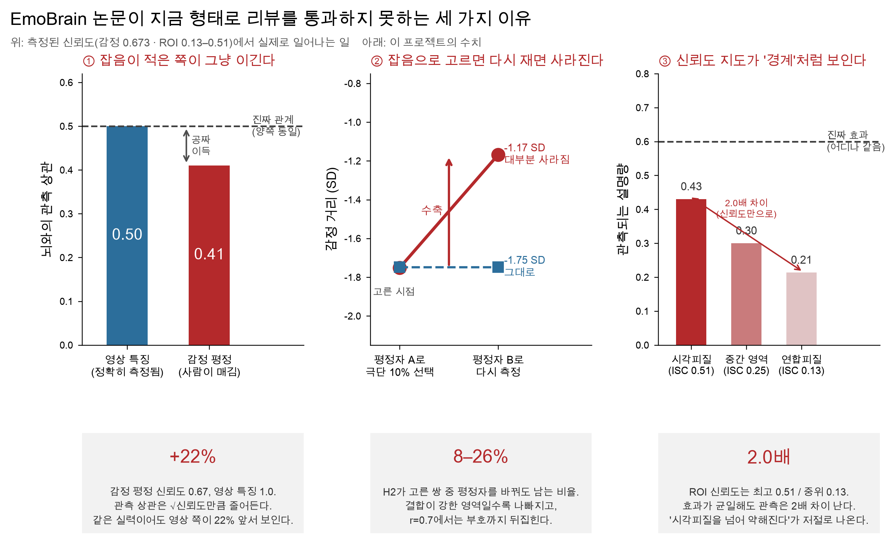
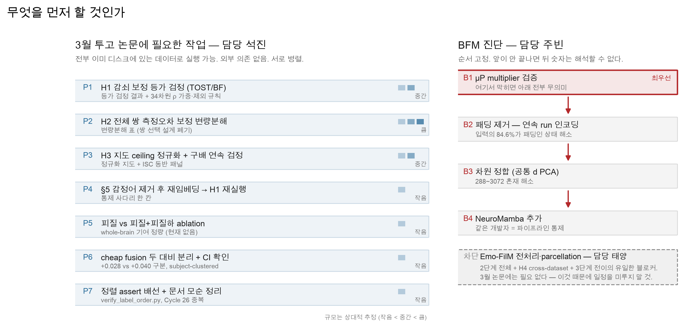

# 연구원용 작업 문서 — EmoBrain 2026-09

이 문서는 자문 검토([`advisory_review.md`](advisory_review.md))에서 나온 지적을
**실행 가능한 작업 단위**로 옮긴 것이다. 검토서는 왜 그런 지적이 나왔는지를 논증하고,
이 문서는 무엇을 어떻게 하면 되는지를 적는다. 통계 배경 없이 읽을 수 있게 썼다.

프롬프트는 [`PROMPTS.md`](PROMPTS.md)에 작업별로 준비돼 있다. AI 코딩 에이전트에 그대로
붙여넣으면 된다.

---

## 0. 먼저 — 왜 이 작업들을 하는가

논문의 논증(`docs/paper_logic_merged.md`)은 잘 짜여 있다. 문제는 논증이 아니라
**측정에 있다.** 세 가지가 전부 같은 뿌리에서 나온다: **감정 평정은 사람이 매긴 값이라
잡음이 있는데, 비교 상대인 영상 특징은 계산값이라 잡음이 없다.**

### 문제 ① — 잡음이 적은 쪽이 그냥 이긴다

같은 것을 재는 자가 두 개 있는데 하나는 눈금이 흐릿하다고 하자. 흐릿한 자로 잰 값은
무엇과 상관을 내도 상관계수가 낮게 나온다. 실력이 나빠서가 아니라 자가 흐려서다.

- 감정 평정의 신뢰도: **0.673** (영상당 평정자 중위 13명, 우리가 측정함)
- 영상 특징의 신뢰도: **1.0** (같은 영상이면 항상 같은 값)
- 결과: **영상 특징이 관측 상관에서 22% 앞서 출발한다.**

H1은 "영상 특징이 감정 평정만큼 설명한다"는 **등가 주장**이다. 그런데 지금 설계는
논문이 원하는 답 쪽으로 기울어 있다. 리뷰어가 이걸 먼저 찾으면 논문은 거기서 끝난다.

**→ 작업 P1: 감쇠 보정하고, "차이가 없다"가 아니라 "등가다"를 제대로 검정한다.**

### 문제 ② — 잡음으로 고르면 다시 재면 사라진다

시험을 두 번 보게 하고 1차에서 최하위 10%를 뽑으면, 2차에서 그 학생들 평균은 올라간다.
운이 나빴던 학생이 섞여 있기 때문이다. 실력이 는 게 아니라 **뽑는 데 쓴 값에 잡음이
있으면 항상 이렇게 된다.**

H2는 "내용 거리와 감정 거리가 가장 어긋나는 쌍"을 뽑아서 그 쌍들의 뇌 반응을 본다.
그런데 뽑는 기준에 감정 평정이 들어가 있다.

- 평정자를 절반으로 나눠 각각 같은 규칙으로 뽑으면 **겹치는 쌍이 8–26%뿐이다**
- 논문 자신이 전제한 영역(내용-감정 결합이 강한 영역)에서 **92%가 재현되지 않는다**
- "감정이 비슷한 쌍"으로 뽑은 459개 쌍은 독립 측정에서 오히려 감정이 **더 먼** 쌍이었다
  (−1.52 SD → +0.47 SD, 부호가 뒤집힘)

**이 문제는 fMRI 피험자를 늘려도 해결되지 않는다.** 검정력이 아니라 설계의 문제다.
뇌가 감정을 완벽하게 따르는 경우에도 H2가 "확인"돼 버린다.

**→ 작업 P2: 쌍을 고르지 말고 전체 쌍에 측정오차 보정 변량분해를 쓴다.**

### 문제 ③ — 신뢰도 지도가 '경계'처럼 보인다

뇌 영역마다 신호가 얼마나 안정적인지가 다르다. 우리 데이터의 ROI별 ISC는
**최고 0.51 / 중위 0.13 — 4.05배 차이**다. 관측되는 상관 r은 √신뢰도에 비례하므로
(설명분산 R²로 보면 신뢰도에 그대로 비례), **피질 전체에 똑같은 효과가 있어도
시각피질에서 r 기준 2배, R² 기준 4배 강하게 보인다.**

지표에 따라 배수가 달라지므로, 논문에서 r을 쓰는지 R²를 쓰는지 명시하고 그에 맞는
배수를 인용할 것. 위 그림 ③은 r 기준이다.

H3의 주장은 "시각피질을 넘어 연합피질까지 이어지되 거기서는 부분적으로만 설명된다"이다.
그런데 이 모양은 **신뢰도 구배 하나만으로 그대로 나온다.** 반대 결과("시각피질에서 멈춘다")도
마찬가지다. 즉 지금 H3는 어느 쪽이 나와도 해석이 안 된다.

**→ 작업 P3: 모든 지도를 ROI별 noise ceiling으로 나눠서 보고, ISC 지도를 같이 싣는다.**

---

## 1. 작업 목록

규모는 상대적 추정이다. 실제 소요는 각자 환경에 따라 다르므로 착수 후 조정할 것.

---

## 2. 석진 — 3월 논문 작업 (P1–P7)

전부 **이미 NERSC에 있는 데이터로 실행 가능**하다. Emo-FilM을 기다릴 필요 없다.
서로 병렬이므로 순서는 편한 대로.

### P1. H1 감쇠 보정 등가 검정 · 규모 중간

**왜.** 문제 ①. 지금은 감정 쪽만 잡음이 있어 비교가 불공정하다.

**무엇을.** 두 가지를 한다.

1. **감쇠 보정.** 감정 측 상관을 √0.673 = 0.821로 나눠 보정한다. 신뢰구간은
   **평정자 단위 bootstrap**으로 전파한다 (자극 단위가 아니다 — 잡음의 출처가 평정자다).
   대안으로 영상 특징에 잡음을 더해 신뢰도를 0.673으로 맞춘 조건도 같이 보고하면 더 안전하다.
2. **등가 검정.** "유의하지 않았다"는 등가의 증거가 아니다. **TOST 또는 Bayes factor**로
   바꾸고, 등가 마진은 **결과를 보기 전에** 정한다.

**34차원 처리.** [`emotion_dimension_reliability.csv`](emotion_dimension_reliability.csv)에
감정별 신뢰도가 있다. 중위 0.695지만 편차가 크다.

| 신뢰도가 낮아 개별 결론을 낼 수 없는 차원 | ρ |
|---|---|
| guilt | 0.187 |
| envy | 0.291 |
| contempt | 0.305 |
| satisfaction | 0.423 |
| disappointment | 0.473 |

guilt는 감쇠 계수가 √0.187 = 0.43이다. 참값이 관측치의 2.3배여야 겨우 보인다.
**이 5개는 사전 등록 시점에 제외하거나 신뢰도 가중을 걸 것.** 결과를 본 뒤에 빼면 그게
바로 리뷰어가 지적하는 selective reporting이다.

**산출물.** 감쇠 보정 전/후 상관 표, 등가 검정 결과(TOST p 또는 BF), 34차원별 결과 표.

**판정.** 등가가 나오든 안 나오든 발표 가능하다 — 논증 문서 §1이 그렇게 설계해 뒀다.
중요한 건 **보정 후에도 결론이 유지되는지**다. 보정하니 뒤집힌다면 그것도 결과다.

---

### P2. H2 재설계 — 쌍 선택 폐기 · 규모 큼

**왜.** 문제 ②. 현재 설계는 어떤 결과가 나와도 해석할 수 없다.

**무엇을. 권장안(1번)을 강하게 추천한다.**

1. **쌍 선택을 버린다.** 전체 2,386,020개 쌍에 **errors-in-variables 변량분해**
   (또는 disattenuated commonality analysis)를 적용한다. 선택 단계가 없어지므로
   문제 ②가 원천적으로 사라지고, 전체 쌍을 쓰니 검정력은 오히려 올라간다.
2. (선택을 꼭 유지한다면) **평정자 풀을 쪼갠다.** 절반 A로 쌍을 고르고, 뇌 검정에는
   절반 B의 감정 거리를 쓴다. 그리고 **cross-half Jaccard를 필수 진단 지표로 보고**한다.
3. 쌍의 불일치가 그 쌍 감정 거리의 자체 측정 SE(이항 오차에서 계산됨)를 넘을 것을 요구한다.

**1번을 택하면 H2가 독립 가설이 아니라 H1의 변량분해 안에 흡수된다.** 가설 하나가 줄지만
남는 셋이 방어 가능해진다. 지금 상태의 넷보다 낫다. 이건 지도교수 판단이 필요한 항목이다.

**산출물.** 변량분해 표 (내용 고유 / 감정 고유 / 공유 / 잔차), 측정오차 보정 전후 대조.

---

### P3. H3 신뢰도 정규화 · 규모 중간

**왜.** 문제 ③. 지금은 신뢰도 지도를 표상 경계로 오독할 위험이 있다.

**무엇을.**

1. **모든 H3 지도를 ROI별 noise ceiling으로 나눈다.** 그리고 **per-ROI ISC 지도를 같은
   그림의 동반 패널로 반드시 게재**한다. 이걸 안 실으면 리뷰어가 요구한다.
2. **경계를 이항 라벨(visual / transmodal)로 검정하지 말고, 주요 기능 구배(principal
   functional gradient) 상의 연속 위치로 검정**한다. 방어력이 올라가고 결과도 더 흥미로워진다.
3. **ROI별 검정력을 명시**한다. ISC 0.13에서 탐지 가능한 효과크기는 크다. 그 영역의 null을
   "설명 안 됨"으로 쓰면 안 되고 **"이 신뢰도에서는 판정 불가"**로 써야 한다.
   논증 문서 §3의 "둘 다 실패하는 영역을 명시하는 것 자체가 결과"는 이 구분 없이는 성립하지 않는다.
4. (여유가 되면) 신뢰도-매칭 ROI 부분표집을 보조 분석으로.

**산출물.** 정규화된 지도, ISC 동반 패널, 구배 상 연속 검정 결과, ROI별 검정력 표.

---

### P4. §5 감정어 제거 후 재임베딩 · 규모 작음

**왜.** caption을 "affect-neutral"이라 부르지 않기로 한 결정은 옳았다. 이제 숫자가 붙었다 —
**caption의 9.3%, 영상의 46.4%가 감정 어휘를 포함한다.** 최빈 누출 토큰은 kissing/kiss(1,370),
beautiful(244), happy/happily(255), scared(197), surprised(161).

**무엇을.** [`caption_emotion_lexicon.json`](caption_emotion_lexicon.json)에 34개 감정 ×
185개 어간이 정본 순서로 준비돼 있다. 이 어간에 걸리는 토큰을 caption에서 제거하고 재임베딩한 뒤
H1을 다시 돌린다. §5 통제 사다리(단어평균 / 문장 / 범주어만 / 명사만 / 뒤섞은 문장)에
**한 칸 추가**하는 것이다.

**판정.** 감정어를 빼도 H1 결과가 유지되면 강한 방어가 된다. 무너지면 그것도 반드시 보고해야
하는 결과다 — 숨기면 리뷰어가 찾는다.

---

### P5. 피질 vs 피질+피질하 ablation · 규모 작음

**왜.** 현재 파싱은 Schaefer-400(피질) + Tian-S3 50(피질하) = 450 ROI인데,
**피질하가 얼마나 기여하는지 보고한 적이 없다.** 감정 연구에서 편도체·선조체·시상의 기여는
리뷰어가 반드시 묻는다.

**무엇을.** ridge를 (a) Schaefer-400만, (b) 450 전체로 각각 돌려 대조한다. 기존 ridge
파이프라인의 ROI 인덱스만 바꾸면 되므로 작은 작업이고, 결과는 논문에 그대로 들어간다.

**주의.** ROI 수가 400 vs 450으로 다르므로 자유도 차이가 있다. 차이가 작게 나오면
ROI 수를 맞춘 대조(피질에서 50개 무작위 제거)도 함께 보고할 것.

---

### P6. cheap fusion 두 대비 분리 · 규모 작음

**왜.** `cheap_fusion_and_floor.py`가 서로 다른 두 값을 계산하는데 지금 구분 없이 인용될
위험이 있다.

| 대비 | 정의 | Δr | ceiling 대비 |
|---|---|---|---|
| `fusion_vs_stimulus_only` | mlp_fusion − ridge_stimulus | +0.040 | +5.9% |
| **`brain_marginal_in_fusion`** | **mlp_fusion − mlp_fusion_brainshuffle** | **+0.028** | **+4.1%** |

**두 번째를 인용해야 한다.** 첫 번째는 "뇌 있음/없음"과 "MLP/ridge"를 섞지만, 두 번째는
같은 MLP·같은 입력 차원에서 뇌 행만 permute하므로 **모델 용량이 통제**된다.

이 수치는 논문에서 가장 중요하다. **뇌 단독은 ceiling의 43%지만, 자극 특징 위에 얹으면
4.1%만 더한다.** H1에는 강한 지지 증거이고 H4에는 축소 근거다.

**할 일.** 본문에 두 대비를 구분해 싣고, 스크립트가 이미 계산하는 bootstrap CI가
**subject-clustered인지 확인**한다. 5명 pooling 데이터에서 stimulus-level CI는
지나치게 좁게 나온다(anti-conservative).

---

### P7. 정렬 assert 배선 + 문서 모순 정리 · 규모 작음

1. [`verify_label_order.py`](verify_label_order.py)를 감정별 결과를 만지는 모든 스크립트
   진입점에 배선한다. 라벨 CSV에는 감정 이름이 없고 `score_0`…`score_33`뿐이라,
   순서가 어긋나면 34개 결과가 **조용히** 뒤섞인다.
   - 매핑은 이번 검토에서 caption 프로브 8개로 경험적 확인했다 (6/8 1위, fear·surprise는
     3위/34이고 둘 다 1위가 amusement — 이 코퍼스의 놀람 영상이 실제로 장난·점프스케어라
     amusement 평정이 높다). `score_j = cowen34_order.txt[j]` 확정.
2. `project/README.md`(teacher/student = LEGACY)와 `paper_logic_merged.md` §4-A
   (teacher→cache→student = 고정)가 반대로 말한다. **LLM teacher 폐기와 teacher/student
   폐기는 다른 결정**인데 구분이 기록돼 있지 않다. 어느 쪽이 유효한지 결정 로그에 남길 것.
3. `build_log.md`에 **"Cycle 26"이 두 개** 있다 (2026-08-17, 2026-07-21 (3)).
   사이클 번호가 결과 provenance 키로 쓰이므로 정리가 필요하다.
4. **자극 개수가 파일마다 다르다.** 라벨 파일은 2,185행, `caption_ck20.csv`는 2,196개 영상 —
   **11개 차이**다. 그래서 `SETTINGS_brain_jepa.md`는 T=5 비율을 71.6%(=1573/2196)로 적었지만
   라벨 기준으로는 72.0%(=1573/2185)다. 큰 차이는 아니지만, 어느 쪽이 canonical 2,185인지
   문서에 못 박고 caption 쪽 11개를 어떻게 처리했는지 기록해야 한다. 지금은 조인할 때마다
   조용히 11개가 빠진다.

---

## 3. 주빈 — BFM 진단 (B1–B4)

**순서가 고정이다.** 앞 단계가 안 끝나면 뒤 단계 숫자는 해석할 수 없다.

### 배경 — 지금까지 확인된 것

35개 조건(Brain-JEPA / SwiFT 5종 / NeuroSTORM × resting vs scratch × padding 5종)의 결과:

- **사전학습 효과는 지금까지 뇌 측에서 얻은 가장 큰 효과다** — 중위 +0.043, 최대 +0.099.
  아키텍처 변경(+0.008), 공간 해상도(+0.006)보다 5–12배 크다
- 그런데 **최고 BFM 0.245는 ROI-mean ridge 0.296에 0.051 미달**이다
- **SwiFT이 특히 낮다** (0.13–0.17). 원인 후보가 아래 B1–B2다

### B1. μP multiplier 검증 · 최우선

**왜.** `SETTINGS_swift_master.md`에 SwiFT 5개 모델 공통 `use_MuTransfer=True`가 적혀 있다.
**μP 가중치를 표준 parameterization forward에 그냥 로드하면 활성값이 조용히 틀어진다.**

결정적 증거: UAH 계열 3개가 **랜덤 초기화보다 나쁘다** (−0.027 ~ −0.049).
랜덤 가중치는 가장 "안 맞춰진" 상태이므로, 그보다 나쁘다는 건 overfitting으로 설명되지 않는다.
**입력 분포가 체크포인트가 기대하는 것과 다르다는 지문이다.**

**무엇을.** SwiFT 5개 체크포인트를 μP 스케일링 적용/미적용으로 각각 임베딩 재추출해 비교한다.

**판정.** UAH의 resting < scratch가 μP 적용 후 사라지면 → **SwiFT 숫자 전체를 폐기하고
재추출**해야 한다. 양수 델타를 낸 NewE 계열도 포함해서. 안 사라지면 다른 원인을 찾는다.

**부수 확인.** 결과 파일 이름(`UAH_5M` / `UAH_51M` / `UAH_202M`)과
SETTINGS(`UAH_P2_51M` / `UAH_P3_806M` / `NewE36`≈9M / `NewE96`≈66M / `NewE192`≈264M)가
**일치하지 않는다.** UAH_5M과 UAH_202M은 SETTINGS에 없고, 806M은 결과에 없다.
어느 체크포인트가 어느 숫자를 냈는지 지금 상태로는 확정할 수 없다 — 이것부터 맞춰야 한다.

### B2. 패딩 제거 — 연속 run 인코딩

**왜.** 이게 SwiFT 부진의 가장 큰 단일 원인일 가능성이 높다.

- Horikawa 자극은 **T=5 프레임이 1,573개(72.0%)** 인데 모델 입력은 20프레임 고정이다
- volumetric 모델은 여기에 공간 패딩이 더 붙는다: (74,91,81) → (96,96,96),
  즉 **부피의 38.3%가 배경**
- 결과: T=5 자극에서 **4D 모델은 입력의 84.6%가 패딩**이다 (ROI 모델은 75%)
- 그리고 이 입력은 UKB/ABCD **연속** resting 20-TR 윈도우로 사전학습된 모델에게 완전한 OOD다

즉 whole-brain coverage가 손해를 본 게 아니다. **whole-brain을 voxel 격자로 담느라
텐서가 커진 만큼 패딩 비율이 커진 것**이다. 참고로 ROI-mean 450(Schaefer-400 + Tian-S3)도
whole-brain coverage이고, 그게 0.296으로 모든 BFM을 이긴다. 그리고 spatial resolution
ladder에서 2mm voxel 0.292 < 4mm block 0.319 ≈ ROI kernel 0.313 — **이 과제의 신호는
parcel 스케일에 있다.**

**무엇을.** 자극별로 20프레임을 만들지 말고, **연속 run 전체를 모델 native 윈도우로
슬라이딩 인코딩한 뒤 각 자극 구간에 해당하는 프레임 임베딩을 pool**한다. 패딩이 0이 되고
입력이 사전학습 분포와 일치한다. **학습이 필요 없는 전처리 변경이다.**

**참고 — 시간축은 지금 기여가 0이다.** `spatial_only`(실제 TR 평균 1개를 20회 복제 =
시간 정보 완전 제거)가 세 인코더 모두에서 같거나 더 낫다: brain_jepa_LEGACY −0.0010,
neurostorm −0.0004, swift_NewE96 −0.0036. SwiFT은 zero 0.134 → replicate 0.144 →
cyclic 0.159 → mean 0.167 → spatial_only 0.171로 **시간축을 죽일수록 단조 개선**된다.
B2가 이걸 바꾸는지가 핵심 관전 포인트다.

### B3. 차원 정합

**왜.** 지금 비교는 **입력 표상 · 사전학습 목표 · 출력 차원 세 가지가 동시에 변한다.**
NeuroSTORM 288, Brain-JEPA 768, NewE96 768, NewE192 1536, UAH_P3 3072.

**무엇을.** 전 인코더를 공통 d(예: 256)로 PCA한 뒤 동일 ridge로 비교한다.

### B4. NeuroMamba 추가

**왜 마지막인가.** 입력의 84.6%가 패딩인 대조에 네 번째 인코더를 더하면 망가진 대조에
숫자가 하나 느는 것뿐이다. B1–B3를 끝낸 뒤 붙이면 **같은 파이프라인 · 같은 입력 · 같은 차원**
에서의 깨끗한 아키텍처 대조가 된다.

**왜 넣을 가치가 있는가.**

1. **같은 개발자 모델이라는 게 핵심 통제다.** SwiFT을 Brain-JEPA/NeuroSTORM과 비교하는 건
   랩도 전처리 파이프라인도 다른 비교다. NeuroMamba는 사전학습 코퍼스와 전처리 관행이
   SwiFT과 공유되므로 **아키텍처/목표만 바꾸는 대조**가 된다. SwiFT의 부진이 파이프라인 탓인지
   Swin+SimMIM 탓인지 가른다
2. **시간축 가설을 직접 겨냥한다.** SSM은 Swin attention과 시간 귀납편향이 다르다

**사전 예측을 걸어둘 것.** 자매 프로젝트 BEACON-T에서 frozen BFM 임베딩의 frame-to-frame
분산이 NeuroMamba 3.6–4.6% vs SwiFT 0.05–0.15% vs Brain-JEPA 0.003%로 측정됐다.
NeuroMamba가 시간 동역학을 30–100배 더 보존한다. "임베딩이 시간 불변이라 실패한다"가
원인이라면 NeuroMamba가 패턴을 깰 유일한 후보다. **단, 그건 다른 프로젝트의 다른 대비
(연속 영화의 frame-to-frame)이므로 EmoBrain 임베딩에서 재현 확인이 필요하다.**
반대 논거도 있다 — T=5가 72%인 이 데이터에서는 SSM의 장거리 이점이 쓸 자리가 없다.
그래서 좋은 실험이다.

### 도움이 될 값싼 진단 (B1 전에 하루면 됨)

**핵심 질문:** 도메인이 안 맞아서 실패했나(→ 적응 SSL이 고침), 아니면 목표 함수가 자극 고정
성분을 버려서 실패했나(→ 데이터만 바꿔선 안 고쳐짐)?

이미 디스크에 있는 임베딩으로 답이 나온다.

- 각 BFM 임베딩 분산을 **자극 고정 성분 vs 피험자/시간 불변 성분으로 분해**
- resting vs scratch의 **표상 유사도(CKA)** — 사전학습이 무엇을 추가했는지
- 각 임베딩의 ROI-mean에 대한 **선형 재구성 오차** — BFM이 무엇을 버렸는지

---

## 4. 태양 — 인프라 (I1)

### I1. Emo-FilM 전처리·parcellation 완료

**과제를 재정의한다.** 현재 action item "데이터셋 데이터베이스 구축 및 데이터 다운로드"는
범위가 너무 넓다. →

> **"Emo-FilM(ds004872)을 Schaefer-400 + Tian-S3 동일 공간으로 전처리·parcellation 완료.
> 하드 기한 명시."**

데이터베이스 구축은 그다음이다.

**착수 전 확인 세 가지** (`paper_logic_merged.md` §8에 이미 블로커로 적혀 있다).
각각에 담당자와 날짜를 붙일 것.

1. git-annex 설치 가능성
2. raw 약 132GB 디스크 여유
3. 전처리 비용 (GPU/CPU 시간)

**왜 최우선인가.** 이 데이터 하나가 **H4 cross-dataset + 로드맵 2단계 전체 + 3단계 전이
검정**을 동시에 막고 있다.

**중요 — 3월 논문은 이것을 기다리지 않는다.** P1–P7은 전부 현재 데이터로 완결된다.
Emo-FilM 지연으로 EmoBrain 일정을 미루지 말 것.

**주의.** Emo-FilM은 CK34와 **9개 감정만 겹친다.** cross-taxonomy 매핑이 별도 작업이라는
뜻이므로 일정에 반영할 것.

---

## 5. 보고 형식 — 결과를 어떻게 적어 올릴 것인가

작업이 끝나면 `docs/notes/build_log.md`에 다음 다섯 항목으로 적는다.

1. **무엇을 돌렸나** — 스크립트 경로 + 커밋 해시
2. **입력** — 데이터 경로, 자극/피험자 수, split 방식
3. **결과** — 숫자. **noise ceiling 대비 %를 반드시 병기**한다 (raw r만 적으면 크기를 알 수 없다)
4. **판정** — 사전에 정한 기준에 비추어 통과/실패/판정 불가 중 무엇인가
5. **의심스러운 점** — 스스로 못 미더운 부분. 이걸 적는 게 가장 중요하다

### 흔한 실수 다섯 가지

1. **결과를 보고 나서 기준을 정하는 것.** 등가 마진, 제외할 감정 차원, 판정 규칙은 전부
   돌리기 전에 정하고 문서에 남긴다
2. **"유의하지 않았다"를 "같다"로 쓰는 것.** 등가는 등가 검정으로만 주장할 수 있다
3. **raw r만 보고하는 것.** noise ceiling 대비로 환산해야 크기를 알 수 있다
4. **stimulus-level bootstrap.** 피험자가 5명이므로 subject-clustered여야 한다
5. **감정 이름을 인덱스로 가정하는 것.** `verify_label_order.py`를 호출한다

---

## 6. 참고 — 이 프로젝트의 핵심 수치

| 값 | 수치 | 출처 |
|---|---|---|
| inter-subject noise ceiling (LOO) | 0.678 [0.654, 0.701] | 저장소 |
| ridge, brain only (pooled) | 0.294 = ceiling의 43.3% | 저장소 |
| ridge, stimulus only | 0.493 = 72.7% | Cycle 26 |
| mlp fusion (stimulus + brain) | 0.533 = 78.6% | Cycle 26 |
| **뇌의 한계 기여 (용량 통제)** | **+0.028 = 4.1%** | Cycle 26 |
| 최고 BFM (Brain-JEPA resting) | 0.245 | 저장소 |
| 감정 RDM 신뢰도 (cosine / Euclidean) | 0.673 / 0.612 | 이번 검토 |
| 감정 34차원 신뢰도 중위 / 범위 | 0.695 / 0.187–0.953 | 이번 검토 |
| per-ROI ISC 최고 / 중위 | 0.514 / 0.127 (4.05배) | 저장소 |
| caption 감정어 누출 | caption 9.3% / 영상 46.4% | 이번 검토 |
| 입력 중 패딩 비율 (T=5, 4D 모델) | 84.6% | SETTINGS에서 계산 |

거리 지표 정본은 **cosine**이다 (신뢰도 0.673 vs Euclidean 0.612).
`paper_logic_merged.md` §8의 첫 미결정 항목은 이걸로 종결한다.
