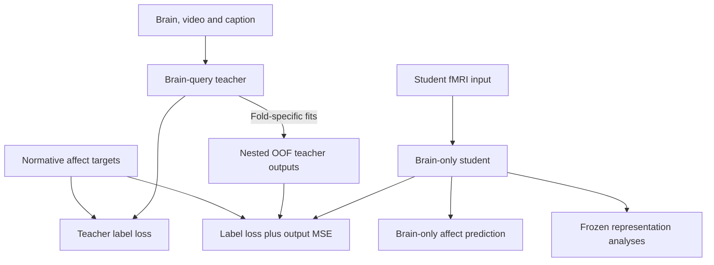

# EmoBrain model figure

_Training, inference and representation analysis · 2026-10-06_

---

## 📚 English


The figure shows the candidate brain-query teacher, output-guided brain-only student, and post-training geometry, content and model-use analyses. Equations illustrate the 34-D case: sigmoid outputs, soft BCE labels and dimension-mean OOF probability MSE. The target strip describes the separate continuous-target runs.

Sources: [implementation specification](../current/02_IMPLEMENTATION_SPEC.md), [study design](../current/01_STORY_AND_DESIGN.md), [independent neural validation](../current/06_NEURAL_VALIDATION_AMENDMENT.md). Depth, widths and the bridge implementation remain development decisions.

### Reading the model

1. **Teacher:** The brain pattern, video and caption each become token vectors. Brain queries select weighted video/caption information through cross-attention; this update is added to the original brain state. The affect head maps that state to a profile.
2. **Student:** A separate encoder receives only fMRI. It learns from the normative annotation and the teacher's predicted profile. The second loss compares output values, not hidden representations.
3. **OOF:** For a training stimulus, guidance comes from a teacher fitted without that stimulus group across participants. This fitting happens inside the student training split; its outer test set stays excluded.
4. **After training:** CKA measures geometry similarity, retrieval tests accessible content, and selective perturbation tests model reliance. The candidate content-side bridge provides a separate route for independent neural validation.

### Design rationale

| Question | Answer |
| --- | --- |
| Scientific question | What can the teacher and student access, learn and use? |
| Alternative explanation | Content shortcuts or feature-matching losses could be mistaken for learned brain–content relations. |
| Basis | Current input, fusion, loss, OOF and evaluation contracts linked above. |
| Choice | Separate training, inference and frozen analysis panels expose information flow. |
| Revision criterion | Revise when an approved architecture or learning contract changes. |
| Claim limit | This schematic is not an implemented result or evidence of human neural causality. |

### Editable information flow



## 📚 한국어

이 그림은 후보 brain-query teacher, 출력 지도를 받는 brain-only student, 학습 후 geometry·content·모델 사용 분석을 보여준다. 수식은 34-D 기준으로 sigmoid 출력, soft BCE label loss, 차원 평균 OOF 확률 MSE를 나타낸다. 연속 target은 별도 학습하며 하단 target 띠에 표시했다.

기준 문서는 위 구현 사양·연구 설계·독립 뇌 검증 문서다. 깊이·너비·bridge 구현은 개발 단계 결정으로 남아 있다.

### 모델 읽기

1. **Teacher:** 뇌 패턴·영상·caption을 각각 token 벡터로 바꾼다. Brain query가 cross-attention으로 영상·caption 정보에 가중치를 주어 가져오고, 이를 원래 뇌 표상에 더한다. Affect head는 이 표상을 정서 프로필로 변환한다.
2. **Student:** 별도 encoder가 fMRI만 입력받는다. 실제 규준 주석과 teacher 예측 프로필 두 가지를 참고해 학습한다. 두 번째 loss는 내부 표상이 아니라 출력값을 비교한다.
3. **OOF:** 특정 학습 자극의 지도값은 모든 참가자에서 해당 자극 그룹을 제외하고 학습한 teacher로 만든다. 이 과정 전체가 student training split 안에서 이루어지며 outer test는 제외한다.
4. **학습 후:** CKA는 표상 구조의 유사성, retrieval은 읽을 수 있는 내용, 선택적 교란은 모델의 정보 의존성을 조사한다. 후보 content-side bridge는 독립 뇌 검증을 위한 별도 경로다.

### 설계 근거

| 질문 | 답 |
| --- | --- |
| 과학적 질문 | Teacher와 student는 무엇에 접근하고 무엇을 학습·사용하는가? |
| 대안 설명 | Content shortcut이나 feature matching loss를 뇌–내용 관계 학습으로 오인할 수 있다. |
| 근거 | 현재 입력·fusion·loss·OOF·평가 계약. |
| 선택 이유 | 학습·추론·고정 후 분석을 나누어 정보 흐름을 보여준다. |
| 수정 기준 | 승인된 구조나 학습 계약이 바뀌면 함께 수정한다. |
| 주장 한계 | 구현 결과나 인간 뇌 인과성의 증거가 아니다. |

## 🔧 Production / 제작

Built-in image generation, using the current model for content and the user-provided figure for restrained styling. Removed tinted panels, decorative borders and redundant labels. Helvetica Neue styling was requested; the raster has no embedded font identity to verify. Reviewed inputs, residual fusion, output losses, OOF scope and evaluation routes. Independent neural validation uses held-out content rather than the evaluation brain. Illustrations and profile bars are schematic. The overview image is unchanged.

내장 이미지 도구로 현재 모델 내용을 유지하고 사용자 첨부 그림의 절제된 스타일을 참고했다. 배경색·장식 테두리·중복 표기를 줄이고 Helvetica Neue 스타일을 요청했다. Raster 이미지이므로 실제 내장 폰트명을 검증할 수는 없다. 입력, residual fusion, 출력 loss, OOF 범위, 평가 경로를 검수했다. 독립 뇌 검증은 평가 뇌가 아니라 held-out content를 입력으로 받는다. 이미지와 프로필 막대는 설명용이며 기존 Overview는 변경하지 않았다.

### Generation prompt

```text
Restyle the FIRST image (current scientifically correct model figure) using the restrained academic appearance of the SECOND image (style reference). Create a clean Nature-style model plate with true-looking Helvetica Neue REGULAR-width letterforms throughout, headings Helvetica Neue Bold. Absolutely no condensed or narrow type, no handwritten fonts, no serif labels except mathematical symbols. Consistent medium-size body text and 3 sizes total. Increase whitespace. Do NOT imitate the dense condensed typography of image 1. This is a full redraw, not a colour filter.

Landscape 3:2 or 4:3, spacious high resolution. Pure WHITE background. No coloured panel fills, no dashed group borders, no gradients, shadows, 3D trapezoids, cartoon icons, coloured cards or giant header. Thin black rules and arrows. Restrained colour only for small token stacks: brain slate blue, video ochre, caption sage; training guidance one muted blue dashed line. Most text black. Three panels a top 65% full width, b bottom left 30%, c bottom right 70%. Large equal outer margins.

Use these concise labels and preserve correct information flow:

a heading "Training: multimodal teacher and brain-only student"

Upper-left 'Teacher' schematic:
Three input rows, each with simple tiny input illustration:
'fMRI' → 'Participant map' → BLUE 'Brain tokens'
'Video' → 'Frozen V-JEPA 2' → 'Projection' → OCHRE 'Video tokens'
'Caption' → 'Frozen sentence encoder' → 'Projection' → SAGE 'Caption tokens'
Caption example "People share a cake."
Brain tokens enter a clean white thin black rectangular 'Cross-attention' as Q; video and caption tokens enter it as K,V. Add small port labels Q and K,V instead of verbose repeated keys/values.
Cross-attention output enters circled '+'; a bypass from brain tokens also enters '+' labeled 'Brain residual'. Then '+' → small neutral token stack 'Fused state' → 'Affect head' → black thin-bar vector 'Teacher prediction'.
No Venn circles, no content-to-head shortcut.

Upper-right 'Supervision' area, plain open typography with a single fine separator, not boxed cards:
'Normative profile y' drawn as small black bars.
Line 'Teacher: soft BCE(y, p_T)'.
Include a short discrete arrow from teacher prediction and from y into this teacher objective; do not send y twice.
Below a small heading 'Nested OOF predictions'
Only two explanatory lines:
'Fit without the recipient stimulus group'
'Outer test excluded from all fitting'
Below show small black bars 'OOF teacher profile'.
This denotes repeated fold-specific teacher fits, NOT a transformation of the teacher's in-sample predictions. If linking from teacher, connect from the teacher GROUP margin with a bracket labelled 'Fold-specific fits', not from the teacher prediction bars.

Below teacher a separate labelled 'Student' lane on the left:
'fMRI' → 'Participant map' → 'Brain encoder' → small blue tokens 'z' → 'Affect head' → bars 'Student prediction'.
On right of this lane put the simple student objective:
'L_student = soft BCE(y, p_S) + λ MSE(p_T^OOF, p_S)'
Direct solid line from student prediction to the objective.
One dashed blue line from the OOF teacher profile down into the student objective.
Solid line or clear label indicates normative y also supplies this objective.
Below objective a single short phrase 'Match labels + teacher outputs'.
Do NOT send OOF into z, no latent-alignment training loss.
Tiny text next to equations '34-D example'.
A single understated line at bottom of panel a:
'Separate target runs: 34-D categories | 14-D ratings | VA / VAD if available'
And a second short line:
'14-D / VA / VAD: standardized MSE label loss + OOF MSE'
Do not add long control lists in panel a. They are in the methods.

b heading 'Inference: brain only'
Small MRI stack → 'Participant map' → 'Trained student' → black bar profile.
Arrange with ample whitespace.
One short line 'No video, caption or teacher'.

c heading 'After training: what did the student learn?'
Left small chain 'Adapter' → 'Encoder stages' → 'z'; bracket label 'Freeze model'.
From the chain branch THREE arrows to unboxed rows separated by fine grey rules:
'Geometry' — small neutral heatmap, 'Linear CKA'
'Content' — two small video/caption examples, 'Held-out retrieval'
small subline 'Including similar-affect scenes'
'Model use' — simple few token squares one outlined, 'Selective ROI / token perturbation'
small subline 'Changes in content and affect readout'
Below these, a SEPARATE row not connected to the z arrows:
'Independent neural validation'
'Held-out content → frozen bridge → separate-cohort fMRI'
Small '(candidate bridge; training-set calibration)'.
Bottom line 'Compare: Direct | Full-guided | Shuffled-guided'.
No repeated disclaimers, no paragraph footers, no coloured panels. Short final note only 'Probes are evaluations, not training losses.'

Make it visually calm, beautifully aligned, spacious like a meticulously typeset journal figure. All mini profiles are schematic. The attached style example contains obsolete weighted MSE for 34-D: do not use that. Maintain soft BCE for 34-D labels, MSE for teacher-output guidance, and brain-only student input during BOTH training and inference. Preserve teacher brain residual, explicit student path, nested OOF and separate independent-validation path.
```
