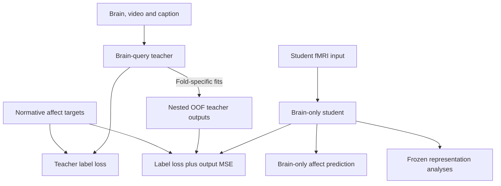

# EmoBrain model figure

_Training / After Training · 2026-10-06_

---

## 📚 English


The figure shows the candidate brain-query teacher, output-guided brain-only student, and post-training geometry, content and model-use analyses. Equations illustrate the 34-D case: sigmoid outputs, soft BCE labels and dimension-mean OOF probability MSE. The target strip describes the separate continuous-target runs.

Sources: [implementation specification](../current/02_IMPLEMENTATION_SPEC.md), [study design](../current/01_STORY_AND_DESIGN.md), [independent neural validation](../current/06_NEURAL_VALIDATION_AMENDMENT.md). Depth, widths and the bridge implementation remain development decisions.

### Reading the model

1. **Teacher:** The brain pattern, video and caption each become token vectors. Brain queries select weighted video/caption information through cross-attention; this update is added to the original brain state by a skip connection. The result is **Fused State (Joint Latent)**; the affect head maps it to a profile. Cross-attention is the candidate fusion operation, not a replacement for the joint representation.
2. **Student:** A separate encoder receives only fMRI. It learns from the normative annotation and the teacher's predicted profile. The second loss compares output values, not hidden representations.
3. **OOF:** For a training stimulus, guidance comes from a teacher fitted without that stimulus group across participants. This fitting happens inside the student training split; its outer test set stays excluded.
4. **After training:** CKA measures geometry similarity, retrieval tests accessible content, and selective perturbation tests model reliance. The candidate content-side bridge provides a separate route for independent neural validation.

### Brain-use checks

The figure includes existing teacher controls: separately trained **BVS vs VS** tests predictive increment; **brain swap with video/caption fixed** tests dependence of the frozen BVS computation. Equal predictive performance does not establish brain neglect: information may be redundant, and an imprecise null is inconclusive. Swap damage alone is also insufficient because mismatched modalities can be out of distribution.

Use a B-only baseline to assess accessible target signal, not to declare whether the brain contains information. The target is a stimulus-level normative profile, so content-only success is not itself leakage or a scientific failure. The user's earlier low-increment experiment is a motivation, not a verified current 34-D result.

Existing development-only rescue candidates are joint video+caption dropout and a same-target B-only auxiliary head sharing the teacher's brain pathway. Neither is newly approved by this figure. Evaluate full-input reliance after rescue, not only missing-content performance. D08 tuning and D14 VS-guided student status remain unchanged.

### Design rationale

| Question | Answer |
| --- | --- |
| Scientific question | What can the teacher and student access, learn and use? |
| Alternative explanation | Content shortcuts or feature-matching losses could be mistaken for learned brain–content relations. |
| Basis | Current input, fusion, loss, OOF and evaluation contracts linked above. |
| Choice | Two panels separate learning from frozen analysis; brain-only inference is noted in the student lane without duplicating the model. |
| Revision criterion | Revise when an approved architecture or learning contract changes. |
| Claim limit | This schematic is not an implemented result or evidence of human neural causality. |

### Editable information flow



## 📚 한국어

이 그림은 후보 brain-query teacher, 출력 지도를 받는 brain-only student, 학습 후 geometry·content·모델 사용 분석을 보여준다. 수식은 34-D 기준으로 sigmoid 출력, soft BCE label loss, 차원 평균 OOF 확률 MSE를 나타낸다. 연속 target은 별도 학습하며 하단 target 띠에 표시했다.

기준 문서는 위 구현 사양·연구 설계·독립 뇌 검증 문서다. 깊이·너비·bridge 구현은 개발 단계 결정으로 남아 있다.

### 모델 읽기

1. **Teacher:** 뇌 패턴·영상·caption을 각각 token 벡터로 바꾼다. Brain query가 cross-attention으로 영상·caption 정보에 가중치를 주어 가져오고, 이를 skip connection으로 원래 뇌 표상에 더한다. 결과가 **Fused State (Joint Latent)**이며 affect head는 이를 정서 프로필로 변환한다. Cross-attention은 후보 결합 연산이지 joint representation의 대체물이 아니다.
2. **Student:** 별도 encoder가 fMRI만 입력받는다. 실제 규준 주석과 teacher 예측 프로필 두 가지를 참고해 학습한다. 두 번째 loss는 내부 표상이 아니라 출력값을 비교한다.
3. **OOF:** 특정 학습 자극의 지도값은 모든 참가자에서 해당 자극 그룹을 제외하고 학습한 teacher로 만든다. 이 과정 전체가 student training split 안에서 이루어지며 outer test는 제외한다.
4. **학습 후:** CKA는 표상 구조의 유사성, retrieval은 읽을 수 있는 내용, 선택적 교란은 모델의 정보 의존성을 조사한다. 후보 content-side bridge는 독립 뇌 검증을 위한 별도 경로다.

### Brain 활용 점검

그림에는 기존 teacher 대조를 표시했다. 따로 학습한 **BVS vs VS**는 예측 증분, **영상·caption을 고정한 brain swap**은 고정된 BVS 계산의 뇌 의존성을 묻는다. 성능이 같아도 공유 정보의 중복이나 추정 불확실성 때문에 brain 무시로 단정할 수 없다. Swap 악화도 모달리티 불일치에 따른 분포 이탈만으로 생길 수 있다.

B-only baseline은 현재 측정·모델에서 읽을 수 있는 target 정보를 평가하며 뇌에 정보가 있는지 없는지를 확정하지 않는다. Target은 자극별 규준 프로필이므로 content-only 성공 자체가 누출이나 연구 실패는 아니다. 사용자의 과거 실험 경험은 설계 동기이며 현재 34-D 실험에서 검증된 결과가 아니다.

기존 개발 단계 rescue 후보는 video+caption 공동 dropout과 teacher brain 경로를 공유하는 동일-target B-only auxiliary head다. 이번 그림으로 새로 승인하지 않는다. Rescue 후에는 content가 모두 있는 조건의 brain 의존성을 검증해야 하며, content가 없는 조건만 잘 맞추는 것으로 충분하지 않다. D08 설정과 D14 VS-guided student의 지위는 유지한다.

### 설계 근거

| 질문 | 답 |
| --- | --- |
| 과학적 질문 | Teacher와 student는 무엇에 접근하고 무엇을 학습·사용하는가? |
| 대안 설명 | Content shortcut이나 feature matching loss를 뇌–내용 관계 학습으로 오인할 수 있다. |
| 근거 | 현재 입력·fusion·loss·OOF·평가 계약. |
| 선택 이유 | Training / After Training 두 패널로 나누고 brain-only 추론은 student 경로에 표시해 중복 모델을 없앤다. |
| 수정 기준 | 승인된 구조나 학습 계약이 바뀌면 함께 수정한다. |
| 주장 한계 | 구현 결과나 인간 뇌 인과성의 증거가 아니다. |

## 🔧 Production / 제작

Built-in image generation using imagegen and scientific-schematics guidance. Two panels, capitalized component labels, and the Fused State (Joint Latent) label follow the user request. Helvetica-style lettering was requested; a raster does not verify an embedded font. Manually checked skip-connection routing, output-only guidance, OOF separation and evaluation paths; no automated quality score is claimed. The study overview is unchanged.

imagegen·scientific-schematics 지침과 내장 이미지 도구를 사용했다. 사용자 요청에 따라 두 패널, 구성요소 대문자 표기, Fused State (Joint Latent)를 적용했다. Helvetica 스타일을 요청했으나 raster의 내장 폰트명은 검증할 수 없다. Skip connection·출력 지도·OOF 분리·평가 경로를 직접 검수했으며 자동 품질 점수는 주장하지 않는다. Study overview는 변경하지 않았다.

### Generation prompt

```text
Edit the reference into a clean Nature-style scientific model figure with EXACTLY TWO PANELS, (a) Training and (b) After Training. Remove the separate Inference panel entirely. White background, thin black lines, generous whitespace, neutral Helvetica / Helvetica Neue regular-width sans-serif, bold headings. No condensed lettering, no big overall title, no colored panel fills, no 3D blocks. Use muted slate blue for brain tokens, ochre for video, sage for captions, a blue dashed output-guidance arrow. Landscape 3:2 with generous margins. Capitalize component labels consistently, e.g. "Participant Map", "Brain Tokens", "Cross-Attention", "Affect Head". Content and scientific details below are mandatory; do not copy lowercase labels or old panel structure.

(a) Training, occupies top 65%.
Left 66%:
Heading "Teacher: Brain + Video + Caption".
Three parallel input rows: fMRI illustration -> Participant Map -> Brain Tokens. Video mini filmstrip -> Frozen V-JEPA 2 -> Projection -> Video Tokens. Caption "People share a cake." -> Frozen Sentence Encoder -> Projection -> Caption Tokens.
Brain Tokens enter Q of Cross-Attention; Video and Caption Tokens enter K,V. Cross-Attention -> circled +; a direct bypass from Brain Tokens also enters +, labeled "Brain Skip Connection". + -> neutral vector labeled EXACTLY "Fused State (Joint Latent)" with small u_BVS beneath -> Affect Head -> profile bars labeled "Teacher Prediction p_T". Do not merge the bypass with Q line before attention. Small "Candidate Fusion" over the operation, not a large disclaimer.
Under teacher, heading "Student: Brain-only Input". fMRI -> Participant Map -> Brain Encoder -> vector z -> Affect Head -> profile bars "Student Prediction p_S". Small line below student "Inference: Brain-only". This is a label only, NOT another pipeline or panel.

Right 34% supervision:
"Normative Profile y" small black bars.
"Teacher Loss" line "L_T = Soft BCE(y, p_T)" with input connections from y and teacher prediction.
Separate small area "Nested OOF Teacher Fits" with two lines "Exclude Recipient Stimulus Across Participants" and "Outer Test Always Excluded". Treat this as fold-specific copies of entire teacher fitting, not transformation of in-sample prediction. Output black bars "OOF Teacher Profile p_T^OOF".
Below "Student Loss":
"L_S = Soft BCE(y, p_S) + λ MSE(p_T^OOF, p_S)"
Show student prediction entering this loss; solid annotation label input y; blue dashed arrow from OOF profile entering this LOSS ONLY, not student latent. Label "Output Guidance Only".
Small "34-D Example" by losses.
At bottom of panel (a) a restrained one-line target strip:
"Independent Target Runs: 34-D Categories | 14-D Ratings | VA / VAD if Available"
second small line "Continuous Targets: Standardized MSE + OOF MSE".

(b) After Training occupies full bottom width.
A frozen student chain on the left: fMRI -> Participant Map -> Encoder Stages -> z. A bracket "Frozen Student" under the chain.
To right three clean unboxed rows connected from Encoder Stages / z by three arrows:
"Geometry" with small heatmap and "Linear CKA"
"Content" with tiny matched scene/caption examples and "Held-out Retrieval"; subline "Including Similar-affect Scenes"
"Model Use" with brain ROI/token icon and "Selective ROI / Token Perturbation"; subline "Changes in Content and Affect Readout"
Bottom-left, separate from student chain, a compact text line "Teacher Brain-use Checks: BVS vs VS | Brain Swap, Content Fixed".
Bottom-right separate row WITHOUT arrow from z: "Independent Neural Validation" and "Held-out Content → Frozen Bridge → Separate-cohort fMRI"; tiny "(Candidate Bridge; Training-set Calibration)".
Last line "Student Comparisons: Direct | Full-guided | Shuffled-guided".
Do not connect independent neural validation to evaluated brain or student z.
No extra panel, no duplicated inference diagram, no long footer paragraphs.
The graphics are illustrative, not empirical results. Preserve output-only distillation; no latent alignment loss. Make all labels crisp and readable, prioritize coherent arrows over decoration.
```

### Correction prompts

```text
Make a precise correction of this TWO-PANEL scientific figure. Keep all layout, white background, capitalized labels, two panels Training / After Training, muted token colors, equations and content. Use non-condensed regular Helvetica-style typography.
1. Remove invented tensor-size annotations "(N_B × d)" by Video Tokens and "(N_z × d)" by z entirely. Keep just labels and z.
2. Remove ALL repeated "34-D Example" text except ONE directly beneath Teacher Loss. No repeated copy elsewhere.
3. Correct supervision routing: draw one clear solid thin arrow from Teacher Prediction p_T rightwards then upwards into Teacher Loss. It must NOT pass through or connect to the Nested OOF Teacher Fits box. Keep Normative Profile y as another input into Teacher Loss. Give Nested OOF Teacher Fits its OWN isolated rectangular outline with output to OOF Teacher Profile; no line from in-sample teacher prediction or teacher loss into that box. Its text already explains exclusion. If needed move box down slightly to make distinct routes.
4. Bottom Frozen Student chain must be exactly: fMRI -> Participant Map -> Block 1 -> ... -> Block N -> z. Remove the redundant Adapter box (Participant Map already is the adapter). Put the Frozen Student bracket across Participant Map and blocks. Encoder Stages bracket only over blocks.
5. Leave three arrows from z to Geometry, Content, Model Use as now; keep independent neural validation separate with no arrow from z. Keep Teacher Brain-use Checks.
6. Keep exact Fused State (Joint Latent) and u_BVS.
All other scientific relationships unchanged; no extra labels or extra panels.

Precise edit only, keep this figure otherwise IDENTICAL. Three changes:
1) DELETE the vertical line and arrow rising from the top of the "Nested OOF Teacher Fits" box to "Teacher Loss". There must be NO connection whatsoever between OOF box and Teacher Loss. Do not replace it. Teacher Loss formula already names p_T so a separate prediction arrow is unnecessary. Keep only the arrow from Normative Profile y into Teacher Loss.
2) Add small text "Inference: Brain-only" under the student lane at bottom left of Training panel, above divider.
3) Add small text "Candidate Fusion" above Cross-Attention.
Do not change any other text, typography, panels, arrows, or objects. Keep exactly two panels and "Fused State (Joint Latent)".
```
