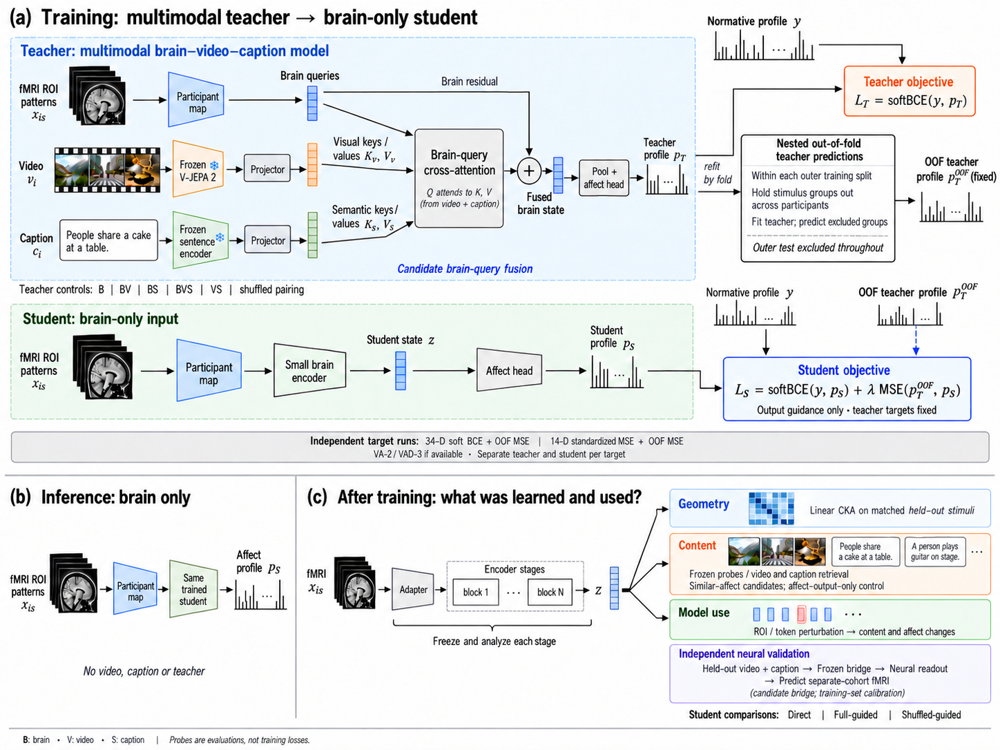
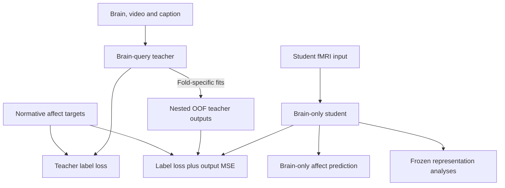

# EmoBrain model figure

_Training, inference and representation analysis · 2026-10-06_

---

## 📚 English



The figure shows the candidate brain-query teacher, output-guided brain-only student, and post-training geometry, content and model-use analyses. Equations illustrate the 34-D case: sigmoid outputs, soft BCE labels and dimension-mean OOF probability MSE. The target strip describes the separate continuous-target runs. Repeated OOF-profile symbols denote the same type of cached prediction, not different supervision sources.

Sources: [implementation specification](../current/02_IMPLEMENTATION_SPEC.md), [study design](../current/01_STORY_AND_DESIGN.md), [independent neural validation](../current/06_NEURAL_VALIDATION_AMENDMENT.md). Depth, widths and the bridge implementation remain development decisions.

### Design rationale

| Question | Answer |
| --- | --- |
| Scientific question | What can the teacher and student access, learn and use? |
| Alternative explanation | Content shortcuts or feature-matching losses could be mistaken for learned brain–content relations. |
| Basis | Current input, fusion, loss, OOF and evaluation contracts linked above. |
| Choice | Separate training, inference and frozen analysis panels expose information flow. |
| Revision criterion | Revise when an approved architecture or learning contract changes. |
| Claim limit | This schematic is not an implemented result or evidence of human neural causality. |

### Editable information flow



## 📚 한국어

이 그림은 후보 brain-query teacher, 출력 지도를 받는 brain-only student, 학습 후 geometry·content·모델 사용 분석을 보여준다. 수식은 34-D 기준으로 sigmoid 출력, soft BCE label loss, 차원 평균 OOF 확률 MSE를 나타낸다. 연속 target은 별도 학습하며 하단 target 띠에 표시했다. 반복된 OOF 프로필 표시는 동일한 종류의 예측 cache를 가리킨다.

기준 문서는 위 구현 사양·연구 설계·독립 뇌 검증 문서다. 깊이·너비·bridge 구현은 개발 단계 결정으로 남아 있다.

### 설계 근거

| 질문 | 답 |
| --- | --- |
| 과학적 질문 | Teacher와 student는 무엇에 접근하고 무엇을 학습·사용하는가? |
| 대안 설명 | Content shortcut이나 feature matching loss를 뇌–내용 관계 학습으로 오인할 수 있다. |
| 근거 | 현재 입력·fusion·loss·OOF·평가 계약. |
| 선택 이유 | 학습·추론·고정 후 분석을 나누어 정보 흐름을 보여준다. |
| 수정 기준 | 승인된 구조나 학습 계약이 바뀌면 함께 수정한다. |
| 주장 한계 | 구현 결과나 인간 뇌 인과성의 증거가 아니다. |

## 🔧 Production / 제작

Built-in image generation, using the user-provided figure as a layout reference. Reviewed inputs, residual fusion, output losses, OOF scope and evaluation routes. Independent neural validation uses held-out content rather than the evaluation brain. Illustrations and profile bars are schematic. The overview image is unchanged.

내장 이미지 도구로 제작했고 사용자 첨부 그림의 배치를 참고했다. 입력, residual fusion, 출력 loss, OOF 범위, 평가 경로를 검수했다. 독립 뇌 검증은 평가 뇌가 아니라 held-out content를 입력으로 받는다. 이미지와 프로필 막대는 설명용이며 기존 Overview는 변경하지 않았다.

### Generation prompt

```text
Create a NEW standalone model figure for the current EmoBrain design, using the attached image ONLY for its clean academic visual style and three-part layout. Do NOT reproduce obsolete weighted-MSE training or Venn-circle fusion. This is a model architecture figure separate from the study overview.

Canvas: generous landscape 4:3, high resolution, white background, crisp Helvetica/Arial, black fine arrows, subdued slate-blue brain path, muted amber video path, sage caption path. Avoid neon, gradients and decorative card styling. Small realistic grayscale MRI stack and filmstrip inputs like the reference. Legible labels, ample whitespace, safe margins. NO overall title, subtitle or date. Only panel titles.
Panel (a) upper 65% full width: training. Panel (b) bottom left 28% width: inference. Panel (c) bottom right 72% width: after-training analysis. Thin grey separators.

(a) heading "Training: multimodal teacher → brain-only student"
Main TEACHER on upper-left two thirds, 3 horizontal input pathways:
MRI stack "fMRI ROI patterns" → "Participant map" → little blue token stack "Brain queries Q"
Filmstrip "Video" → "Frozen V-JEPA 2" → "Projector" → little amber token stack "Visual keys / values"
Caption box text "People share a cake at a table." → "Frozen sentence encoder" → "Projector" → green token stack "Semantic keys / values"
All three enter a box "Brain-query cross-attention": Q from brain, K/V from video+caption. Output goes to circled "+" receiving BOTH the attention output and a clearly drawn residual arrow from Brain queries Q. Label bypass "Brain residual".
The plus outputs "Fused brain state" → "Pool + affect head" → "Teacher profile p_T" drawn as schematic bar vector.
Caption under this group "Candidate brain-query fusion". No content-only skip to affect head. No LLM, no extra object/event branch.

To the UPPER RIGHT of teacher draw normative bar vector "Normative profile y" feeding compact orange label-loss box:
"Teacher objective"
"L_T = softBCE(y, p_T)"
Clearly connect teacher profile to this loss box too. Frozen encoder icons only on pretrained video and sentence encoders, not the entire teacher.

On the RIGHT MIDDLE show a compact box headed "Nested out-of-fold teacher predictions".
Inside, only 3 short lines:
"Within each outer training split"
"Hold stimulus groups out across participants"
"Fit teacher; predict excluded groups"
At bottom a small line "Outer test excluded throughout".
From this box output a bar vector labelled "OOF teacher profile p_T^OOF (fixed)".
Use a thin connector from teacher to OOF box to indicate repeated fold-specific fits, NOT the in-sample teacher prediction serving as OOF. Label that connector "refit by fold".

Beneath teacher within PANEL (a), show a separate student TRAINING lane:
"fMRI ROI patterns" → "Participant map" → "Small brain encoder" → "Student state z" → "Affect head" → "Student profile p_S".
Label lane "Student: brain-only input".
NO video or caption input to student.
To its right a blue student objective box with TWO inputs: "Normative profile y" via solid line and "OOF teacher profile" via dashed blue line. Student prediction p_S also connects to the objective.
Exact text:
"Student objective"
"L_S = softBCE(y, p_S) + λ MSE(p_T^OOF, p_S)"
Small line "Output guidance only · teacher targets fixed"
Use readable math, not an enormous formula. OOF guidance goes to this output loss, NOT to student z. Labels also supervise teacher. No visual reconstruction or joint-latent loss.

Below these, a narrow light-grey strip across panel (a):
"Independent target runs: 34-D soft BCE + OOF MSE | 14-D standardized MSE + OOF MSE"
Second shorter line "VA-2 / VAD-3 if available · Separate teacher and student per target"
The detailed displayed p_T / p_S objectives illustrate the 34-D case only; add small label "34-D example" near the objectives.
A separate small line beneath teacher only if space "Teacher controls: B | BV | BS | BVS | VS | shuffled pairing".
Define B=brain, V=video, S=caption in small legend at bottom, no giant legend.

(b) heading "Inference: brain only"
MRI stack → "Participant map" → "Same trained student" → "Affect profile".
Arrange on two lines if needed, arrows continuous.
Below concise text "No video, caption or teacher".
This is trained student from (a), not a separately optimized decoder.

(c) heading "After training: what was learned and used?"
Left-to-right mini chain "fMRI" → "Adapter" → "Encoder stages" → "z"; bracket below "Freeze and analyze each stage". Do not prescribe exactly two blocks, depth is not frozen.
From stages or z branch to three readable stacked panels:
"Geometry" — a small heatmap; text "Linear CKA on matched held-out stimuli"
"Content" — tiny video thumbnails and caption slips; text "Frozen probes / video and caption retrieval"
second small line "Similar-affect candidates; affect-output-only control"
"Model use" — small token group one selectively perturbed; text "ROI / token perturbation → content and affect changes".
Below these three a slender fourth row
"Independent neural validation"
"Content-derived representation → separate-cohort fMRI"
small "(candidate bridge; training-set calibration)"
No arrow using held-out evaluation brain as predictor for this fourth row. Do not imply human neural causality.
At bottom line "Student comparisons: Direct | Full-guided | Shuffled-guided".
Small footer legend "B: brain · V: video · S: caption · Probes are evaluations, not training losses".

Prioritize correct information flow and readable model, not prose. All profiles/heatmaps are schematic without numeric results. Unlike reference, fusion must be explicit Q / K,V with a brain residual, student training must be visible, OOF must be nested, and current 34-D loss is unweighted soft BCE plus teacher-output MSE (NOT weighted MSE, correlation loss, KL, or softmax). Keep the scientific workflow self-contained and visually intuitive.
```

### Revision prompt

```text
Correct only three information-flow details in this scientific model figure. Keep all layout, typography, colours, model blocks, equations, panels and margins otherwise unchanged.
1. UPPER-RIGHT TEACHER OBJECTIVE: currently normative y has duplicate arrows and p_T is not clearly connected. Show exactly one arrow from the top normative profile y into 'Teacher objective', and a SEPARATE continuous thin black arrow from the actual Teacher profile p_T (the bars immediately after Pool + affect head) UP and RIGHT into that teacher objective. Remove any line between the OOF procedure box and the teacher objective. The teacher objective has exactly two incoming data lines: y and p_T.
2. The OOF teacher profile on the far upper right is duplicated just above the Student objective. REMOVE the lower duplicate OOF bar plot and its label, leaving the student normative y plot unchanged. Connect the single upper-right 'OOF teacher profile p_T^OOF (fixed)' directly DOWN to the student objective with a continuous DASHED BLUE arrow. This is the only OOF guidance line. Student objective retains its other two inputs y and p_S and its existing formula.
3. BOTTOM-RIGHT independent neural validation: REMOVE the arrow from student z to the fourth 'Independent neural validation' box. Only the first three Geometry, Content and Model use boxes receive branches from z. In the fourth box, replace the brain icon and old body text with an explicit small TWO-LINE content-only prediction route:
'Held-out video + caption → Frozen bridge → Neural readout'
'→ Predict separate-cohort fMRI'
Small italic line '(candidate bridge; training-set calibration)'.
Keep its heading 'Independent neural validation'. It must be visually separate from the three z-probe branches; no z arrow enters this box. Evaluation fMRI must not be an input. If needed increase that fourth box height slightly using bottom whitespace, but do not overlap the student-comparisons line or crop any content.
These are corrections of information flow, not changes to design. Do not add any other panels or prose.
```
