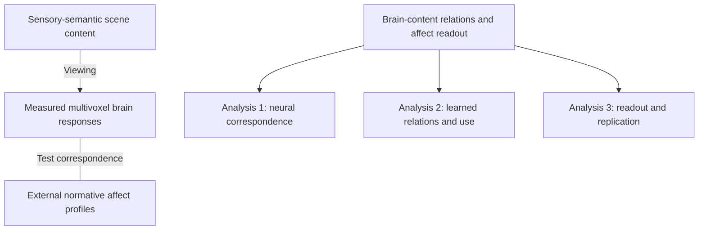
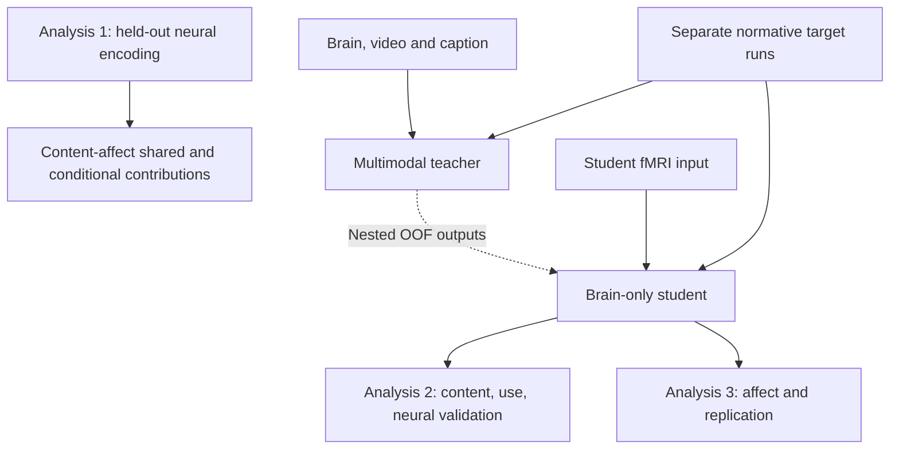

# EmoBrain study overview source

_Figure specification and editable study logic · 2026-10-06 · Not experimental results_

---

## 📚 English

### Purpose and authority

The README figure starts with the conceptual question: how do brain responses relate to scene content, and how are these relations used for affect readout? Panel a connects illustrative emotionally evocative scenes, measured multivoxel responses, high-dimensional response structure and external normative profiles. Panels b–d then distinguish direct neural correspondence (Analysis 1), learned content and model use with independent neural validation (Analysis 2), and affect readout with participant-cohort replication (Analysis 3). Teacher–student training is a subordinate tool inside Analysis 2 and also supports Analysis 3, not the study's headline or a demonstration that latent geometry transfers.

The user's conceptual reference motivates the hierarchy, not new scientific commitments. Personal memories, values, bodily state and individual experience are explicitly outside current measurements. The image does not adopt a shared-scaffold / situated-conjunction decomposition, adaptive-balance mechanism or effective-dimensionality analysis. No such analysis is added by this visual revision.

Sources: [study design](../current/01_STORY_AND_DESIGN.md), [neural-validation amendment](../current/06_NEURAL_VALIDATION_AMENDMENT.md) and [decision register](../current/04_DECISION_REGISTER.md). These documents govern interpretation; the figure does not freeze pending choices.

### Inclusion rationale

1. **Question:** How do the three analyses provide distinct evidence for the brain–content thesis?
2. **Alternative explanation:** An architecture-only diagram could imply that better prediction or output distillation alone establishes learned content and neural mechanisms.
3. **Basis:** The accepted three-analysis design and the 1b/2d amendment linked above, not new experimental evidence.
4. **Choice:** A conceptual framework followed by three color-coded complementary tests. Analysis 2 has extra space for the candidate brain-query teacher and brain-only student while retaining the post-training analyses. Removing the document-title strip allocates space to the science. Training remains a supporting tool, not the top-level research question.
5. **Revision criterion:** Update the figure if the accepted design changes or if a depicted method fails feasibility review; do not retain obsolete arrows for visual continuity.
6. **Limits:** No effect sizes, successful outcomes, causal emotion decomposition, individual feelings or confirmed bridge feasibility are claimed.

### Editable logic

The conceptual diagram below separates measured relationships from the complementary tests; the second diagram records the supporting model workflow. Connections are not evidence of biological causality. Analysis 1 is separate from teacher–student training. The frozen student supports both model interpretation and affect readout.





### Reading and scope notes

- Analysis 1a compares nested low-level, video and caption predictors of measured fMRI. Analysis 1b compares the same fMRI target with baseline, baseline + content, baseline + affect and their combination. Shared and conditional contrasts can be negative; no biological Venn proportions are implied.
- Teacher inputs include fMRI. Brain reliance must be tested against content-only teachers and pairing controls, not inferred from architecture. Student guidance is output-only and nested OOF, not a visual/semantic or joint-latent training loss.
- Analysis 2 includes teacher brain reliance, frozen student probes/retrieval, supplementary CKA, selective perturbation and independent neural validation. Affect-neighborhood retrieval is an accepted supplementary analysis, not a new training objective.
- In 2d, a content-side bridge and separately calibrated neural map predict held-out validation fMRI without receiving that evaluation brain as input. The direction is accepted, but bridge implementation, feasibility and detailed scope still require D17 validation/freezing. Calibration uses training stimuli only. Test stimuli are excluded from discovery, bridge and readout fitting.
- Analysis 3 uses independently trained 34-D and 14-D targets; VA-2/VAD-3 depend on the annotation codebook. Direct, Full-guided and Shuffled-guided students are matched comparisons. Different cohorts viewing shared videos do not establish generalization to a new stimulus distribution.
- New ROI-subset retraining (D19), imagery, LLMs, subject-personality claims and a foundation-model construction claim are not added to the overview.

### Production record

The raster is generated with the built-in image-generation tool using the exact prompt below. The Mermaid block is the editable logic source, not a pixel-reproducible renderer. Review is manual for text, arrows, scope and clipping; no automated journal-quality score, print certification or experimental validation is implied.

Selected asset: [study_overview.png](study_overview.png). The latest revision removes the title/subtitle/date strip, uses a roomier 4:3 layout and restores muted blue, terracotta and sage analysis colors. Analysis 2 now shows the candidate teacher's participant map, brain queries, frozen video/sentence encoders, content keys/values, fused brain state and affect head; the separate student receives fMRI only. The dashed OOF connector joins output profiles, not hidden states. Encoder-to-token projectors and loss details are omitted for readability; this is not a complete implementation graph and does not freeze D05. The image was visually inspected for complete margins, legible major labels and information-access boundaries. The response graph, bar heights, scenes, brain patches and participant icons are illustrative, not measured values, localization, matched-affect evidence or sample counts. Full-size viewing is recommended for small architecture labels. The reference for this edit is the previous asset in commit `2d94a58`; prior art and prompts remain in Git history without duplicate active files.

## 📚 한국어

### 목적과 기준

README 그림은 ‘장면 내용과 뇌 반응은 어떻게 관련되고, 그 관계가 정서 프로필 예측에 어떻게 사용되는가?’라는 개념적 질문으로 시작한다. 상단 a는 설명용 장면, 측정된 다중 voxel 뇌 반응, 고차원 반응 구조, 외부 규준 정서 프로필을 연결한다. 아래 b–d는 실제 뇌에서의 대응(분석 1), 학습된 내용·모델 내 사용과 독립 뇌 검증(분석 2), 정서 프로필 예측과 참가자 집단 간 재현(분석 3)을 구분한다. Teacher–student 학습은 분석 2 안의 하위 도구로 배치하고 분석 3에서도 활용한다. 연구의 핵심 결론이나 latent geometry 전달의 증거로 제시하지 않는다.

사용자가 첨부한 그림에서는 개념을 먼저 보여주는 구성만 참고했다. 개인 기억·가치·신체 상태·개인 경험은 현재 측정 범위 밖임을 명시했다. Shared scaffold / situated conjunctions 분해, adaptive balance 기전, effective dimensionality 분석은 채택하거나 새로 추가하지 않았다.

기준은 위에 연결한 연구 설계·보강 문서·결정 기록이다. 그림이 미확정 결정을 자동으로 동결하지 않는다.

### 포함 근거

1. **질문:** 세 분석은 뇌–내용 관계라는 명제에 각각 어떤 근거를 제공하는가?
2. **대안 설명:** 구조도만 제시하면 예측 성능 향상이나 출력 증류만으로 내용 학습과 신경 기전이 입증된 것처럼 보일 수 있다.
3. **근거:** 승인된 세 분석과 1b/2d 보강 방향이며, 새로운 실험 결과가 아니다.
4. **선택 이유:** 개념적 틀 아래 세 검정을 색상으로 구분한다. 분석 2를 넓혀 후보 brain-query teacher와 brain-only student를 보여주되 학습 후 분석을 유지한다. 제목 줄을 제거해 과학적 내용에 공간을 배정한다. 학습은 여전히 보조 도구이며 최상위 연구 질문을 대체하지 않는다.
5. **수정 기준:** 승인 설계가 바뀌거나 실행 가능성 검토에서 방법이 제외되면 그림도 수정한다. 모양 유지를 위해 낡은 화살표를 남기지 않는다.
6. **한계:** 효과 크기, 성공 결과, 감정의 인과적 분해, 개인 감정, bridge 실행 가능성 확정을 주장하지 않는다.

### 그림 읽기와 범위

- 분석 1a는 low-level → video 추가 → caption 추가의 중첩 encoding을 비교한다. 1b는 공통 baseline, content 추가, affect 추가, 둘 다 추가한 모델이 동일 fMRI를 예측하는지 비교한다. 공유·조건부 대비는 음수일 수 있으며 생물학적 구성 비율이 아니다.
- Teacher 입력에는 뇌가 포함된다. 실제 뇌 의존성은 content-only teacher와 pairing 대조로 검증한다. Student는 뇌만 입력받고 중첩 OOF 출력 지도를 받으며, visual/semantic/joint-latent 복원을 학습 loss로 쓰지 않는다.
- 분석 2는 teacher 뇌 의존성, 고정된 student의 probe/retrieval, 보조 CKA, 선택적 교란, 독립 뇌 검증을 포함한다. 정서 프로필 이웃 내 retrieval은 채택된 보조 분석이며 학습 목표가 아니다.
- 2d는 content-side bridge와 별도 calibration된 뇌 예측기를 사용하며, 평가할 뇌 신호를 예측 입력으로 사용하지 않는다. 보강 방향은 승인되었지만 구현·실행 가능성·세부 규칙은 D17에서 검토·동결한다. Calibration은 training 자극만 사용하고 test 자극은 discovery·bridge·readout fitting 모두에서 제외한다.
- 분석 3의 34-D와 14-D는 독립 학습이다. VA-2/VAD-3는 codebook 확인이 필요하다. Direct, Full-guided, Shuffled-guided를 비교한다. 공유 영상을 본 다른 참가자 집단에서의 재현은 새 자극 분포 일반화가 아니다.
- D19의 새 ROI subset 재학습, imagery, LLM, 개인 성격 해석, foundation model 구축은 이 그림에 추가하지 않는다.

### 제작 기록

내장 이미지 생성 도구와 아래의 정확한 프롬프트로 PNG를 만든다. 위 Mermaid는 수정 가능한 논리 원본이며 픽셀 단위 재생성기는 아니다. 글자·화살표·범위·잘림을 직접 검수하며, 자동 저널 품질 점수나 인쇄 인증, 실험 검증을 수행했다고 주장하지 않는다.

최종 파일은 [study_overview.png](study_overview.png)다. 최신 수정은 제목·부제·날짜 줄을 없애고 4:3 지면을 활용하며, 분석별 차분한 파랑·주황·초록을 복원했다. 분석 2에는 teacher의 participant map, brain query, 고정 video/sentence encoder, content key/value, fused brain state, affect head를 표시했다. 별도 student의 입력은 fMRI뿐이며 점선 OOF 지도는 hidden state가 아니라 출력 프로필 사이에 연결된다. 가독성을 위해 encoder–token projector와 loss 세부는 생략했다. 완전한 구현도가 아니며 D05를 동결하지 않는다. 여백, 주요 글자, 정보 접근 경계를 직접 확인했다. 그래프·막대·장면·뇌 색 표시·참가자 아이콘은 설명용이며 실제 값·위치·정서 유사성 근거·표본 수가 아니다. 작은 모델 글자는 원본 크기로 보는 것을 권장한다. 이번 수정의 참조 이미지는 커밋 `2d94a58`의 이전 그림이며, 과거 도안과 프롬프트는 중복 파일 없이 Git 이력에 보존한다.

## 🔧 Generation prompt / 생성 프롬프트

```text
Revise the attached EmoBrain study figure according to these instructions. Preserve the science and conceptual-first hierarchy, but expand the drawing area and substantially enlarge and detail the model inside Analysis 2. Use a spacious landscape 4:3 canvas, preferably 2400 x 1800 pixels. Reflow rather than squeeze. High-resolution editorial neuroscience paper figure, readable at 1400px. White background, dark charcoal/navy sans-serif typography, thin clean arrows. No gradients, neon, drop shadows or dashboard styling.

REMOVE COMPLETELY the top 'EmoBrain' title, 'Sensory–semantic content, brain representations and affect' subtitle and the date. Start the figure at 'a  Conceptual framework'. Retain panel headings. Use freed space for content.
Top conceptual panel occupies about 34% of canvas height. Lower three analysis panels occupy about 64%. Lower widths: Analysis 1 = 23%, Analysis 2 = 53%, Analysis 3 = 24%. Analysis 2 is visibly largest. Colour code ONLY the three analysis panels with muted pastel HEADER bands and fine borders: b Analysis 1 slate BLUE, c Analysis 2 dusty TERRACOTTA/ORANGE, d Analysis 3 SAGE GREEN. Bodies mostly white. The top conceptual panel stays neutral. Avoid decorative boxes except functionally meaningful model modules.

TOP PANEL a:
Keep question exactly "How do brain responses relate to scene content, and how are these relations used for affect readout?"
Keep left 'Emotionally evocative scenes' with birthday and ocean illustrative thumbnails; underneath 'Sensory structure' and 'Objects, actions and situation meaning'.
Arrow labelled 'Viewing' to a line-art brain labelled 'Brain responses' / 'Multivoxel fMRI patterns', and neighboring abstract dot graph labelled 'High-dimensional response structure'.
A bidirectional connector labelled 'Correspondence to test' leads to 'Normative affect profiles' with separate schematic '34-D categories' and '14-D ratings' bar profiles. Labels 'Crowdsourced stimulus-level annotations' and 'Not participant self-reports'.
Beneath these a thin dashed neutral band 'Beyond current measurements: personal memories, values, bodily state and individual emotional experience'. No arrows from this unmeasured band into the brain. Tiny note 'Hypothesis: similar affect can coexist with different scene content and neural representations.'
Do not infer a fixed shared/individual latent decomposition or emotion-generation mechanism. All art is schematic.

BOTTOM LEFT PANEL b:
Title 'b  Analysis 1' / 'Test correspondence in the brain'
Question 'Which content explains neural responses?'
Video and caption small glyphs → 'Held-out encoding' → small fMRI brain.
Two subsections:
'1a  Content → fMRI'
'Low-level controls + video + caption'
'1b  Content / affect → same fMRI'
'Shared and conditional prediction'
Small explanation 'Same held-out responses; common score'
Bottom label 'Measured brain evidence'

BOTTOM CENTRE PANEL c:
Title 'c  Analysis 2' / 'Explain learned relations'
Question 'What is learned, accessible and used?'
The top half of THIS PANEL is a genuine readable teacher-student model schematic, not just two summary boxes. Put a small heading 'Candidate brain-query model'.

TEACHER diagram occupies upper 3 rows of model area:
Inputs on left with 3 separate horizontal paths:
'fMRI ROI patterns' → 'Participant map' → 'Brain tokens (Q)'
'Video' → 'Frozen V-JEPA 2' → 'Video tokens (K,V)'
'Caption' → 'Frozen sentence encoder' → 'Caption tokens (K,V)'
These three paths converge on 'Brain-query fusion'. Q comes from brain tokens, keys/values from video and caption tokens. Fusion has a brain residual pathway; if there is room show an elegant labeled residual arrow, otherwise put 'brain residual + content update' inside fusion below its title.
Fusion outputs 'Fused brain state' → 'Affect head' → 'Teacher profile'. Can place the last 3 blocks on one horizontal line under teacher inputs to avoid microscopic text. NO direct content-to-head skip. Label group 'Teacher · training only'. Show little stacked token blocks on the three paths, not huge pictograms.
Only video and sentence encoders are marked frozen; teacher fusion and participant maps are not marked frozen.

STUDENT diagram directly underneath:
'fMRI ROI patterns' → 'Participant map' → 'Small brain encoder' → 'Student state' → 'Affect head' → 'Student profile'.
Label 'Student · brain-only training and inference'. No video or caption arrow enters this path. A dashed connector goes from the TEACHER PROFILE to the STUDENT PROFILE with label 'Nested OOF output guidance (training only)'. The guidance must target the OUTPUT comparison, not the student hidden state. If necessary put an 'Output guidance' comparison box between the two profiles and point dashed arrows from both profiles to it. Do not depict latent matching or feature reconstruction losses.
One short line under the model 'Normative targets supervise both heads; separate model per target'.
Ensure the arrows actually connect to the correct blocks. Model diagram readable, not every detail forced into tiny text.

UNDER THE MODEL inside this same c panel, draw an 'After training' subsection with 3 compact rows:
'Brain reliance' — 'Content-only controls; held-out brain swaps'
'Content and geometry' — 'Frozen probes / retrieval; CKA'
'Model use' — 'Selective ROI / token perturbation'
A small italic side callout 'Different content among similar-affect scenes?'
Then a distinct last subsection 'Independent neural validation':
'Content-derived representation → separate-cohort fMRI'
'Bridge implementation pending validation; separate training-set calibration'
'Test fMRI is evaluation only'
Bottom label 'Learned relations + independent brain evidence'
Do not let model graphic remove any of these four analysis components.

BOTTOM RIGHT PANEL d:
Title 'd  Analysis 3' / 'Test affect readout and replication'
Question 'Are the relations functionally accessible?'
Small brain → 'Same student' → schematic generic bars.
Label 'Brain-only inference'
Text 'Separate models: 34-D | 14-D'
'VA-2 / VAD-3 if codebook supports'
'Direct · Full-guided · Shuffled-guided'
Two simple participant groups with shared video, caption 'Different participants, shared stimuli'
Bottom label 'Normative prediction + replication'

Very bottom two-line footer:
'Study plan, not results · Probes are evaluations, not training losses'
'Three complementary tests, not a causal chain · Model perturbation is not neural causality'

Keep all panel labels, critical caveats and text uncropped. No giant document title, no date. Keep the conceptual panel recognizably similar to the reference while making the bottom model richer, the overall page roomier and the three analysis colours clear.
```
