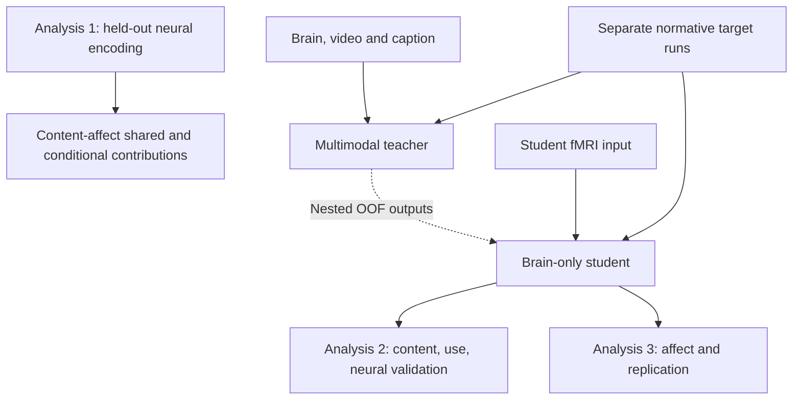

# EmoBrain study overview source

_Figure specification and editable study logic · 2026-10-06 · Not experimental results_

---

## 📚 English

### Purpose and authority

The README figure separates direct neural correspondence (Analysis 1), learned content and model use with independent neural validation (Analysis 2), and affect readout with participant-cohort replication (Analysis 3). Teacher–student training is shared preparation for Analyses 2 and 3, not a fourth analysis or a demonstration that latent geometry transfers.

Sources: [study design](../current/01_STORY_AND_DESIGN.md), [neural-validation amendment](../current/06_NEURAL_VALIDATION_AMENDMENT.md) and [decision register](../current/04_DECISION_REGISTER.md). These documents govern interpretation; the figure does not freeze pending choices.

### Inclusion rationale

1. **Question:** How do the three analyses provide distinct evidence for the brain–content thesis?
2. **Alternative explanation:** An architecture-only diagram could imply that better prediction or output distillation alone establishes learned content and neural mechanisms.
3. **Basis:** The accepted three-analysis design and the 1b/2d amendment linked above, not new experimental evidence.
4. **Choice:** One three-panel study overview with a shared-training strip, rather than adding a separate analysis or repeating a detailed architecture figure.
5. **Revision criterion:** Update the figure if the accepted design changes or if a depicted method fails feasibility review; do not retain obsolete arrows for visual continuity.
6. **Limits:** No effect sizes, successful outcomes, causal emotion decomposition, individual feelings or confirmed bridge feasibility are claimed.

### Editable logic

Arrows below represent data flow or evaluation branches, not biological causality. Analysis 1 is separate from teacher–student training. The frozen student supports both model interpretation and affect readout.



### Reading and scope notes

- Analysis 1a compares nested low-level, video and caption predictors of measured fMRI. Analysis 1b compares the same fMRI target with baseline, baseline + content, baseline + affect and their combination. Shared and conditional contrasts can be negative; no biological Venn proportions are implied.
- Teacher inputs include fMRI. Brain reliance must be tested against content-only teachers and pairing controls, not inferred from architecture. Student guidance is output-only and nested OOF, not a visual/semantic or joint-latent training loss.
- Analysis 2 includes teacher brain reliance, frozen student probes/retrieval, supplementary CKA, selective perturbation and independent neural validation. Affect-neighborhood retrieval is an accepted supplementary analysis, not a new training objective.
- In 2d, a content-side bridge and separately calibrated neural map predict held-out validation fMRI without receiving that evaluation brain as input. The direction is accepted, but bridge implementation, feasibility and detailed scope still require D17 validation/freezing. Calibration uses training stimuli only. Test stimuli are excluded from discovery, bridge and readout fitting.
- Analysis 3 uses independently trained 34-D and 14-D targets; VA-2/VAD-3 depend on the annotation codebook. Direct, Full-guided and Shuffled-guided students are matched comparisons. Different cohorts viewing shared videos do not establish generalization to a new stimulus distribution.
- New ROI-subset retraining (D19), imagery, LLMs, subject-personality claims and a foundation-model construction claim are not added to the overview.

### Production record

The raster is generated with the built-in image-generation tool using the exact prompt below. The Mermaid block is the editable logic source, not a pixel-reproducible renderer. Review is manual for text, arrows, scope and clipping; no automated journal-quality score, print certification or experimental validation is implied.

Selected asset: [study_overview.png](study_overview.png). One targeted revision replaced ambiguous teacher-control pictograms with explicit brain + video + caption versus video + caption inputs, added the brain-swap diagnostic label, and replaced invented affect-dimension names with neutral indices. The final image was visually inspected for complete margins, legible major labels and the specified information boundaries. The matrix, bar heights, pictures and participant icons are illustrative; their values, affect similarity and counts are not study observations. Full-size viewing is recommended for small annotations.

## 📚 한국어

### 목적과 기준

README 그림은 실제 뇌에서의 대응(분석 1), 학습된 내용·모델 내 사용과 독립 뇌 검증(분석 2), 정서 프로필 예측과 참가자 집단 간 재현(분석 3)을 구분한다. Teacher–student 학습은 분석 2·3의 공통 준비이며, 별도의 네 번째 분석이나 latent geometry 전달의 증거가 아니다.

기준은 위에 연결한 연구 설계·보강 문서·결정 기록이다. 그림이 미확정 결정을 자동으로 동결하지 않는다.

### 포함 근거

1. **질문:** 세 분석은 뇌–내용 관계라는 명제에 각각 어떤 근거를 제공하는가?
2. **대안 설명:** 구조도만 제시하면 예측 성능 향상이나 출력 증류만으로 내용 학습과 신경 기전이 입증된 것처럼 보일 수 있다.
3. **근거:** 승인된 세 분석과 1b/2d 보강 방향이며, 새로운 실험 결과가 아니다.
4. **선택 이유:** 공통 학습 부분과 세 연구 질문을 한 장에 표시한다. 새 분석이나 상세 모델 구조도를 추가하지 않는다.
5. **수정 기준:** 승인 설계가 바뀌거나 실행 가능성 검토에서 방법이 제외되면 그림도 수정한다. 모양 유지를 위해 낡은 화살표를 남기지 않는다.
6. **한계:** 효과 크기, 성공 결과, 감정의 인과적 분해, 개인 감정, bridge 실행 가능성 확정을 주장하지 않는다.

### 그림 읽기와 범위

- 분석 1a는 low-level → video 추가 → caption 추가의 중첩 encoding을 비교한다. 1b는 공통 baseline, content 추가, affect 추가, 둘 다 추가한 모델이 동일 fMRI를 예측하는지 비교한다. 공유·조건부 대비는 음수일 수 있으며 생물학적 구성 비율이 아니다.
- Teacher 입력에는 뇌가 포함된다. 실제 뇌 의존성은 content-only teacher와 pairing 대조로 검증한다. Student는 뇌만 입력받고 중첩 OOF 출력 지도를 받으며, visual/semantic/joint-latent 복원을 학습 loss로 쓰지 않는다.
- 분석 2는 teacher 뇌 의존성, 고정된 student의 probe/retrieval, 보조 CKA, 선택적 교란, 독립 뇌 검증을 포함한다. 정서 프로필 이웃 내 retrieval은 채택된 보조 분석이며 학습 목표가 아니다.
- 2d는 content-side bridge와 별도 calibration된 뇌 예측기를 사용하며, 평가할 뇌 신호를 예측 입력으로 사용하지 않는다. 보강 방향은 승인되었지만 구현·실행 가능성·세부 규칙은 D17에서 검토·동결한다. Calibration은 training 자극만 사용하고 test 자극은 discovery·bridge·readout fitting 모두에서 제외한다.
- 분석 3의 34-D와 14-D는 독립 학습이다. VA-2/VAD-3는 codebook 확인이 필요하다. Direct, Full-guided, Shuffled-guided를 비교한다. 공유 영상을 본 다른 참가자 집단에서의 재현은 새 자극 분포 일반화가 아니다.
- D19의 새 ROI subset 재학습, imagery, LLM, 개인 성격 해석, foundation model 구축은 이 그림에 추가하지 않는다.

### 제작 기록

내장 이미지 생성 도구와 아래의 정확한 프롬프트로 PNG를 만든다. 위 Mermaid는 수정 가능한 논리 원본이며 픽셀 단위 재생성기는 아니다. 글자·화살표·범위·잘림을 직접 검수하며, 자동 저널 품질 점수나 인쇄 인증, 실험 검증을 수행했다고 주장하지 않는다.

최종 파일은 [study_overview.png](study_overview.png)다. 한 차례 수정으로 teacher 대조를 뇌+영상+caption 대 영상+caption으로 명확히 표시하고 brain swap 진단을 추가했으며, 확인되지 않은 정서 차원 이름을 중립적인 번호로 교체했다. 최종 그림의 여백, 주요 글자, 정보 접근 경계를 직접 확인했다. 행렬·막대 높이·사진·참가자 아이콘의 값, 정서 유사성, 인원수는 연구 관측값이 아니다. 작은 주석은 원본 크기로 보는 것을 권장한다.

## 🔧 Generation prompt / 생성 프롬프트

```text
Create a polished neuroscience STUDY OVERVIEW FIGURE for the EmoBrain GitHub README, not a result figure. Landscape 3000 by 2000 pixel preferred, exceptionally readable at 1400px wide. Nature-style restrained editorial scientific figure: white background, charcoal Helvetica/Arial typography, fine dark grey arrows and separators, generous whitespace, only muted slate blue, dusty terracotta and desaturated sage accents. No neon, no gradients, no shadows, no rounded-card infographic dashboard, no clipart emoji. Small anatomically plausible grey brain illustrations and small realistic illustrative video thumbnails make it intuitive; all scientific graphics are schematic, not experimental results. Keep all margins safe, nothing cropped.

TITLE centered: "EmoBrain | From brain–content relations to affect readout"
Small subtitle: "Study overview · 2026-10-06 · Proposed analyses, not results"

LAYOUT: full-width top shared-training strip, then three vertical panels a, b, c below. Panel b slightly wider than others. Thin grey rules between panels. Main panels must be tall and airy. The main reading sequence is a to b to c but DO NOT draw causal arrows between panels. Top training strip is explicitly the common preparation for Analyses 2 and 3, not input to Analysis 1.

TOP STRIP heading "Shared training for Analyses 2 and 3".
Left show three small inputs with unmistakable labels "fMRI", "Video", "Caption" leading together to a box labeled "Brain + video + caption teacher". IMPORTANT brain must be visible among teacher inputs.
A dashed arrow from teacher to a student box labeled "Nested OOF output guidance" above it and "(training only)" below it. An independent fMRI brain icon arrow enters the student labeled "Brain-only student".
Small neutral annotation below this strip: "Normative targets supervise teacher and student · Separate training for each target".
Do not connect video or caption directly to student. Do not depict latent alignment loss. This strip is conceptual, not a detailed loss schematic.

PANEL a title two lines: "a  Analysis 1" / "Correspondence in measured brain"
Question italic: "What explains held-out fMRI?"
Subheading "1a  Content encoding"
Draw three neatly stacked feature sets "Low-level", "+ Video", "+ Caption", with a simple brace or common arrow to a small grey brain labeled "Predict fMRI". The stack indicates nested predictors, not separate image encoders.
Subheading "1b  Content–affect overlap"
Show FOUR small rows in a compact comparison list:
"Baseline"
"Baseline + content"
"Baseline + affect"
"Baseline + content + affect"
One arrow from their shared brace to text "Same held-out fMRI".
Below label: "Shared and conditional predictive contributions"
Tiny note: "Common score; signed contrasts"
No Venn diagram, no percentages, no fictitious quantitative result.

PANEL b title "b  Analysis 2" / "Learned content, use and neural validation"
Question italic: "What did the model learn and use?"
Three compact rows with small meaningful visuals:
"Brain reliance" — a brain icon and paired versus swapped input symbol; small line "Brain + content vs content-only teacher".
"Content and geometry" — small brain representation grid next to film thumbnails and caption lines; small line "Held-out probes / retrieval · CKA".
"Model use" — a few token squares with one outlined and arrow to two readouts; small line "Selective ROI / token perturbation".
A distinct slim callout: "Similar affect, different content?"
small line "Affect-neighborhood retrieval".
Lower subheading "2d  Independent neural validation".
A short illustrated pipeline entirely within this panel: "Held-out content" arrow "Frozen bridge*" arrow "Predict separate-cohort fMRI". Put independent measured brain icon only as evaluation comparator, not input to this path. Under line "*Bridge implementation pending validation".
No training arrow from the evaluation brain back into the model. Caption small "Separate training-set calibration; shared test stimuli excluded from all fitting".

PANEL c title "c  Analysis 3" / "Affect readout and replication"
Question italic "Do the relations support affect prediction?"
Grey brain icon arrow "Same brain-only student" arrow small illustrative multi-bar affect profile, labelled "Normative affect profile".
Subheading "Independent target runs"
Text "34-D categories | 14-D ratings"
Below smaller "VA-2 / VAD-3: codebook-dependent"
Add "No joint-target training".
Subheading "Matched student comparisons"
List three small lines: "Direct" / "Full-guided" / "Shuffled-guided".
Subheading "Participant-cohort replication"
Two small distinct group icons and one shared video thumbnail with text "Different participants, shared videos".
No participant counts, numeric performance, stars or assertions of success.

BOTTOM FOOTER separated by thin rule, two readable lines:
"Brain-only student at inference · Visual and semantic probes are evaluations, not training losses"
"Normative annotations are not participant self-reports · Model perturbation is not neural causality"

All quoted text should be faithfully typeset, no added claims. Use enough whitespace and large labels. Focus on the research questions and three analysis panels, not on an overly complex neural-network architecture.
```

### Targeted revision / 부분 수정

```text
Edit this EmoBrain study overview with a single targeted correction. Preserve the full canvas, all other panels, title, shared training strip, typography, colors, layout and footer exactly. ONLY replace the confusing pictograms in the row labelled '2a Brain reliance' in the central Analysis 2 panel. In that row, show two clearly labelled small configurations SIDE BY SIDE: on the left a small brain icon + video thumbnail + caption sheet, with the exact short label 'Brain + video + caption'; in the middle 'vs'; on the right the same video thumbnail + caption sheet without a brain, with the exact short label 'Video + caption'. Under both configurations add the readable small text 'Matched teachers + held-out brain swaps'. No ghost outline brain, no duplicated unlabeled video, and no 'brain vs brain' diagram. Keep everything legible within that row; do not intrude into the content/geometry row below. Also remove the invented affect-dimension names below the illustrative bar profile in panel c (Joy/Sad/Anger/Fear/Disgust/Neutral) and replace them with neutral indexed labels '1  2  3  ...  D'; preserve the bar heights and the 'Normative affect profile' heading. This avoids implying an unverified annotation codebook. Make no other content changes.
```
