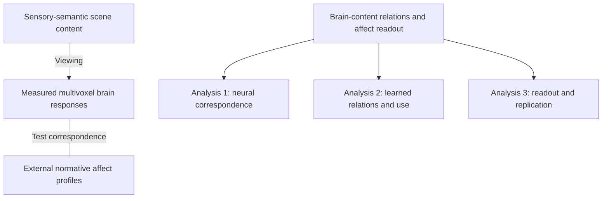
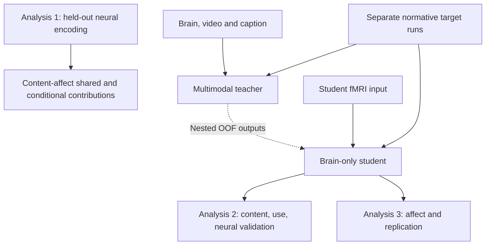

# EmoBrain study overview source

_Figure specification and editable study logic · 2026-10-06 · Not experimental results_

---

## 📚 English

### Purpose and authority

The README figure starts with the conceptual question: how do brain responses relate to scene content, and how are these relations used for affect readout? Panel a connects illustrative emotionally evocative scenes, measured multivoxel responses, high-dimensional response structure and external normative profiles. Panels b–d then distinguish direct neural correspondence (Analysis 1), learned content and model use with independent neural validation (Analysis 2), and affect readout with participant-cohort replication (Analysis 3). Teacher–student training is a subordinate tool inside Analysis 2 and also supports Analysis 3, not the study's headline or a demonstration that latent geometry transfers.

The user's conceptual reference motivates the hierarchy, not new scientific commitments. Personal memories, values, bodily state and individual experience are explicitly outside current measurements. The image does not adopt a shared-scaffold / situated-conjunction decomposition, adaptive-balance mechanism or effective-dimensionality analysis. No such analysis is added by this visual revision.

Sources: [study design](../current/01_STORY_AND_DESIGN.md), [neural-validation amendment](../current/06_NEURAL_VALIDATION_AMENDMENT.md) and [decision register](../current/04_DECISION_REGISTER.md). These documents govern interpretation; the figure does not freeze pending choices.

### Inclusion rationale

1. **Question:** How do the three analyses provide distinct evidence for the brain–content thesis?
2. **Alternative explanation:** An architecture-only diagram could imply that better prediction or output distillation alone establishes learned content and neural mechanisms.
3. **Basis:** The accepted three-analysis design and the 1b/2d amendment linked above, not new experimental evidence.
4. **Choice:** A large conceptual framework followed by three complementary tests; training is shown as a smaller supporting tool. The previous top-level training strip obscured the whole-study motivation, as the user's feedback identified.
5. **Revision criterion:** Update the figure if the accepted design changes or if a depicted method fails feasibility review; do not retain obsolete arrows for visual continuity.
6. **Limits:** No effect sizes, successful outcomes, causal emotion decomposition, individual feelings or confirmed bridge feasibility are claimed.

### Editable logic

The conceptual diagram below separates measured relationships from the complementary tests; the second diagram records the supporting model workflow. Connections are not evidence of biological causality. Analysis 1 is separate from teacher–student training. The frozen student supports both model interpretation and affect readout.





### Reading and scope notes

- Analysis 1a compares nested low-level, video and caption predictors of measured fMRI. Analysis 1b compares the same fMRI target with baseline, baseline + content, baseline + affect and their combination. Shared and conditional contrasts can be negative; no biological Venn proportions are implied.
- Teacher inputs include fMRI. Brain reliance must be tested against content-only teachers and pairing controls, not inferred from architecture. Student guidance is output-only and nested OOF, not a visual/semantic or joint-latent training loss.
- Analysis 2 includes teacher brain reliance, frozen student probes/retrieval, supplementary CKA, selective perturbation and independent neural validation. Affect-neighborhood retrieval is an accepted supplementary analysis, not a new training objective.
- In 2d, a content-side bridge and separately calibrated neural map predict held-out validation fMRI without receiving that evaluation brain as input. The direction is accepted, but bridge implementation, feasibility and detailed scope still require D17 validation/freezing. Calibration uses training stimuli only. Test stimuli are excluded from discovery, bridge and readout fitting.
- Analysis 3 uses independently trained 34-D and 14-D targets; VA-2/VAD-3 depend on the annotation codebook. Direct, Full-guided and Shuffled-guided students are matched comparisons. Different cohorts viewing shared videos do not establish generalization to a new stimulus distribution.
- New ROI-subset retraining (D19), imagery, LLMs, subject-personality claims and a foundation-model construction claim are not added to the overview.

### Production record

The raster is generated with the built-in image-generation tool using the exact prompt below. The Mermaid block is the editable logic source, not a pixel-reproducible renderer. Review is manual for text, arrows, scope and clipping; no automated journal-quality score, print certification or experimental validation is implied.

Selected asset: [study_overview.png](study_overview.png). Redesigned after the user's feedback to prioritize conceptual motivation over training. A targeted correction made fMRI an explicit teacher and student input and removed a misleading student-to-brain output arrow. The final image was visually inspected for complete margins, legible major labels and the specified information boundaries. The response-structure graph, bar heights, scene pictures, brain patches and participant icons are illustrative; their values, affect similarity, localization and counts are not study observations. Full-size viewing is recommended for small annotations. The user-supplied conceptual image was a layout reference only and is not redistributed in this repository. The former asset and prompt remain recoverable from Git history, not as duplicate active files.

## 📚 한국어

### 목적과 기준

README 그림은 ‘장면 내용과 뇌 반응은 어떻게 관련되고, 그 관계가 정서 프로필 예측에 어떻게 사용되는가?’라는 개념적 질문으로 시작한다. 상단 a는 설명용 장면, 측정된 다중 voxel 뇌 반응, 고차원 반응 구조, 외부 규준 정서 프로필을 연결한다. 아래 b–d는 실제 뇌에서의 대응(분석 1), 학습된 내용·모델 내 사용과 독립 뇌 검증(분석 2), 정서 프로필 예측과 참가자 집단 간 재현(분석 3)을 구분한다. Teacher–student 학습은 분석 2 안의 하위 도구로 배치하고 분석 3에서도 활용한다. 연구의 핵심 결론이나 latent geometry 전달의 증거로 제시하지 않는다.

사용자가 첨부한 그림에서는 개념을 먼저 보여주는 구성만 참고했다. 개인 기억·가치·신체 상태·개인 경험은 현재 측정 범위 밖임을 명시했다. Shared scaffold / situated conjunctions 분해, adaptive balance 기전, effective dimensionality 분석은 채택하거나 새로 추가하지 않았다.

기준은 위에 연결한 연구 설계·보강 문서·결정 기록이다. 그림이 미확정 결정을 자동으로 동결하지 않는다.

### 포함 근거

1. **질문:** 세 분석은 뇌–내용 관계라는 명제에 각각 어떤 근거를 제공하는가?
2. **대안 설명:** 구조도만 제시하면 예측 성능 향상이나 출력 증류만으로 내용 학습과 신경 기전이 입증된 것처럼 보일 수 있다.
3. **근거:** 승인된 세 분석과 1b/2d 보강 방향이며, 새로운 실험 결과가 아니다.
4. **선택 이유:** 큰 개념적 틀 아래 세 검정을 배치하고 학습은 작은 보조 도구로 표시한다. 이전 상단 학습 박스가 전체 연구 동기를 가렸다는 사용자 피드백을 반영했다.
5. **수정 기준:** 승인 설계가 바뀌거나 실행 가능성 검토에서 방법이 제외되면 그림도 수정한다. 모양 유지를 위해 낡은 화살표를 남기지 않는다.
6. **한계:** 효과 크기, 성공 결과, 감정의 인과적 분해, 개인 감정, bridge 실행 가능성 확정을 주장하지 않는다.

### 그림 읽기와 범위

- 분석 1a는 low-level → video 추가 → caption 추가의 중첩 encoding을 비교한다. 1b는 공통 baseline, content 추가, affect 추가, 둘 다 추가한 모델이 동일 fMRI를 예측하는지 비교한다. 공유·조건부 대비는 음수일 수 있으며 생물학적 구성 비율이 아니다.
- Teacher 입력에는 뇌가 포함된다. 실제 뇌 의존성은 content-only teacher와 pairing 대조로 검증한다. Student는 뇌만 입력받고 중첩 OOF 출력 지도를 받으며, visual/semantic/joint-latent 복원을 학습 loss로 쓰지 않는다.
- 분석 2는 teacher 뇌 의존성, 고정된 student의 probe/retrieval, 보조 CKA, 선택적 교란, 독립 뇌 검증을 포함한다. 정서 프로필 이웃 내 retrieval은 채택된 보조 분석이며 학습 목표가 아니다.
- 2d는 content-side bridge와 별도 calibration된 뇌 예측기를 사용하며, 평가할 뇌 신호를 예측 입력으로 사용하지 않는다. 보강 방향은 승인되었지만 구현·실행 가능성·세부 규칙은 D17에서 검토·동결한다. Calibration은 training 자극만 사용하고 test 자극은 discovery·bridge·readout fitting 모두에서 제외한다.
- 분석 3의 34-D와 14-D는 독립 학습이다. VA-2/VAD-3는 codebook 확인이 필요하다. Direct, Full-guided, Shuffled-guided를 비교한다. 공유 영상을 본 다른 참가자 집단에서의 재현은 새 자극 분포 일반화가 아니다.
- D19의 새 ROI subset 재학습, imagery, LLM, 개인 성격 해석, foundation model 구축은 이 그림에 추가하지 않는다.

### 제작 기록

내장 이미지 생성 도구와 아래의 정확한 프롬프트로 PNG를 만든다. 위 Mermaid는 수정 가능한 논리 원본이며 픽셀 단위 재생성기는 아니다. 글자·화살표·범위·잘림을 직접 검수하며, 자동 저널 품질 점수나 인쇄 인증, 실험 검증을 수행했다고 주장하지 않는다.

최종 파일은 [study_overview.png](study_overview.png)다. 사용자 피드백에 따라 학습 절차보다 개념적 동기를 앞세우도록 다시 구성했다. 부분 수정으로 teacher와 student의 fMRI 입력을 명시하고, student가 뇌를 생성하는 것처럼 보이는 화살표를 제거했다. 최종 그림의 여백, 주요 글자, 정보 접근 경계를 직접 확인했다. 반응 구조 그래프·막대·장면·뇌의 색 표시·참가자 아이콘은 설명용이며 실제 값, 정서 유사성, 해부학적 위치, 인원수를 나타내지 않는다. 작은 주석은 원본 크기로 보는 것을 권장한다. 사용자 첨부 개념도는 배치 참고용이며 저장소에 재배포하지 않는다. 이전 그림과 프롬프트는 별도 현행 사본을 만들지 않고 Git 이력에 보존한다.

## 🔧 Generation prompt / 생성 프롬프트

```text
Create a completely redesigned, exceptionally clear full-study neuroscience overview for EmoBrain. The attached image is ONLY a reference for putting CONCEPTUAL FRAMEWORK and a prominent brain BEFORE methodology; do NOT copy its untested constructs or its individualized-experience claims.

Scientific editorial style reminiscent of Nature: white background, crisp charcoal/navy Helvetica, restrained muted blue/ochre/sage, thin rules, simple elegant brain line art with small colored response patches, realistic tiny scene illustrations, ample whitespace. No gradient panels, no dashboard cards, no neon, no stock 3D brain CGI. Landscape 3:2, high resolution. Large readable typography. Treat as a journal overview not a conference model architecture. Keep generous safe margins.

TITLE "EmoBrain"
SUBTITLE "Sensory–semantic content, brain representations and affect"
Small date "Study framework · 2026-10-06"

COMPOSITION: Top 45% is a full-width panel a with the scientific idea and central question. Bottom 55% is three aligned panels b, c, d, corresponding to Analysis 1, Analysis 2, Analysis 3. Panel c slightly wider. Main attention should be the top concept, NOT the teacher architecture. NO shared-training header at top.

TOP a heading "a  Conceptual framework"
Central question in bold just below:
"How do brain responses relate to scene content, and how are these relations used for affect readout?"

Across this top panel, draw three major groups.
LEFT group heading "Emotionally evocative scenes". Two small tasteful scene illustrations: people sharing a birthday cake, and a dramatic ocean landscape. Below them two short lines "Sensory structure" and "Objects, actions and situation meaning". Small footnote "Illustrative scenes".
CENTER group heading "Brain responses". A large anatomically plausible line-art brain, small dispersed blue and ochre response squares on its surface, no named emotion centers. Subtitle "Multivoxel fMRI patterns". Next to brain, within same group, a small sparse cloud of interconnected colored dots, labelled "High-dimensional response structure". Do not depict a settled two-subspace theory or a dimensionality estimate.
RIGHT group heading "Normative affect profiles". Two tiny generic multibar profiles labelled "34-D categories" and "14-D ratings". These are separate reference spaces, not simultaneous training outputs. Under profiles label "Crowdsourced stimulus-level annotations" and "Not participant self-reports".
Draw a single solid arrow from scenes to brain labelled "Viewing". Between brain-response structure and normative profiles draw a bidirectional thin arrow labelled "Correspondence to test". A subtle bracket or line under scenes plus brain states "Brain–visual–semantic relations" (not causal mediation).
Below these groups a small light-grey dashed-border horizontal band titled "Beyond the current measurements". Body "Personal memories, values, bodily state and individual emotional experience". No arrows from this band into the measured model. It is theoretical context, not observed variables or new analyses. Do not claim these are measured or recovered.
One small note at bottom of panel a: "Hypothesis: similar affect can coexist with different scene content and neural representations."
Do not claim that emotion equals visual plus semantic input. No 'adaptive balance', 'shared scaffold', 'situated conjunctions' or 'effective dimensionality estimated'.

BOTTOM PANEL b heading "b  Analysis 1" then "Test correspondence in the brain"
Question italic "Which content explains neural responses?"
Mini graphic: small VIDEO + CAPTION glyphs point via arrow labelled "Held-out encoding" to small brain.
Two clear numbered study components:
"1a  Content → fMRI"
"Low-level controls + video + caption"
"1b  Content / affect → same fMRI"
"Shared and conditional prediction"
Below a short summary "Measured brain evidence".
No fake effect maps, quantitative effects, Venn proportions or significance stars.

BOTTOM PANEL c heading "c  Analysis 2" then "Explain learned relations"
Question italic "What is learned, accessible and used?"
Small SUBORDINATE preparation line at top of this lower panel:
"Brain + video + caption → Teacher"
"OOF output guidance → Brain-only student"
Under it tiny label "Training tool, not the scientific conclusion".
The student has fMRI as its ONLY input; OOF guidance is during training only. Avoid a complex architecture drawing; these two lines occupy less than 15% of panel c.
Then three compact rows with simple icons, not giant boxes:
"Brain reliance" / "Content-only controls; brain swaps"
"Content and geometry" / "Held-out retrieval; CKA"
"Model use" / "Selective ROI / token perturbation"
A small italic question "Different content among similar-affect scenes?"
Then a clearly separated last row:
"Independent neural validation"
"Content-derived representation → separate-cohort fMRI"
Tiny note "Bridge implementation pending validation"
and "Training-set calibration; test fMRI is evaluation only".
Caption below panel "Learned model relations + independent brain evidence".
Do not suggest CKA establishes use or individual feelings.

BOTTOM PANEL d heading "d  Analysis 3" then "Test affect readout and replication"
Question italic "Are the relations functionally accessible?"
Small simple brain icon → small 'Same student' block → generic multi-bar profile. Label "Brain-only inference".
Text "Separate models: 34-D | 14-D"
Text "VA-2 / VAD-3 if codebook supports"
Text "Direct · Full-guided · Shuffled-guided"
Then small two participant-group icons sharing one VIDEO glyph, label "Different participants, shared stimuli".
Caption below "Normative prediction + cohort replication".
No exact participant counts, no joint training, no new-stimulus-distribution claims.

BOTTOM FOOTER two very legible small lines:
"Three complementary tests — not a causal chain or an emotion-generation model"
"Study plan, not results · Probes are evaluations, not training losses · Model perturbation is not neural causality"

All figures, profiles, icons and example scenes are schematic, not evidence. Preserve scientific distinctions. Avoid additional jargon, equations, giant loss boxes, crowded arrow spaghetti or tiny text. Give the scientific concept clear visual priority, with methods as supporting tests below.
```

### Targeted revision / 부분 수정

```text
Make one surgical correction to the small training inset inside panel c (Analysis 2) of this image. Preserve EVERYTHING else exactly: the conceptual framework, all brain and scene illustrations, all text, panels b and d, the lower analysis tests, margins and layout. The training inset currently wrongly omits brain as a teacher input and shows a brain after the student, suggesting brain generation. Replace ONLY that inset diagram with this unambiguous two-row schematic, keeping within its existing rectangle. TOP ROW: exact text 'fMRI + video + caption' → a small box 'Teacher'. BOTTOM ROW: exact text 'fMRI only' → a small box 'Student'. Put Teacher directly above Student at the right so one DASHED DOWNWARD arrow goes from Teacher to Student, labelled 'Nested OOF output guidance' and '(training only)' in two short lines to its left or right. Make sure the dashed guidance arrow is visually separate from the solid fMRI input arrow. There must be NO arrow from Student to any brain illustration, NO generated fMRI, and no video/caption input to Student. REMOVE the old video icon, caption icon and output brain icon from this inset. Beneath the inset preserve the italic note 'Training tool, not the scientific conclusion'. Use clean small text rather than decorative icons for this inset. Do not change anything outside this small training inset.
```
