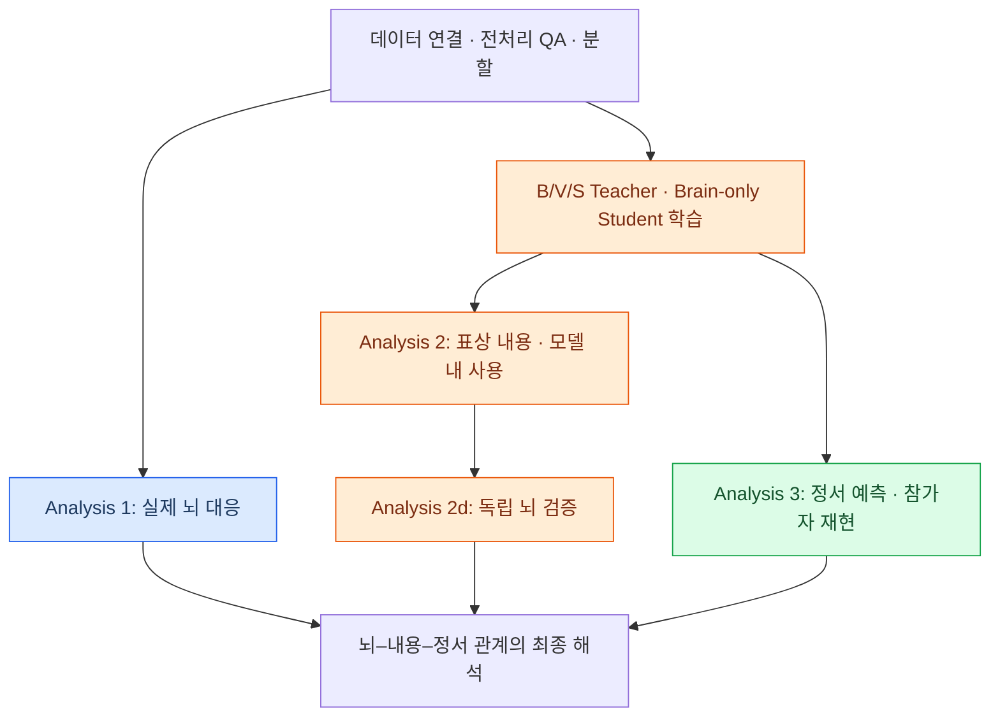
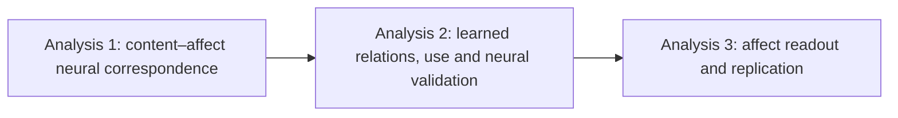
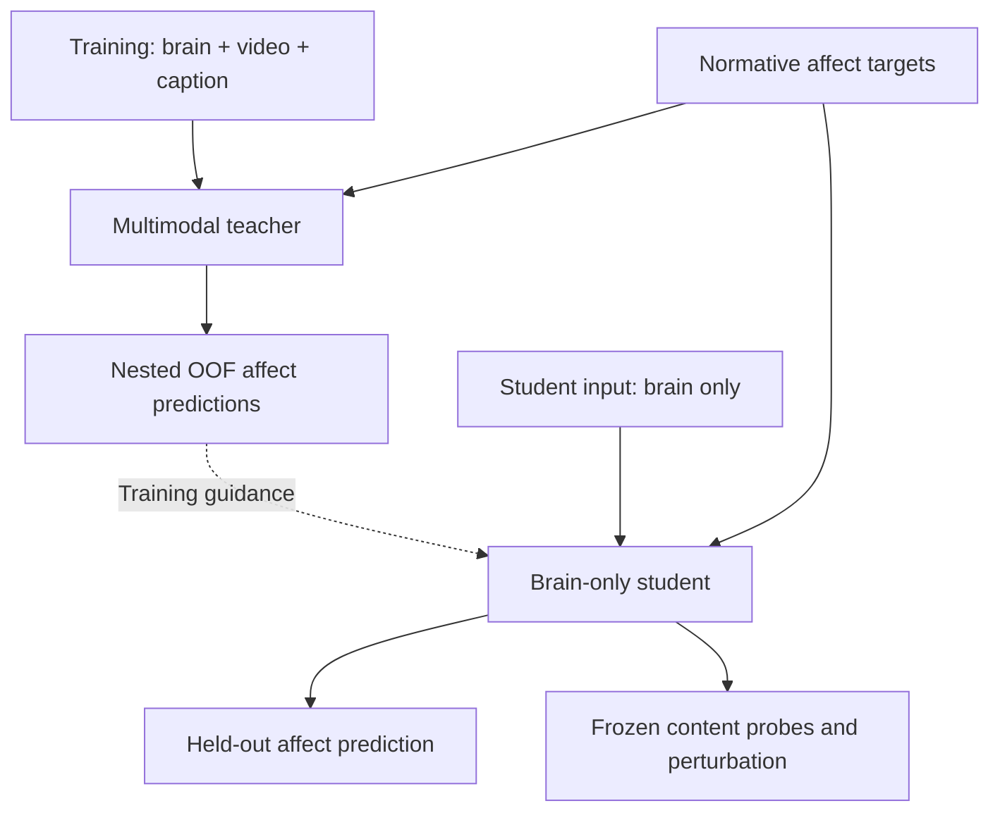
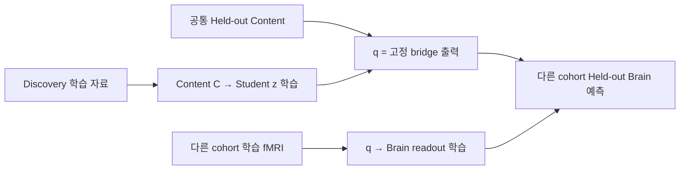

# EmoBrain 전체 연구 흐름: 질문에서 모델, 해석과 논문까지

_문석진 연구자용 전체 설명서 · 2026-10-08 · 현재 설계를 설명하는 문서이며 실험 결과 보고서는 아님_

**학위논문 가제**

Development and Validation of a Multimodal Learning Framework for Modeling and Interpreting Affective Brain Representations

멀티모달 학습을 통한 정서 관련 뇌 표상의 모델링 및 해석 프레임워크 개발과 검증

이 문서는 연구의 전체 논리를 한 곳에서 이해하기 위한 설명서다. 0절에서 실제 실행 순서를 먼저 보고, 1–7절에서 질문·세 분석·설계 이유·주장 범위를 읽은 뒤, 8–12절에서 데이터 준비·수식·OOF·사후 분석을 구체적으로 이해하면 된다. 설명용 케이크 장면과 숫자는 실제 실험 결과가 아닌 가상 예시다.

| 읽을 부분 | 답하는 질문 |
|---|---|
| 0–1. 전체 지도와 연구 질문 | 우리는 왜 이 연구를 하며 무엇을 주장하려 하나? |
| 2. 세 분석 | 실제 뇌 → 학습된 모델 → 정서 readout이 어떻게 연결되나? |
| 3–6. 모델·통제·학습 목표 | 각 입력과 학습 전략을 왜 쓰나? |
| 7. 해석 | 어떤 결과에서 무엇까지 주장할 수 있나? |
| 8. 데이터 준비 | 원자료에서 자극별 brain/visual/semantic/affect가 어떻게 만들어지나? |
| 9. 모델과 loss 상세 | Participant Map, Cross-Attention, Joint Latent와 loss 수식은 무엇인가? |
| 10. OOF 상세 | Teacher의 답을 어떻게 만들어 student에 전달하나? |
| 11. 세 분석의 실제 계산 | Encoding·CKA·retrieval·perturbation·독립 뇌 검증을 어떻게 하나? |
| 12. 실행과 완성 | 지금부터 무엇을 순서대로 하고 어떤 결과물로 논문을 완성하나? |

---

## 📍 0. 전체 연구를 먼저 한 번에 연결해 보기

### 출발 장면

영상 A에는 친구들이 생일 케이크를 나누는 장면, 영상 B에는 혼자 아름다운 풍경을 바라보는 장면이 있다고 하자. 두 영상이 비슷한 긍정적 정서 프로필을 얻더라도, 색·물체·움직임·인물 관계·상황은 다르다. 두 영상의 정서 점수를 뇌에서 잘 예측했다고 해서 어떤 정보가 예측을 가능하게 했는지까지 설명된 것은 아니다.

우리는 그 빈칸을 조사한다. **실제 뇌 반응과 장면 내용 사이의 관계를 확인하고, 모델이 그 관계를 어떻게 학습하고 예측에 사용하는지 분석한다.** 성능은 그 표현의 기능적 평가이지 연구 전체의 유일한 목적이 아니다.

### 논문의 흐름과 실행 순서



논문은 Analysis 1 → 2 → 3으로 설명하지만, 실제로는 **분석 2와 3이 같은 teacher/student 학습 결과를 공유한다.** 모델을 고정하고 안에 무엇이 있는지 조사하면 분석 2, 그 모델의 원래 affect output을 평가하면 분석 3이다. 분석 2를 마친 뒤 새로운 decoding architecture를 추가하는 것이 아니다.

Analysis 1의 encoding model은 별도 분석 도구다. 그 가중치를 teacher에 반드시 넣는 구조가 아니며, encoding이 좋은 ROI만 사후 골라 후속 모델에 넣도록 정해진 것도 아니다. 데이터 준비가 끝나면 encoding과 모델 구현을 일부 병행할 수 있다.

실제 작업을 한 줄씩 이어 쓰면 다음과 같다.

1. 원 fMRI·영상·caption·annotation을 확보한다.
2. 전처리와 QC를 검토하고 자극당 fMRI 공간 패턴을 만든다.
3. 각 brain observation을 정확한 영상·caption·label에 연결한다.
4. 같은 내용·반복 회차·run 구조를 고려해 학습과 평가를 나눈다.
5. Frozen video/caption feature와 저수준 통제를 준비한다.
6. Analysis 1에서 내용과 정서 주석으로 실제 뇌를 예측한다.
7. 허용된 학습 범위 안에서 B/V/S teacher를 학습하고 뇌 사용을 검사한다.
8. Recipient 자극을 보지 않은 teacher의 OOF 예측을 만든다.
9. 원 label과 OOF 출력으로 brain-only student를 학습한다.
10. 학습된 student를 고정해 geometry·content·model use를 조사한다.
11. 같은 student의 held-out affect prediction을 평가한다.
12. 내용 관련 모델 표현을 독립 뇌 자료에 연결하고 두 번째 cohort에서 재현을 평가한다.
13. 각 결과가 지지하는 주장과 남은 대안 설명을 함께 논문으로 정리한다.

이 순서는 실행 의존성을 설명한다. 앞 단계의 양성 결과만 남기고 나머지를 숨기는 gate가 아니다. 신호가 약하거나 결과가 연결되지 않는 경우도 조사·보고한다.

---

## 🎯 1. Thesis와 central question

### 논문의 중심 명제

정서를 유발하는 자연 장면에 대한 뇌 반응은 장면의 시공간적 시각 내용과 상황 의미에 체계적으로 연결되어 있을 수 있다. 본 연구는 이 관계가 모델에 학습되는지, brain-only representation에서 읽히는지, 그리고 normative affect readout에 실제 사용되는지를 검정한다.

영문 working thesis:

> Brain responses to emotionally evocative scenes may be systematically related to spatiotemporal visual and situation-semantic content. We test whether these relations are learned, recoverable from brain-only representations, and used by the model for normative affect readout.

영문 central RQ:

> How are neural responses to emotionally evocative scenes related to their sensory–semantic content, and how are these brain–content relations learned and used for high-dimensional normative affect readout?

이는 결과를 미리 선언하는 thesis가 아니라 검정할 주장이다. 연구의 중심은 **뇌**이고, annotation geometry나 decoding score는 뇌–내용 관계를 평가하는 외부 좌표와 기능적 endpoint다.

### 감정 이론과의 관계

출발점은 ‘기쁨’ 같은 언어적 label이 서로 다른 감각·상황·기억·신체 과정의 결과를 묶을 수 있다는 문제의식이다. 그러나 현재 자료로 감정 전체가 sensory + semantic으로 환원된다고 증명할 수는 없다. 개인 기억, interoception, 실제 주관 경험을 직접 측정하지 않기 때문이다.

Kragel et al.의 visual emotion schema 연구를 개념적 출발점으로 삼되, 특정 visual network의 성공을 곧 인간 감정의 완전한 생성 원리로 확대하지 않는다. Horikawa 연구는 고차원 affect annotation과 뇌 반응을 연결하는 데이터·분석 맥락을 제공한다.[^1][^2]

‘A와 B가 모두 기쁨으로 평가되고 뇌 반응 일부가 비슷하다’는 결과만으로 그 공통 성분이 순수한 기쁨 code라고 단정하지 않는다. 공유된 시각 내용, 상황 의미, 과제 구조, 자극 순서라는 대안 설명을 함께 다룬다.

### 연구에서 말하지 않을 것

- fMRI 참가자 개인이 실제로 느낀 감정을 복원했다는 주장
- 34개 category가 독립적인 생물학적 감정 실체라는 주장
- V-JEPA 2는 순수 visual, caption encoder는 순수 semantic이라는 이분법
- Teacher output distillation만으로 joint latent geometry가 전달되었다는 주장
- Attention map 또는 activation patching만으로 인간 뇌의 인과기제를 찾았다는 주장
- 같은 영상의 다른 참가자 cohort를 새로운 자극 분포에 대한 독립 검증이라고 부르는 것

## 📚 2. 논문의 세 단계



### Analysis 1 — 실제 뇌에서 내용과 정서의 대응

Analysis 1a는 기존 content encoding이며, 1b는 2026-10-06 승인된 보강이다. 모델 내부의 관계가 아니라 측정된 뇌 반응에서 content와 affect annotation의 연결을 직접 평가한다.

질문은 ‘어떤 내용 좌표가 held-out 자극의 뇌 반응을 예측하는가?’다. Low-level visual control `L`, frozen video feature `V`, frozen caption feature `S`를 사용해 `L`, `L+V`, `L+V+S`의 cross-validated encoding을 비교한다. `L+S`는 visual의 조건부 기여까지 대칭적으로 보려는 경우의 사전 지정 보조 비교다.

핵심 대비는 `L+V − L`과 `L+V+S − (L+V)`다. 각 모델의 held-out prediction을 비교하며, low-level baseline을 모든 중첩 모델에 유지한다. 이로써 단순한 밝기·색·움직임 통계와 비교한 추가 설명력을 묻는다. Encoding과 decoding은 서로 다른 질문에 답한다.[^3]

1b에서는 content C=[V,S], normative affect E, 공통 low-level/nuisance baseline G로 `G`, `G+C`, `G+E`, `G+C+E`가 동일 held-out fMRI를 예측하는지 비교한다. 34-D와 14-D E는 별도 실행한다. Content·affect의 조건부 증분과 공유 예측 성분을 구분하며, signed out-of-sample score와 동일 분모를 사용한다. 음수 성분을 0으로 잘라 생물학적 구성 비율로 그리지 않는다. Primary/secondary와 family는 기존 1a 대비를 포함해 다시 동결한다. 근거·산식·제약은 [보강 문서](06_NEURAL_VALIDATION_AMENDMENT.md)에 있다.[^10]

1a에 성공하면 ‘검사한 content representation이 뇌 반응과 대응한다’고 말할 수 있다. 1b의 공유 설명력은 normative-affect-associated brain response와의 예측적 중첩이지 감정 생성의 인과적 매개가 아니다. 성공만으로 뇌가 해당 network를 구현한다거나 그 정보가 정서 예측에 사용된다고 말할 수는 없다. 다음 분석이 필요한 이유다.

### Analysis 2 — 학습된 관계·모델 내 사용·독립 뇌 검증

이 분석이 논문의 중심이다. Teacher의 입력은 `B+V+S`, student의 입력은 `B`다. Teacher는 학습 시 추가 정보를 제공하는 장치이며, test-time 접근이 없는 정보로 학습을 안내하는 발상은 privileged information/distillation과 연결된다.[^4]

기존 모델 내부 분석 2a–c와 실제 뇌 검증 2d를 분리한다. Teacher–student 학습은 Analysis 2·3의 공통 준비이지 분석의 결론 자체가 아니다. 먼저 다음 세 질문을 다룬다.

1. **Teacher 형성:** video와 caption만으로 해결하지 않고 실제 fMRI에 의존하는가? 올바른 brain–content pairing이 frozen teacher의 표현과 output을 바꾸는가?
2. **Student 내용:** output guidance를 받은 brain-only student에서 visual·semantic 내용이 Direct 및 Shuffled-guided보다 더 잘 읽히는가?
3. **모델 내 사용:** 사전 정의된 일부 brain token/ROI나 내부 경로를 교란했을 때 content retrieval과 affect output이 함께 바뀌는가?

첫째는 matched teacher control과 brain/content swap, 둘째는 low-capacity held-out probe/retrieval, 셋째는 선택적 perturbation/patching으로 조사한다. CKA는 단계별 표상 구조의 유사성을 요약하는 보조 지표다.[^5] 각 방법의 양성 결과는 서로 대체되지 않는다.

2d는 모델에서 발견한 내용 관련 표현을 검증할 뇌 신호를 입력으로 사용하지 않는 독립 neural validation이다. 구현 권고는 discovery 자료에서 `content C → frozen student z`의 작은 bridge를 학습·고정하고, 그 content-recoverable projection으로 별도 참가자의 held-out fMRI를 예측하는 것이다. Validation cohort의 training stimuli로 neural readout을 calibration할 수 있으나, 공통 test 자극은 discovery·bridge·readout 학습 전체에서 제외한다. Original-content 및 Direct-derived projection과 비교하며, projection은 C의 함수이므로 새 정보나 뇌와 동일한 계산을 입증하지 않는다. 구체 구현은 pilot과 D17의 동결을 거친다.[^1]

사용자가 채택한 Analysis 2의 정식 보조 분석은 ‘정서 프로필이 가까운 후보들 사이에서도 content를 구별하는가?’라는 affect-neighborhood retrieval이다. 전체 34-D/14-D 연속 profile을 따로 사용하고 단일 emotion threshold나 공동학습은 하지 않는다. Affect-output-only probe를 필수 비교로 포함해 label-profile 재표현 대안을 점검한다. D18은 채택 여부가 아니라 거리·후보 수·coverage·null의 동결을 다룬다. 불충분한 coverage는 미실행/한계로 보고하며 사후 좋은 후보만 고르지 않는다.[^7]

### Analysis 3 — 기능적 readout과 재현

앞 단계에서 조사한 brain-only representation으로 고차원 normative affect profile을 얼마나 읽을 수 있는지 평가한다. ‘갑자기 decoding을 추가’하는 것이 아니라, 관찰된 brain–content 관계가 논문의 정서적 질문에 연결되는지를 확인하는 endpoint다.

34-D, 14-D, VA-2, VAD-3는 각각 별도의 모델로 학습한다. 34-D를 mechanistic analysis의 기준으로 삼되 14-D를 배제하지 않는다. VA/VAD는 실제 annotation codebook에 대응 열이 있는지 확인한 뒤 사용한다. 다른 참가자 cohort에서 동일한 분석 규칙을 적용하되, 공유 자극이라는 범위를 명시한다.

## ⚙️ 3. 모델의 역할과 학습 흐름

### 모델 개요



OOF는 out-of-fold, 즉 해당 자극을 학습하지 않은 teacher의 예측이다. 실제 구현에서는 student의 바깥 test set까지 제외한 nested OOF여야 한다. 전 데이터에서 한 번 만든 OOF cache를 모든 student fold에 재사용하는 것은 허용하지 않는다.

### Brain pathway

ROI별 fMRI pattern을 작은 token으로 압축하고 participant-specific map으로 공통 token width에 맞춘다. 이 map은 참가자별 측정 좌표 차이를 처리하는 adapter다. 개인 감정이나 성격을 알아낸 module이라는 뜻은 아니다. 향후 brain token에 subject-specific component를 추가하려는 사용자 의도는 유지하되, 현재 normative target만으로 개인 주관성을 학습했다고 해석하지 않는다.

ROI-PCA는 작은 표본에서 파라미터 수를 제한하고 해부학적 위치를 유지하기 위한 후보다. 고분산 방향이 목표 관련 방향과 같다는 보장은 없다. Ridge는 제한된 자료에서 재현 가능한 linear baseline 및 probe로 쓰는 것이며, 뇌가 선형이라는 가정이나 최신성이 선택 이유가 아니다. 대체안은 train-only reduced-rank mapping, direct regularized projection이며 개발 단계에서 제한된 비교만 한다.

### Video와 caption pathway

Video는 frozen V-JEPA 2 feature, caption은 frozen sentence embedding을 사용한다. V-JEPA 2는 appearance와 temporal content를 함께 담는 후보로 선택하며, object/event 전용 branch를 임의로 두 개 만들지 않는다.[^6] Caption은 언어로 명시된 object, action, situation을 별도 관측 관점으로 제공한다.

두 공간은 겹쳐도 된다. 통제할 대상은 ‘겹침 자체’가 아니라 겹친 부분을 각각의 고유한 효과로 이중 계산하거나 모델 차이를 심리 구성개념 차이로 해석하는 오류다. 이를 위해 nested prediction, matched modality ablation, caption-word robustness를 사용한다. Residualization을 주 분석에 강제하면 제거 순서에 따라 의미가 달라지므로 기본 설계에 넣지 않는다.

### Fusion과 student

기존 설계의 brain-query fusion을 후보 기본안으로 유지한다. Brain token이 query, content token이 key/value가 되고 affect head는 업데이트된 brain-token state를 읽는다. 다만 이 구조도 content 정보를 복사할 수 있으므로 뇌 의존성을 구조만으로 보증하지 않는다. Small fusion과 작은 student encoder를 사용하고, LLM을 기본으로 포함하지 않는다.

Student는 normative target loss와 teacher output guidance만 받는다. Visual, semantic, joint-latent recovery는 사후 평가이며 학습 loss가 아니다. 이 구분이 없으면 ‘visual feature를 복원하도록 학습했으니 visual feature가 읽힌다’는 자명한 결과가 된다. 다만 output guidance 자체도 내용과 상관된 감독이므로, 성공을 완전히 무감독인 발견이라고 부르지 않는다.

## 🔍 4. 무엇을 보면 ‘관계를 배웠다’고 말할 수 있는가

### 사용자가 원하는 직관적인 그림

예를 들어 ‘이 brain pattern에서 케이크와 사람이 있는 영상/설명이 잘 검색되고, 특정 token group을 교란하면 그 검색과 해당 affect profile 예측이 함께 바뀐다’를 보여준다. 여기서 `brain pattern = cake = human = happy`라는 일대일 등식은 만들지 않는다. 같은 object와 상황도 여러 affect profile에 대응할 수 있다.

최종 증거는 다음 네 종류를 연결한 것이다.

- 실제 자극·caption과 독립적인 feature reference
- Teacher/student의 단계별 held-out representation
- 올바른 pairing과 교란 pairing의 차이
- 사전 정의한 부분 개입에 따른 content·affect readout 변화

### 읽을 수 있음과 사용함의 차이

Probe/retrieval 양성은 해당 representation에서 정보가 읽힌다는 뜻이다. 그것만으로 원래 affect head가 그 정보를 쓰는지는 알 수 없다. Probe capacity와 control task를 제한하는 이유가 여기에 있다.[^7]

CKA가 높다는 것은 같은 자극 집합의 전체 geometry가 유사하다는 뜻이다. 특정 ‘cake’ feature를 사용했다거나 두 네트워크가 같은 계산을 한다는 증거가 아니다. 2-D embedding의 예쁜 cluster도 primary evidence로 쓰지 않는다.

선택적 patching과 ROI perturbation은 frozen model의 계산적 의존성을 평가한다. 그러나 corruption이 자연스러운 입력 분포를 벗어날 수 있고, 효과가 특정 feature의 의미 때문인지 일반적인 손상 때문인지 control이 필요하다.[^8] 인간 뇌에서 실제 개입한 결과와는 다르다.

### Whole-state restoration에 관한 정정

Brain swap으로 바꾼 유일한 입력의 전체 pre-fusion brain state를 clean state로 되돌리면, deterministic model은 clean computation으로 돌아가는 것이 당연하다. 최종 latent 전체를 clean latent로 바꾼 경우도 마찬가지다. 이를 독립적인 기전 증거 또는 confirmatory gate로 삼지 않는다.

전체 복원은 구현 QA/positive control로 남긴다. 기전 분석에서는 일부 ROI/token/path만 복원하고, 크기·위치 선택 규칙이 맞는 null과 비교하며 downstream computation을 다시 수행한다. 이 정정은 기존의 무조건적인 restoration gate를 대체한다.

## 🛡️ 5. Text/video shortcut과 brain weight

### 어떤 실패를 걱정하는가

Teacher가 사실상 `f(B,V,S) ≈ g(V,S)`로 학습해도 teacher 성능과 student distillation 성능은 좋아질 수 있다. 따라서 brain-only inference가 teacher의 뇌 의존성을 증명하지 않는다. Multimodal training에서 modality별 일반화와 최적화 차이가 생길 수 있다는 문헌은 이 위험을 점검할 근거이지, 현재 모델에서 shortcut이 발생했다는 결과는 아니다.[^9]

필수 진단은 matched `BVS vs VS`, content를 고정한 held-out brain swap, B-only baseline이다. Caption-only 및 affect-word-only baseline, 감정어 masking sensitivity는 직접 label-word 의존을 점검한다. Brain swap의 성능 저하에도 distribution shift라는 대안 설명이 남는다.

예측 증분과 사용 여부는 구별한다. BVS와 VS의 성능 차이가 작아도 brain과 content가 중복 정보를 제공할 수 있고, 추정 불확실성이 크면 무시 여부를 판정할 수 없다. 반대로 brain swap에 민감하더라도 유용한 추가 정보가 아니라 불일치에 민감한 계산일 수 있다. Input ablation을 통한 cross-modal influence 진단의 문헌적 선례는 [Frank et al. (2021)](https://aclanthology.org/2021.emnlp-main.775/)이며, 이 연구가 EmoBrain의 의존성을 입증하지는 않는다.

규준 target은 참가자별 자기보고가 아니라 자극별 평정이다. 따라서 content-only 성공 자체를 shortcut 누출로 부르지 않는다. 사용자가 보고한 과거 video/caption 대비 brain 추가 이득 부족은 현재 34-D 실험의 검증 결과가 아니라 pilot 동기다. Teacher brain-grounding의 증거가 없으면 그 주장을 보류하되, 이를 뇌에 정서 정보가 없다는 결론으로 바꾸지 않는다.

### Brain weight를 높이면 해결되는가

단순 scalar는 새로운 정보를 만들지는 않지만 최적화에 영향을 줄 수 있다. 같은 축에 적용되는 LayerNorm 앞의 균일한 scale은 대체로 상쇄될 수 있고, learnable projection이 보상할 수도 있다. 따라서 ‘무조건 불가능’도 ‘brain을 보도록 보장’도 아니다.

기본안은 임의 brain amplification 없이 시작한다. Content-modality dropout 또는 같은 target의 B-only auxiliary loss는 학습 보완 후보다. Text만 drop하면 의존이 video로 옮겨갈 수 있으므로 공동 dropout 여부를 명시한다. 이 후보들의 채택·weight는 미확정이며, 아래 학습 전략과 탐색 기록 원칙을 따른다.

Auxiliary head를 사용한다면 본 teacher와 brain 경로를 공유해야 해당 경로에 학습 신호를 줄 수 있다. Dropout/auxiliary로 B-only 성능이 좋아져도 full-input teacher가 brain을 사용하는지는 별도로 검정한다. 두 입력 상태를 분리해 처리하는 모델도 가능하므로 rescue 성공을 자동적인 brain-grounding으로 해석하지 않는다. 이는 기존 rescue 후보의 해석 보강이며 새 primary loss 채택이 아니다.

B-only 실패는 ‘뇌에 정보가 없다’는 증명이 아니다. 측정 잡음, 표상 선택, 모델 적합성, task 난도 또는 modality 간 상호작용이 원인일 수 있다. 이 경우 QC와 제한된 multimodal pilot으로 진단하고, 양성 결론의 범위를 줄인다.

### Joint 학습 우선, Brain-first는 추가 실험 경로

2026-10-06 사용자 합의: **Brain + Video + Caption의 joint 학습을 기본 방향으로 유지한다.** Fused State (Joint Latent)는 세 입력의 결합 결과이고, cross-attention은 이를 구현하는 후보 연산이다. Brain-first warm-up을 필수 전제로 만들거나 별도의 두 연구를 의무화하지 않는다.

**Brain-first → Joint Training**은 필요에 따라 비교할 추가 학습 전략이다. Teacher의 brain 경로와 affect head를 해당 training scope의 affect target으로 먼저 학습한 뒤, 그 가중치에서 시작해 video·caption을 포함한 joint 학습으로 이어간다. 최종 연구 대상은 여전히 joint 모델이다. B-only 신호는 읽히는데 joint 최적화에서 brain 경로가 뒤처지는 정황은 시도할 동기이지, 반드시 통과해야 하는 실패 gate가 아니다. Joint 결과를 보고 새 전략을 탐색하거나 이유 있는 비교를 미리 수행할 수 있다.

동시에 두 경로를 예측하는 **공유 Affect Head 보조 loss**도 제안으로 기록한다. 같은 brain 경로와 head로 brain-only·joint 예측을 만들고 `L_joint + η L_brain`을 학습한다. 이 제안은 warm-up과 별개이며, primary loss로 채택된 것이 아니다. 현 기본 teacher loss와 output-only student distillation은 유지한다. 구현·상태는 [02 §4](02_IMPLEMENTATION_SPEC.md), 결정은 D20/D21이다.

### Affect supervision의 해석과 탐색 원칙

Training affect로 먼저 학습하는 것 자체는 cheating이 아니다. 다만 warm-up부터 nested OOF 제외 범위를 지켜야 한다. 전체 프로젝트 데이터로 affect warm-up한 checkpoint를 재사용하고 후속 fitting에서만 recipient 자극을 제외하면 누출이다. Affect로 학습한 latent에서 affect geometry가 나타났다는 사실만으로 원래 뇌의 자연적 geometry를 발견했다고 주장하지 않는다. 연구 질문은 **정서 예측을 학습하는 과정에서 brain–visual–semantic 관계가 어떻게 조직되고 사용되는가**이며, affect-free emergence 검정으로 바꾸지 않는다. 이 한계는 warm-up 없는 기존 supervised joint 학습에도 적용된다.

**결과를 보고 모델·loss·학습 순서를 수정하는 탐색은 허용한다.** 이전의 ‘최종 결과를 본 뒤 학습법을 바꾸면 안 된다’는 포괄적 설명을 정정한다. 기존 실험과 변경 이유·선택 과정은 보존하고, 어떤 평가 자료를 변경 결정에 사용했는지 기록한다. 선택에 사용한 test는 이후에도 탐색에 활용할 수 있으나 같은 결과를 독립적인 최종 검증이라고 부르지 않는다. 최종 선택 모델을 바꿀 수 있지만 사후 선택을 사전 지정 primary 결과로 소급 표시하지 않는다. 독립 검증이 아직 없으면 그 상태로 보고하며, 새 split 이름이나 freeze 날짜만으로 독립성을 복구하지 않는다. 탐색 허용은 임의의 GPU 실행·예산 확대 승인과는 다르다.

## 📊 6. Target과 loss의 논리

### 독립 target runs

34-D는 각 category의 선택 비율을 보존한다. 한 영상에 여러 값이 동시에 존재하며 합이 1일 필요가 없다. 따라서 one-hot 분류나 softmax 확률벡터로 바꾸지 않는다. 14-D는 별도의 연속 평정 공간이며 정확한 열 이름과 척도를 확인한다. ‘Appraisal-14’는 임시 약칭일 뿐 codebook 검증 없이 모든 열을 appraisal construct로 규정하지 않는다.

VA-2/VAD-3는 저차원 비교 대상이다. 각 target마다 teacher, student, head, trainable parameter, target transform, OOF cache를 분리한다. 동일 frozen feature와 split을 재사용할 수는 있다. 이는 공동학습이 아니다.

### Loss와 평가를 구분

- 34-D teacher label loss: unweighted soft binary cross-entropy.
- 34-D student: 같은 label loss + OOF teacher probability에 대한 dimension-mean MSE.
- 14-D/VA-2/VAD-3: train-fold 표준화 후 dimension-mean MSE label loss + OOF MSE guidance.
- 34-D within-profile correlation: profile 모양을 보는 readout metric이지 primary training loss가 아니다.

이 선택은 현재 문서의 loss 계약을 유지한 것이다. MSE 또는 KL이 joint latent 학습을 직접 측정한다는 뜻은 아니다. 34-D에 categorical KL을 쓰려면 부적절한 sum-to-one 정규화를 강요할 수 있으므로 기본값으로 두지 않는다. 다른 loss를 추가하려면 annotation 생성과 noise model에 대한 이유가 필요하다.

## 📌 7. 결과에 따라 달라질 논문의 주장

| 관찰 결과 | 허용되는 해석 | 보류할 주장 |
|---|---|---|
| 1b의 공유 예측 성분이 안정적 | 내용·정서 주석의 뇌 설명력 중첩 | 감정의 인과적 분해·완전 환원 |
| 2d 독립 뇌 예측 양성 | 내용 관련 모델 표현의 독립 신경 대응 | 뇌와 모델의 동일 계산 |
| Encoding만 양성 | 검사한 content와 뇌 반응의 대응 | Student의 학습·사용 |
| Prediction만 개선 | Privileged supervision의 이득 | Joint geometry의 전달 |
| Content retrieval 개선 | 내용 정보의 선형적 접근성 증가 | Affect head의 사용 |
| Teacher가 VS와 구별되지 않음 | Content teacher로도 설명 가능 | Brain-grounded teacher 확립 |
| Swap 민감성만 있음 | 입력 교란에 대한 의존성 | Brain의 고유한 증분 정보 |
| 부분 개입과 readout 수렴 | 모델 내부의 내용 관련 계산 의존 | 인간 뇌의 인과회로 |
| 다른 참가자에서 재현 | 공유 자극에서 참가자 간 재현 | 새로운 자극 분포로의 일반화 |

비유의 결과를 곧 동등함 또는 정보 부재로 해석하지 않는다. 통계적 불확실성이 넓으면 ‘판단 불충분’이라고 쓴다. 양성 gate를 통과하지 않은 분석도 숨기지 않고 exploratory diagnostic으로 보고한다.

## 📦 8. 데이터 준비를 실제로 따라가 보기

### 8.1 두 cohort와 한 관측의 의미

현재 설계는 MindCaptioning 2025의 6명을 주 자료로, Horikawa 2020의 5명을 재현 자료로 사용한다. 서로 다른 참가자가 공유 영상을 본 구조다. 이것은 현재 연구 문서의 데이터 기준이며 실제 사용 가능한 행 수·제외 대상·공유 범위는 서버 manifest에서 확인해야 한다.

한 참가자 s가 영상 i를 본 관측을 풀어 쓰면 다음과 같다.

| 기호 | 자료 | 공유·반복 구조 |
|---|---|---|
| B 또는 x_is | 해당 자극 제시의 fMRI 공간 패턴 | 참가자·제시 회차마다 다름 |
| V 또는 v_i | 영상에서 추출한 feature | 동일 영상이면 공유 가능 |
| S 또는 c_i | 장면 설명문에서 추출한 feature | 동일 caption 집합이면 공유 가능 |
| E 또는 y_i | 외부 집단의 정서 평정 프로필 | 자극 수준의 annotation |
| L | 밝기·색·방향·움직임 등 저수준 통계 | 영상에서 산출하는 통제 변수 |

동일 label이 여섯 참가자의 brain에 연결돼도 독립적인 label 여섯 개가 생기는 것은 아니다. 영상의 정체성인 **canonical content ID**와 참가자·run·회차를 구분하는 **observation ID**를 따로 관리하는 이유다.

우리가 예측하는 것은 외부 집단이 그 영상에 부여한 normative affect profile이다. 촬영 참가자의 실제 순간 감정을 직접 복원했다는 뜻은 아니다. 따라서 video/caption-only prediction이 잘되는 것 자체는 누출이 아니며, teacher가 brain도 사용하는지는 별도 질문이다.

### 8.2 fMRI 시계열 → 자극당 한 공간 패턴

한 영상에 대응하는 뇌 반응을 시간적으로 요약해, 유효 voxel이 p개라면 p개의 값을 가진 B_is를 만든다. **시간축의 block 평균과 공간축의 ROI 평균은 다르다.** 전자는 한 자극의 반응 요약이고, 후자는 영역 안의 공간 정보를 하나의 값으로 줄이는 것이다. 우리는 ROI 내부의 voxel pattern을 기본적으로 유지한다.

현재는 지연을 고려한 block response가 출발점이다. 다만 ‘자극당 한 벡터’라는 입력 형식이 특정 평균 window를 강제하지는 않는다. Onset/duration, TR, HRF 지연, 휴지기·loop, 직전 자극의 영향, nuisance 처리와 run 정규화 순서를 실제 기록과 대조한다. 원 시계열은 보존하며 response estimator의 세부는 [07](07_RESPONSE_ESTIMATION_REVIEW.md)에 따라 검토한다.

Run 전체를 사용한 정규화와 모델의 training-only scaler는 다른 단계다. 전자가 실제 평가 상황에서 어떤 자료를 사용하는지, 후자가 어느 training fold에서 fit되는지 각각 기록해야 한다.

### 8.3 왜곡 보정·저신호·mask를 구분한다

사용자 보고상 Perlmutter에 데이터가 준비됐고 Horikawa의 왜곡 보정 비교가 진행 중이다. 이 문서 작성 과정에서 서버 산출물의 최신 품질을 직접 검증한 것은 아니다.

OFC 등의 문제는 촬영 자체의 저신호, run 교집합 mask의 추가 제외, 왜곡/정합에 따른 위치 불확실성으로 나눈다. 보정을 다시 했다고 세 문제가 모두 해결되는 것은 아니다. MindCaptioning의 보정 전후 차이를 Horikawa의 효과 크기로 옮기지 않는다. 구체 QA·결정 기준은 [09](09_PREPROCESSING_HANDOFF.md)에 있다.

지금 자료로 구현과 작은 pilot은 진행할 수 있다. 다만 보정 데이터를 받으면 brain 입력, PCA/map/scaler, encoding fit, brain-dependent teacher/OOF/student, probe와 평가를 새 버전에 맞게 다시 만든다. 영상·caption과 추출 규칙이 같으면 frozen V/S feature는 재사용 가능하다.

### 8.4 배열 순서가 아니라 ID로 연결한다

```text
영상 파일 / 제시 기록 → Canonical content ID
                        ├─ 참가자별 brain observation
                        ├─ Video feature
                        ├─ Caption 집합 / Semantic feature
                        └─ 원 annotation 행 / Target 정책
```

배열의 10번째 행이 다른 파일의 10번째 영상이라고 추정하지 않는다. 해상도 변형, 반복 제시, 복수 annotation 행은 각각 확인한다. 내용이 같아도 두 annotation 행의 값이 다를 수 있고, 그것이 독립 평정 표본인지도 별도 확인해야 한다. 미결 그룹을 임의로 평균내거나 영구 제외하지 않는다.

### 8.5 학습·평가 분할은 원래의 전체 기록에서 정한다

같은 내용이 다른 참가자·회차를 통해 학습과 평가에 함께 들어가면 새로운 자극 평가라고 보기 어렵다. 또한 인접 자극의 뇌 반응이 run·시간 구조를 공유할 수 있으므로 단순 무작위 행 분할로 끝내지 않는다.

현재는 canonical content와 run의 연결 구조를 함께 고려한다. 같은 내용을 연결하는 run들을 그룹으로 묶는 방안을 실제 자료에서 검사하고, 유효한 fold 수를 정한다. 반복 때문에 거의 모든 run이 연결되면 그 사실을 보고하고 설계를 재검토한다. 권고 K에 맞추기 위해 몰래 random split으로 바꾸지 않는다.

Reserved test 영상이 training session에도 나왔다면 다른 회차라는 이유만으로 학습에 넣지 않는다. 같은 canonical content의 관련 관측을 함께 관리한다. 개발 subset부터 잘라 놓고 남은 행만 검사하면 이런 반복을 놓칠 수 있어 전체 manifest audit가 먼저다.

## 🧠 9. 모델의 각 상자와 수식을 낱낱이 읽기

### 9.1 Participant Map은 무엇을 바꾸나?

참가자마다 ROI 안의 유효 voxel 수나 측정 좌표가 다를 수 있다. Participant Map은 각자의 입력을 공유 encoder가 처리할 수 있는 같은 폭의 벡터로 연결하는 변환이다.

```text
자극당 Brain Pattern → ROI별 Voxel 묶음
→ Training-only 압축/Projection → Participant Map → Brain Tokens
```

Token은 모델이 처리하는 벡터 단위다. 해부학적 ROI와 연결하면 이후 어느 위치의 입력을 교란했는지 추적할 수 있다. Token의 특정 숫자를 미리 ‘cake’ 또는 ‘happy’로 지정하지 않는다. 같은 폭으로 변환됐다고 참가자 사이 의미 좌표가 완벽히 일치한다는 보장도 없다.

ROI-PCA는 작은 모델과 위치 추적성을 위한 후보이며 필수는 아니다. 고분산 방향이 목표 관련 신호와 같지 않다면 regularized projection 같은 대안을 검토한다. 모든 학습 변환은 해당 training scope에서 fit한다. 새 참가자에게 map을 fit하면 calibration을 보고하며 zero-shot으로 표현하지 않는다.

### 9.2 Frozen Encoder와 Projection은 무엇이 다른가?

Frozen video/sentence encoder는 이번 학습의 gradient로 weight를 바꾸지 않는 feature 추출기다. Projection은 그 feature 폭을 fusion 입력에 맞추는 작은 변환이며 학습될 수 있다. 거대한 network 전체를 새로 학습하는 것과 구분한다.

V-JEPA 2의 정확한 checkpoint·layer·frame sampling·pooling, 짧은 영상의 loop와 긴 영상의 sampling 방식은 기록·동결해야 한다. Caption은 원 human annotation을 기준으로 유효 문장 집합·집계 규칙을 남긴다. 감정 예측에 유리한 문장만 사후 선택하지 않는다.

### 9.3 Cross-Attention은 연산, Joint Latent는 그 결과

현재 후보 구조에서 brain token은 Query, video/caption token은 Key와 Value다. Brain 쪽 상태가 content를 참조해 자신의 표현을 갱신한다고 이해하면 된다. 단일 head를 단순화한 설명식은 다음과 같다.

$$
Q=H_BW_Q,\quad K=H_CW_K,\quad V_c=H_CW_V
$$

$$
A=\mathrm{softmax}\left(\frac{QK^\top}{\sqrt{d_k}}\right),\quad
U=H_B+AV_cW_O
$$

H_B는 brain token 행렬, H_C는 video/caption token을 모은 행렬, W는 학습하는 변환이다. QKᵀ로 token 사이의 점수를 만들고, softmax로 각 brain token이 어떤 content token을 얼마나 섞을지 가중치를 만든다. AV_c는 그 비중으로 섞인 content 정보다. 실제 normalization·feed-forward·head 수는 구현에서 추가될 수 있으며 이 식으로 architecture 세부를 동결한 것은 아니다.

`+ H_B`가 Brain Skip Connection 또는 residual이다. Content를 참조하면서 기존 brain 경로를 남긴다. 그 결과 U가 **Fused State (Joint Latent)**이며 head가 이를 읽어 정서 profile을 예측한다.

Residual이 있어도 head가 실질적으로 content 부분만 읽을 수 있다. Joint는 세 입력이 결합될 수 있다는 구조의 이름이지, 뇌·영상·caption이 동일하게 기여했다는 실험 결과가 아니다.

### 9.4 Student는 teacher의 무엇을 따라 하나?

Student는 brain → participant map → 작은 encoder → z → affect head로 구성된다. Training forward에도 video/caption을 넣지 않는다.

현재 teacher가 전달하는 것은 **affect output profile**이다. Teacher의 U와 student의 z를 직접 같게 만드는 latent loss가 아니다. 출력이 비슷하더라도 내부 표현이 같다는 보장은 없다. 그래서 이후 CKA·content retrieval·perturbation으로 무엇이 남았는지 따로 확인한다.

Teacher와 student의 map/encoder를 무조건 같은 학습 객체로 공유하지 않는다. 특히 OOF teacher fitting의 독립성을 깨는 parameter 공유나 전체 데이터 warm-up checkpoint 재사용을 피하고, 구현상 어떤 parameter를 공유하는지 명시한다.

### 9.5 Teacher의 Soft BCE를 풀어 쓰기

34-D에서 각 차원의 실제 비율을 y_k, sigmoid 예측을 p_k라고 하자.

$$
L_T=-\frac{1}{D}\sum_{k=1}^{D}
\left[y_k\log p_k+(1-y_k)\log(1-p_k)\right],\quad D=34
$$

Soft는 정답이 0/1만이 아니라 .2, .7 같은 비율일 수 있다는 뜻이다. 각 예측을 그 비율에 맞추도록 하는 오차다. 실제 구현은 안정적인 BCEWithLogits를 사용하고 유효 label entry만 평균한다. 34개 category를 서로 배타적인 softmax class로 만들지 않는다.

### 9.6 Student의 두 loss는 각각 무엇을 요구하나?

$$
L_S=\mathrm{SoftBCE}(y,p_S)
+\lambda\frac{1}{D}\sum_{k=1}^{D}(p_{S,k}-p^{\mathrm{OOF}}_{T,k})^2
$$

첫 항은 원 annotation을 맞추라는 목표, 둘째 항은 teacher의 OOF 예측과 가까워지라는 목표다. λ는 teacher guidance의 비중이며 뇌 input 자체의 weight가 아니다. Teacher 출력은 detach하여 student update가 teacher fitting으로 역전파되지 않게 한다.

가상 사례로 y=.70, teacher=.60, student=.40이면 label loss는 .70 쪽으로, guidance는 .60 쪽으로 이동시키는 방향으로 작용한다. 그 차원의 guidance 오차는 (.40−.60)²=.04다. 전체 유효 차원에 대해 평균하고 λ를 곱한다. Teacher도 틀릴 수 있으므로 guidance가 항상 도움이 되지는 않는다.

14-D는 training fold 평균·표준편차로 표준화한 continuous target의 MSE를 사용한다. OOF teacher마다 scaler가 다르면 원척도로 먼저 복원한 뒤 student training scaler로 다시 맞춘다. 서로 다른 표준화 좌표의 값을 그대로 비교하지 않는다.

현재 within-profile correlation은 **평가 metric**이지 primary training loss가 아니다. BCE/MSE 역시 joint geometry의 학습 정도를 직접 측정하는 것은 아니다. Joint latent를 잘 배웠는지는 별도의 분석으로 답한다.

## 🔄 10. OOF와 전체 학습 순서를 예시로 이해하기

### 10.1 Teacher가 자기 숙제를 외운 답을 전달하지 않게 한다

OOF는 Out-of-Fold다. Student에게 guidance를 줄 자극을 teacher의 학습·선택에서 제외한 뒤 답을 만든다. 여기에는 gradient 학습뿐 아니라 PCA/scaler fit, early stopping, tuning, warm-up도 포함된다.

가상의 outer split에서 학습 그룹 A/B/C와 평가 그룹 D가 있다고 하자. 고정된 hyperparameter를 쓰는 단순 예시는 다음과 같다.

| Guidance 대상 | Teacher 학습 그룹 | Teacher 예측 그룹 |
|---|---|---|
| A | B, C | A |
| B | A, C | B |
| C | A, B | C |

D는 어떤 teacher fitting에도 들어가지 않는다. A/B/C의 OOF 출력과 원 label로 student를 학습한 뒤 D에서 brain만 넣어 평가한다. 같은 영상의 다른 참가자·회차도 canonical content 제외 규칙을 따른다. 이 예시는 실제 K를 3으로 정한 것이 아니다.

### 10.2 왜 nested인가?

Student의 λ나 width까지 고르려면 outer train 안에서 inner train I와 validation V로 나눈다. 이때 I에 줄 teacher OOF는 **I 안에서만** 만들어야 한다. V를 본 teacher가 I의 guidance를 만들면 student 선택 과정의 분리가 깨질 수 있다.

```text
Outer train / Outer test를 나눈다.
  Inner train I / Inner validation V를 나눈다.
    I 안에서 recipient R을 뺀 자료로 teacher 전체 fitting/선택을 수행한다.
    Frozen teacher로 R을 예측하여 I의 OOF guidance를 채운다.
    I로 student를 학습하고 B-only V 예측으로 설정을 선택한다.
  선택 후 전체 outer train 안에서 teacher OOF를 다시 만든다.
  선택한 설정으로 student를 outer train에서 fit한다.
  Outer test에서 brain-only로 평가한다.
```

전체 데이터에서 만든 OOF cache 하나를 모든 student fold에 재사용하는 것으로는 충분하지 않다. 해당 outer/inner 평가 자료가 다른 teacher fitting에 들어갔을 수 있기 때문이다. OOF cache마다 recipient ID, fit/선택 ID, split, target, preprocessing, transform과 checkpoint를 기록한다.

### 10.3 OOF teacher의 latent를 이어 붙이면 안 되는 이유

OOF teacher들은 서로 다르게 학습된 모델이다. 출력 34개 차원의 이름은 공통이므로 그 profile을 전달할 수 있지만, 각 teacher의 latent 좌표가 같은 의미로 정렬됐다고 가정할 수 없다.

따라서 같은 U라는 이름을 가졌다는 이유로 OOF latent 행을 한 행렬로 이어 붙여 geometry를 계산하지 않는다. 하나의 reference fit에서 같은 held-out 자극을 비교하거나, fold 안에서 분석한 통계를 적절히 집계한다.

### 10.4 Brain-first도 이 경계 안에서만 한다

Affect로 brain을 먼저 학습하는 것 자체가 cheating은 아니다. 하지만 전체 자료에서 affect warm-up한 checkpoint를 가져와 후속 teacher fit에서만 recipient를 빼면 recipient가 이미 학습에 노출됐을 수 있다. Warm-up부터 모든 학습 단계에 같은 경계를 적용한다.

## 🔍 11. 세 분석이 실제로 계산하는 것

### 11.1 Analysis 1b의 공통 score와 네 모델

G=공통 low-level/nuisance baseline, C=[V,S], E=실제 affect annotation으로 둔다. 동일한 held-out B를 G, G+C, G+E, G+C+E로 각각 예측한다. E는 teacher prediction이 아니다.

$$
Q(X)=1-\frac{\mathrm{SSE}(X)}{\mathrm{SSE}(\text{training-mean baseline})}
$$

SSE는 실제 뇌와 예측 뇌의 차이를 제곱해 합한 값이다. 분모는 training에서 얻은 평균 반응으로 held-out 뇌를 예측한 오차이며 모든 모델이 같은 분모·행·voxel·가중치를 사용한다. 기준보다 나쁘면 Q는 음수가 될 수 있다.

```text
Content given affect = Q(G+C+E) − Q(G+E)
Affect given content = Q(G+C+E) − Q(G+C)
Shared component     = Q(G+C) + Q(G+E) − Q(G+C+E) − Q(G)
```

예를 들어 Q(G)=.10, Q(G+C)=.25, Q(G+E)=.20, Q(G+C+E)=.30이면 content 조건부 증분 .10, affect 조건부 증분 .05, shared component .05다. 이는 가상 예시이며 ‘감정의 5%가 visual’이라는 생물학적 분해가 아니다.

Shared 항이 음수가 될 수 있어 0으로 자르지 않는다. Regularization·추정 불안정·predictor 관계를 조사하고 signed predictive contrast로 보고한다. ROI 집계와 주 대비·다중성 규칙은 동결할 항목이다. Encoding이 낮은 곳은 coverage·신뢰도·전처리를 함께 검토하며 낮은 성과를 곧 정보 부재라고 하지 않는다.

### 11.2 After Training의 기본 원칙

학습된 student의 weight를 고정한다. 각 stage의 출력은 추출하지만 원 모델을 content task에 맞게 다시 학습시키지 않는다. 후속 probe는 별도로 training 자료에서 fit하고 held-out 자료에서 평가한다.

넓게는 XAI이지만 heatmap 하나를 만드는 것이 아니다. 아래 세 가지를 구분한다.

| 질문 | 도구 | 답하지 못하는 것 |
|---|---|---|
| 전체 표상 구조가 비슷한가? | CKA | 특정 의미를 쓰는지 |
| 내용 정보가 읽히는가? | Held-out probe/retrieval | 원 affect head가 사용하는지 |
| 예측이 해당 입력·계산에 의존하는가? | 선택적 perturbation/patching | 인간 뇌의 인과회로인지 |

### 11.3 Geometry: CKA를 어디에 어떻게 쓰나?

같은 held-out 자극의 student stage 표상을 행렬 H로 모으고, 같은 행 순서의 video/caption feature 또는 한 reference teacher의 joint state를 Z로 둔다. 각 feature를 자극 평균으로 중심화했을 때 linear CKA는 다음과 같다.[^5]

$$
\mathrm{CKA}(H,Z)=\frac{\lVert H^\top Z\rVert_F^2}
{\lVert H^\top H\rVert_F\,\lVert Z^\top Z\rVert_F}
$$

Frobenius norm은 행렬 원소의 제곱합에 제곱근을 취한 크기다. 분자는 표현 사이의 대응을, 분모는 크기의 정규화를 담당한다. 분모가 0인 상수 표현 등은 따로 처리한다.

핵심은 latent 17번과 feature 17번이 같은 뜻인지가 아니라 **같은 자극들이 두 공간에서 비슷한 관계 구조를 가지는지**다. 결과는 stage × reference의 작은 표로 보여 줄 수 있다. 같은 stage의 Direct/Full-guided 차이를 비교하되 teacher와 student가 같은 B를 공유하는 효과도 고려한다.

CKA만으로 cake를 이해했다거나 뇌와 같은 계산을 했다고 결론내리지 않는다. OOF 좌표를 섞지 않고, 구체 내용은 다음 retrieval로 확인한다.

### 11.4 Content: 영상과 caption을 어떻게 검색하나?

Training 자극에서 frozen z를 추출해 작은 linear/ridge probe를 fit한다.

```text
z → predicted video feature
z → predicted caption feature
```

Held-out brain의 z로 feature를 예측한 뒤 실제 held-out 영상/caption 후보 중 가까운 것을 찾는다. 케이크 장면의 brain을 넣었을 때 케이크·사람·축하 상황의 후보가 검색되는지 보는 방식이다. 모델이 그럴듯한 문장을 새로 생성하는 task가 아니다.

Probe를 작게 두고 같은 training 자료·capacity·후보 집합에서 Direct, Full-guided, Shuffled-guided 및 필요한 adapter baseline을 비교한다. Probe 자체가 복잡한 내용을 새로 학습해 원 표현의 정보를 가리는 대안을 줄이기 위해서다.[^7]

후보는 canonical content 중복을 제거한다. Top-k, median rank, 후보 수와 chance를 함께 보고한다. 같은 영상의 여러 caption을 서로 무관한 정답으로 세지 않도록 평가 단위를 정한다.

### 11.5 비슷한 affect 안에서도 내용을 구별하는가?

채택된 affect-neighborhood retrieval은 전체 34-D 또는 14-D profile이 가까운 영상들을 어려운 후보로 놓는다. ‘기쁨 .5 이상’처럼 하나의 감정으로 자극을 잘라 묶지 않는다.

필요한 이유는 z가 내용 자체보다 affect profile을 재표현해서 그와 흔히 연결되는 영상을 찾았을 수 있기 때문이다. 그래서 student의 affect output만으로 content를 예측하는 probe를 필수 비교로 둔다.

Profile 거리·후보 수·coverage·null은 D18에서 결정한다. 비슷한 profile이 완전한 affect 통제를 뜻하지 않으며, 충분히 내용이 다른 후보가 없으면 그 한계를 보고한다. 성공 사례만 사후 고르지 않는다.

### 11.6 Model Use: ROI/token을 교란하면 무엇을 보나?

z에서 케이크 정보가 읽혀도 affect head가 그 부분을 쓰지 않을 수 있다. 그래서 고정된 student의 특정 ROI/token/내부 경로를 교란하고 content retrieval과 affect output의 변화를 함께 본다.

| 변화 | 해석의 출발점 |
|---|---|
| Retrieval만 감소 | Probe가 접근하는 정보에 중요했지만 affect 사용 근거는 부족 |
| Affect만 감소 | 예측 의존성은 있지만 검사한 내용과의 연결은 불명확 |
| 둘 다 감소하고 matched null보다 선택적 | 내용 접근과 affect readout에 연결된 모델 의존성의 근거 |
| 무관한 같은 크기 교란도 동일 감소 | 일반적인 손상 효과 가능성 |

ROI/token 수·교란 크기·validity·donor 규칙을 맞춘 null이 필요하다. 두 readout이 함께 변해도 특정 내용이 affect를 인과적으로 매개했다고 완전히 증명한 것은 아니다. 여러 정보의 동시 변화나 분포 밖 손상이 남을 수 있다.[^8]

Brain swap 뒤 전체 state를 clean state로 되돌리거나 final latent 전체를 복원하는 것은 QA다. 해석에는 일부 경로의 선택적 개입과 matched 비교가 필요하다. Attention 그림만으로 대체하지 않는다.

### 11.7 Teacher의 brain-use와 ROI increment는 따로 구분한다

BVS–VS는 content에 brain을 더했을 때 유용한 예측 증분이 있는지 묻는다. Frozen teacher의 content를 고정하고 brain을 바꾸는 swap은 입력 의존성을 묻는다. 성능 차이가 작아도 중복 정보로 brain을 사용할 수 있고, swap 민감성도 불일치에 대한 반응일 수 있어 두 검사를 함께 해석한다. VS의 repeated participant weighting도 동일 자극을 과도하게 세지 않도록 관리한다.

한편 visual cortex만으로 학습한 모델과 visual cortex+amygdala로 새로 학습한 모델의 비교는 기존 모델의 ROI reliance와 다르다. 전자는 조건부 예측 정보, 후자는 이미 학습한 계산의 의존성이다. ROI increment는 D19 검토 후보이며 현재 필수 primary가 아니다. 추가 차원·capacity·coverage·신뢰도를 고려해야 하고 hypothalamus는 별도 적합성 검토가 필요하다.

### 11.8 Analysis 2d: 왜 모델 밖의 뇌 검증을 추가하나?

Student z=f(B)로 같은 B를 예측하면 공통 입력이 이미 연결돼 있다. 이것만으로 내용 관련 모델 발견이 독립 뇌 측정에서 지지된다고 말하기 어렵다. 그래서 test brain을 입력으로 쓰지 않는 경로를 만든다.

현재 후보는 discovery training에서 **C=[V,S] → frozen student z**를 예측하는 작은 bridge g를 fit하는 것이다. q=g(C)는 content로 복원 가능한 student 표현의 근사다. 이어 다른 cohort의 training fMRI를 이용해 q→B readout을 calibration한다.



Test에서는 content만으로 q를 만들고 held-out B를 예측한다. 검증할 B는 마지막 평가 target이지 예측 경로의 입력이 아니다. 공통 test 자극은 discovery teacher/student, bridge, 다른 cohort readout의 학습·선택에서 모두 제외한다. Calibration이 있으므로 zero-shot은 아니다.

Original C encoding과 Direct-derived q를 비교한다. q는 C의 함수여서 C에 없던 정보를 만들지 않는다. 이득은 representation 선택·regularization 효과일 수 있다. g가 z를 충분히 근사하지 못하면 q를 원 student 표상의 대표로 해석하지 않는다.

방향은 승인됐지만 stage·rank·participant 집계·calibration 경계는 D17의 feasibility와 동결이 필요하다. 모델 내부 분석을 실제 뇌 자료와 연결하기 위한 단계이며, 별도의 거대한 Analysis 4를 추가하는 것이 아니다.

### 11.9 Analysis 3: 이미 학습한 정서 output을 왜 다시 평가하나?

정서가 학습 목표였어도 새로운 자극에서 예측 가능한지는 별도 문제다. 앞에서 조사한 **같은 student의 원 affect head**를 평가한다. 새 content probe의 성능을 affect decoding 성능이라고 바꾸어 부르지 않는다.

Direct는 원 label만, Full-guided는 원 label+올바른 teacher OOF, Shuffled-guided는 원 label+training pairing을 깨뜨린 teacher OOF로 학습한다. B·architecture·split·tuning 기회를 맞춘다. Shuffled는 label을 무작위로 섞는 것과 다르다. Video/caption의 쌍을 유지하며 brain과의 연결을 허용 training scope 안에서 바꾼다.

Full이 Direct보다 좋아도 BVS teacher가 content-only teacher보다 꼭 필요했다는 뜻은 아니다. 그 주장은 VS-guided student와의 비교가 필요하며 D14에 남아 있다. 그 대조를 하지 않았다면 해당 수준의 필요성은 주장하지 않는다.

### 11.10 Correlation의 두 축과 재현의 두 뜻

34-D **within-profile correlation**은 한 영상의 34개 예측 값과 실제 34개 값의 상관이다. 높고 낮은 값의 조합 모양이 비슷한지 본다. 반면 **차원별 across-stimulus correlation**은 여러 영상에 걸쳐 한 차원의 예측과 실제 값을 비교한다. 두 축을 섞지 않는다. 14-D의 차원별 평가·집계도 척도와 규칙을 명시한다.

상관이 높아도 절대값이 틀릴 수 있으므로 MSE/RMSE와 training-mean profile baseline을 같이 본다. 상수 벡터의 상관은 정의되지 않아 임의로 0/1로 채우지 않고 규칙을 정한다. 차원별 보조 결과는 전체 성과가 몇 차원에 끌리는지 확인하는 용도로도 사용한다.

다른 cohort에서 동일 절차를 다시 fit하면 **pipeline replication**, 학습한 weight를 옮겨 평가하면 **model transfer**다. Calibration과 학습 범위가 다르며 구체 방식은 D13에서 정한다. 공유 영상을 본 다른 참가자의 재현이지 새로운 자극 분포 전체로의 일반화는 아니다.

### 11.11 작은 n과 해석의 단위

영상이 많아도 참가자 일반화의 참가자 수는 6명·5명이다. Fold·seed·ROI를 독립 참가자로 늘려 세지 않는다. 참가자별 효과·불확실성과 자극 일반화 질문을 구분한다.

정확한 양측 부호 뒤집기 검정은 5명에서 최소 p=2/32=.0625, 6명에서 2/64=.03125다. 계층 모형·방향 일치·자극 변동을 어떻게 추론 체계에 넣을지는 D09/D10의 미결 항목이며 계층 모형이 작은 n을 없애 주는 것은 아니다. 반복 측정 없는 자료에 다른 cohort의 noise ceiling을 그대로 적용하지 않는다.

## ✍️ 12. 지금부터 논문 완성까지

### 12.1 지금 할 일

현재는 데이터 ID·join·버전을 확인하고 loader/split/loss/checkpoint를 구현한다. Synthetic 검사 후 제한된 개발 자료에서 작은 encoding·brain-only baseline을 돌리고, joint teacher/student의 한 경로와 frozen probe·perturbation interface를 연결한다. 대규모 전체 sweep부터 시작하지 않는다.

앞서 추가한 `pilot_contracts.py`는 로컬 synthetic 검사 11개가 통과했다. 이는 분할 계약 코드의 검사 결과이지 Perlmutter 실제 학습·데이터 품질 검증 완료를 뜻하지 않는다. Claude Code/Codex 역할과 실행 기준은 [10 전달문](10_PILOT_IMPLEMENTATION_HANDOFF.md)에 있다.

### 12.2 전처리 비교가 끝난 다음

입력 버전·mask·공간·response estimator를 근거와 함께 정리하고 brain-dependent artifact를 재생성한다. 가능한 한 같은 split과 공통 관측으로 비교하며 변경된 sample membership을 기록한다. 이전 pilot을 삭제하거나 새 결과로 덮어쓰지 않는다.

본실험 전에 annotation join, split K, feature extraction, model budget, 평가 규칙, 주 대비·다중성·추론 방식을 결정한다. 설정을 바꿀 수는 있지만 변경 이유와 선택에 노출된 자료를 기록한다. 새 freeze 날짜가 과거 test 노출을 없애 주지는 않는다.

### 12.3 본실험의 산출물

1. **데이터 기반:** cohort별 ID/분할·coverage·QC·전처리 차이와 제외 이유.
2. **Analysis 1:** 동일 held-out B의 prediction, content/affect 조건부·공유 대비, 참가자/ROI별 불확실성.
3. **학습 과정:** teacher brain-use 진단, target별 OOF provenance, student 조건별 학습 기록.
4. **Analysis 2:** stage별 CKA, held-out retrieval, similar-affect 구별, 선택적 개입과 matched null.
5. **독립 neural validation:** bridge fidelity, 다른 cohort의 뇌 예측, original-content/Direct controls.
6. **Analysis 3:** 같은 student의 affect 성과, target별 결과, 참가자 재현과 일반화 범위.

이는 결과물의 내용 목록이지 figure 수나 통계 family를 새로 확정한 것은 아니다.

### 12.4 확정된 방향과 남아 있는 결정

| 유지하는 방향 | 아직 검증·결정할 설정 |
|---|---|
| 세 분석과 neuroscience 중심 목적 | Primary contrasts·family·small-n inference |
| BVS teacher, B-only student, output-only guidance | Width/depth/rank·checkpoint/layer/pooling·λ |
| Joint 우선, Brain-first 선택적 비교 | Warm-up·dropout·auxiliary 채택·범위 |
| 34-D/14-D 독립 학습 | Codebook·VA/VAD 열·annotation join |
| Content/run 및 nested OOF 경계 | 연결 성분·outer/inner/OOF K |
| Probing·model use·독립 neural validation | D17 bridge·D18 거리/후보·D12 patch/null |
| 두 cohort 활용 | 최종 preprocessing와 D13 재현 방식 |

확정된 연구 방향과 구현·실험 완료는 다르다. 특히 output guidance가 joint latent 전달을 보장하지 않는다는 점은 연구가 실패했다는 뜻이 아니라, 우리가 실제로 확인하려는 질문이 남아 있다는 뜻이다.

### 12.5 최종적으로 어떤 이야기로 묶나?

가장 설득력 있는 결과는 ‘성능이 높다’ 하나가 아니라 **실제 뇌 대응 → 모델에 남은 내용 → 계산적 의존성 → affect readout → 독립 자료의 지지**가 수렴하는 경우다. 어떤 연결이 끊기면 그 위치와 불확실성을 보고한다.

예를 들어 케이크 장면의 brain에서 해당 영상/문장이 검색되고, 비슷한 affect의 다른 장면과도 구별되며, 특정 token group 교란에서 검색·affect readout이 함께 변하는 사례를 보여 줄 수 있다. 이 사례는 전체 held-out 결과를 이해시키는 예시이지, `brain pattern = cake = human = happy`라는 일대일 등식을 증명하는 그림이 아니다.

개인 기억·신체 상태·개인 경험과 emotion foundation model로의 확장은 Discussion에서 연결할 수 있다. 이번 연구가 그것을 직접 측정·구축한 것처럼 쓰지 않는다. Imagery·새 LLM·generative caption·별도 object/event branch·모든 XAI 방법의 동시 투입은 현재 범위가 아니다.

**한 문단으로 정리하면:** EmoBrain은 영상의 시각적 내용과 상황 의미가 실제 뇌 반응과 어떻게 대응하는지 먼저 조사한다. 이어 뇌·영상·caption을 함께 보는 teacher의 출력으로 뇌만 보는 student의 학습을 안내하고, 학습된 표현에서 어떤 내용이 읽히며 정서 예측이 어떤 입력·계산에 의존하는지 검정한다. 내용 관련 모델 표현을 독립 뇌 자료와 연결하고, brain-only 정서 readout과 다른 참가자에서의 재현을 함께 평가한다. 최종 기여는 높은 점수의 모델 하나가 아니라 **뇌–장면 내용 관계가 학습되고 사용되는 방식에 대한 검증된 설명**이다.

## 🔗 13. 근거와 상세 문서

아래 문헌은 현재 설계의 개념·방법 근거이며 현재 EmoBrain 데이터에서 효과가 검증됐다는 뜻은 아니다. 새로 확정한 모델이나 분석은 없으며, 설명은 [02 구현 명세](02_IMPLEMENTATION_SPEC.md), [04의 항목별 여섯 질문 rationale](04_DECISION_REGISTER.md), [06의 1b·2d·affect-neighborhood rationale](06_NEURAL_VALIDATION_AMENDMENT.md)에 대응한다.

[^1]: Kragel et al. (2019). Emotion schemas are embedded in the human visual system. https://doi.org/10.1126/sciadv.aaw4358
[^2]: Horikawa et al. (2020). The neural representation of visually evoked emotion is high-dimensional, categorical, and distributed across transmodal brain regions. https://doi.org/10.1016/j.isci.2020.101060
[^3]: Naselaris et al. (2011). Encoding and decoding in fMRI. https://doi.org/10.1016/j.neuroimage.2010.07.073
[^4]: Lopez-Paz et al. (2016). Unifying distillation and privileged information. https://arxiv.org/abs/1511.03643
[^5]: Kornblith et al. (2019). Similarity of neural network representations revisited. https://proceedings.mlr.press/v97/kornblith19a.html
[^6]: Assran et al. (2025). V-JEPA 2: Self-supervised video models enable understanding, prediction and planning. https://arxiv.org/abs/2506.09985
[^7]: Hewitt and Liang (2019). Designing and interpreting probes with control tasks. https://aclanthology.org/D19-1275/
[^8]: Heimersheim and Nanda (2024). How to use and interpret activation patching. https://arxiv.org/abs/2404.15255
[^9]: Wang, Tran and Feiszli (2020). What makes training multi-modal classification networks hard? https://arxiv.org/abs/1905.12681


[^10]: Lescroart, Stansbury and Gallant (2015). Fourier power, subjective distance, and object categories all provide plausible models of BOLD responses in scene-selective visual areas. https://doi.org/10.3389/fncom.2015.00135
