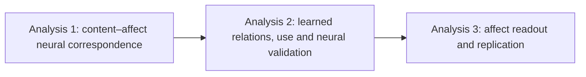
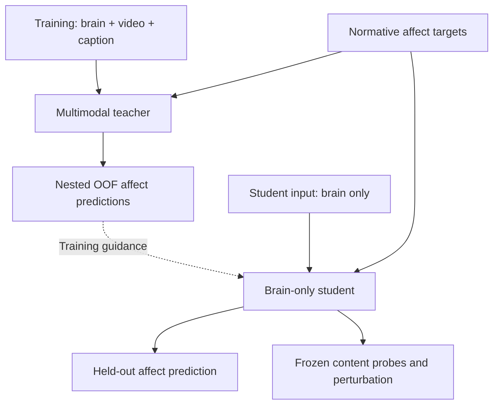

# EmoBrain 연구 스토리와 설계

_서버 AI가 연구 의도와 해석 경계를 이해하기 위한 설계 문서 · 2026-10-06 · 분석 결과 없음_

---

## 🎯 1. Thesis와 central question

### 논문의 중심 명제

정서를 유발하는 자연 장면에 대한 뇌 반응은 장면의 시공간적 시각 내용과 상황 의미에 체계적으로 연결되어 있을 수 있다. 본 연구는 이 관계가 모델에 학습되는지, brain-only representation에서 읽히는지, 그리고 normative affect readout에 실제 사용되는지를 검정한다.

영문 working thesis:

> Brain responses to emotionally evocative scenes may be systematically related to spatiotemporal visual and situation-semantic content. We test whether these relations are learned, recoverable from brain-only representations, and used by the model for normative affect readout.

영문 central RQ:

> How are neural responses to emotionally evocative scenes related to their sensory–semantic content, and how are these brain–content relations learned and used for high-dimensional normative affect readout?

이는 결과를 미리 선언하는 thesis가 아니라 검정할 주장이다. 연구의 중심은 **뇌**이고, annotation geometry나 decoding score는 뇌–내용 관계를 평가하는 외부 좌표와 기능적 endpoint다.

### 감정 이론과의 관계

출발점은 ‘기쁨’ 같은 언어적 label이 서로 다른 감각·상황·기억·신체 과정의 결과를 묶을 수 있다는 문제의식이다. 그러나 현재 자료로 감정 전체가 sensory + semantic으로 환원된다고 증명할 수는 없다. 개인 기억, interoception, 실제 주관 경험을 직접 측정하지 않기 때문이다.

Kragel et al.의 visual emotion schema 연구를 개념적 출발점으로 삼되, 특정 visual network의 성공을 곧 인간 감정의 완전한 생성 원리로 확대하지 않는다. Horikawa 연구는 고차원 affect annotation과 뇌 반응을 연결하는 데이터·분석 맥락을 제공한다.[^1][^2]

‘A와 B가 모두 기쁨으로 평가되고 뇌 반응 일부가 비슷하다’는 결과만으로 그 공통 성분이 순수한 기쁨 code라고 단정하지 않는다. 공유된 시각 내용, 상황 의미, 과제 구조, 자극 순서라는 대안 설명을 함께 다룬다.

### 연구에서 말하지 않을 것

- fMRI 참가자 개인이 실제로 느낀 감정을 복원했다는 주장
- 34개 category가 독립적인 생물학적 감정 실체라는 주장
- V-JEPA 2는 순수 visual, caption encoder는 순수 semantic이라는 이분법
- Teacher output distillation만으로 joint latent geometry가 전달되었다는 주장
- Attention map 또는 activation patching만으로 인간 뇌의 인과기제를 찾았다는 주장
- 같은 영상의 다른 참가자 cohort를 새로운 자극 분포에 대한 독립 검증이라고 부르는 것

## 📚 2. 논문의 세 단계

### Analysis 1 — 실제 뇌에서 내용과 정서의 대응

Analysis 1a는 기존 content encoding이며, 1b는 2026-10-06 승인된 보강이다. 모델 내부의 관계가 아니라 측정된 뇌 반응에서 content와 affect annotation의 연결을 직접 평가한다.

질문은 ‘어떤 내용 좌표가 held-out 자극의 뇌 반응을 예측하는가?’다. Low-level visual control `L`, frozen video feature `V`, frozen caption feature `S`를 사용해 `L`, `L+V`, `L+V+S`의 cross-validated encoding을 비교한다. `L+S`는 visual의 조건부 기여까지 대칭적으로 보려는 경우의 사전 지정 보조 비교다.

핵심 대비는 `L+V − L`과 `L+V+S − (L+V)`다. 각 모델의 held-out prediction을 비교하며, low-level baseline을 모든 중첩 모델에 유지한다. 이로써 단순한 밝기·색·움직임 통계와 비교한 추가 설명력을 묻는다. Encoding과 decoding은 서로 다른 질문에 답한다.[^3]

1b에서는 content C=[V,S], normative affect E, 공통 low-level/nuisance baseline G로 `G`, `G+C`, `G+E`, `G+C+E`가 동일 held-out fMRI를 예측하는지 비교한다. 34-D와 14-D E는 별도 실행한다. Content·affect의 조건부 증분과 공유 예측 성분을 구분하며, signed out-of-sample score와 동일 분모를 사용한다. 음수 성분을 0으로 잘라 생물학적 구성 비율로 그리지 않는다. Primary/secondary와 family는 기존 1a 대비를 포함해 다시 동결한다. 근거·산식·제약은 [보강 문서](06_NEURAL_VALIDATION_AMENDMENT.md)에 있다.[^10]

1a에 성공하면 ‘검사한 content representation이 뇌 반응과 대응한다’고 말할 수 있다. 1b의 공유 설명력은 normative-affect-associated brain response와의 예측적 중첩이지 감정 생성의 인과적 매개가 아니다. 성공만으로 뇌가 해당 network를 구현한다거나 그 정보가 정서 예측에 사용된다고 말할 수는 없다. 다음 분석이 필요한 이유다.

### Analysis 2 — 학습된 관계·모델 내 사용·독립 뇌 검증

이 분석이 논문의 중심이다. Teacher의 입력은 `B+V+S`, student의 입력은 `B`다. Teacher는 학습 시 추가 정보를 제공하는 장치이며, test-time 접근이 없는 정보로 학습을 안내하는 발상은 privileged information/distillation과 연결된다.[^4]

기존 모델 내부 분석 2a–c와 실제 뇌 검증 2d를 분리한다. Teacher–student 학습은 Analysis 2·3의 공통 준비이지 분석의 결론 자체가 아니다. 먼저 다음 세 질문을 다룬다.

1. **Teacher 형성:** video와 caption만으로 해결하지 않고 실제 fMRI에 의존하는가? 올바른 brain–content pairing이 frozen teacher의 표현과 output을 바꾸는가?
2. **Student 내용:** output guidance를 받은 brain-only student에서 visual·semantic 내용이 Direct 및 Shuffled-guided보다 더 잘 읽히는가?
3. **모델 내 사용:** 사전 정의된 일부 brain token/ROI나 내부 경로를 교란했을 때 content retrieval과 affect output이 함께 바뀌는가?

첫째는 matched teacher control과 brain/content swap, 둘째는 low-capacity held-out probe/retrieval, 셋째는 선택적 perturbation/patching으로 조사한다. CKA는 단계별 표상 구조의 유사성을 요약하는 보조 지표다.[^5] 각 방법의 양성 결과는 서로 대체되지 않는다.

2d는 모델에서 발견한 내용 관련 표현을 검증할 뇌 신호를 입력으로 사용하지 않는 독립 neural validation이다. 구현 권고는 discovery 자료에서 `content C → frozen student z`의 작은 bridge를 학습·고정하고, 그 content-recoverable projection으로 별도 참가자의 held-out fMRI를 예측하는 것이다. Validation cohort의 training stimuli로 neural readout을 calibration할 수 있으나, 공통 test 자극은 discovery·bridge·readout 학습 전체에서 제외한다. Original-content 및 Direct-derived projection과 비교하며, projection은 C의 함수이므로 새 정보나 뇌와 동일한 계산을 입증하지 않는다. 구체 구현은 pilot과 D17의 동결을 거친다.[^1]

사용자가 채택한 Analysis 2의 정식 보조 분석은 ‘정서 프로필이 가까운 후보들 사이에서도 content를 구별하는가?’라는 affect-neighborhood retrieval이다. 전체 34-D/14-D 연속 profile을 따로 사용하고 단일 emotion threshold나 공동학습은 하지 않는다. Affect-output-only probe를 필수 비교로 포함해 label-profile 재표현 대안을 점검한다. D18은 채택 여부가 아니라 거리·후보 수·coverage·null의 동결을 다룬다. 불충분한 coverage는 미실행/한계로 보고하며 사후 좋은 후보만 고르지 않는다.[^7]

### Analysis 3 — 기능적 readout과 재현

앞 단계에서 조사한 brain-only representation으로 고차원 normative affect profile을 얼마나 읽을 수 있는지 평가한다. ‘갑자기 decoding을 추가’하는 것이 아니라, 관찰된 brain–content 관계가 논문의 정서적 질문에 연결되는지를 확인하는 endpoint다.

34-D, 14-D, VA-2, VAD-3는 각각 별도의 모델로 학습한다. 34-D를 mechanistic analysis의 기준으로 삼되 14-D를 배제하지 않는다. VA/VAD는 실제 annotation codebook에 대응 열이 있는지 확인한 뒤 사용한다. 다른 참가자 cohort에서 동일한 분석 규칙을 적용하되, 공유 자극이라는 범위를 명시한다.

## ⚙️ 3. 모델의 역할과 학습 흐름

### 모델 개요

OOF는 out-of-fold, 즉 해당 자극을 학습하지 않은 teacher의 예측이다. 실제 구현에서는 student의 바깥 test set까지 제외한 nested OOF여야 한다. 전 데이터에서 한 번 만든 OOF cache를 모든 student fold에 재사용하는 것은 허용하지 않는다.

### Brain pathway

ROI별 fMRI pattern을 작은 token으로 압축하고 participant-specific map으로 공통 token width에 맞춘다. 이 map은 참가자별 측정 좌표 차이를 처리하는 adapter다. 개인 감정이나 성격을 알아낸 module이라는 뜻은 아니다. 향후 brain token에 subject-specific component를 추가하려는 사용자 의도는 유지하되, 현재 normative target만으로 개인 주관성을 학습했다고 해석하지 않는다.

ROI-PCA는 작은 표본에서 파라미터 수를 제한하고 해부학적 위치를 유지하기 위한 후보다. 고분산 방향이 목표 관련 방향과 같다는 보장은 없다. Ridge는 제한된 자료에서 재현 가능한 linear baseline 및 probe로 쓰는 것이며, 뇌가 선형이라는 가정이나 최신성이 선택 이유가 아니다. 대체안은 train-only reduced-rank mapping, direct regularized projection이며 개발 단계에서 제한된 비교만 한다.

### Video와 caption pathway

Video는 frozen V-JEPA 2 feature, caption은 frozen sentence embedding을 사용한다. V-JEPA 2는 appearance와 temporal content를 함께 담는 후보로 선택하며, object/event 전용 branch를 임의로 두 개 만들지 않는다.[^6] Caption은 언어로 명시된 object, action, situation을 별도 관측 관점으로 제공한다.

두 공간은 겹쳐도 된다. 통제할 대상은 ‘겹침 자체’가 아니라 겹친 부분을 각각의 고유한 효과로 이중 계산하거나 모델 차이를 심리 구성개념 차이로 해석하는 오류다. 이를 위해 nested prediction, matched modality ablation, caption-word robustness를 사용한다. Residualization을 주 분석에 강제하면 제거 순서에 따라 의미가 달라지므로 기본 설계에 넣지 않는다.

### Fusion과 student

기존 설계의 brain-query fusion을 후보 기본안으로 유지한다. Brain token이 query, content token이 key/value가 되고 affect head는 업데이트된 brain-token state를 읽는다. 다만 이 구조도 content 정보를 복사할 수 있으므로 뇌 의존성을 구조만으로 보증하지 않는다. Small fusion과 작은 student encoder를 사용하고, LLM을 기본으로 포함하지 않는다.

Student는 normative target loss와 teacher output guidance만 받는다. Visual, semantic, joint-latent recovery는 사후 평가이며 학습 loss가 아니다. 이 구분이 없으면 ‘visual feature를 복원하도록 학습했으니 visual feature가 읽힌다’는 자명한 결과가 된다. 다만 output guidance 자체도 내용과 상관된 감독이므로, 성공을 완전히 무감독인 발견이라고 부르지 않는다.

## 🔍 4. 무엇을 보면 ‘관계를 배웠다’고 말할 수 있는가

### 사용자가 원하는 직관적인 그림

예를 들어 ‘이 brain pattern에서 케이크와 사람이 있는 영상/설명이 잘 검색되고, 특정 token group을 교란하면 그 검색과 해당 affect profile 예측이 함께 바뀐다’를 보여준다. 여기서 `brain pattern = cake = human = happy`라는 일대일 등식은 만들지 않는다. 같은 object와 상황도 여러 affect profile에 대응할 수 있다.

최종 증거는 다음 네 종류를 연결한 것이다.

- 실제 자극·caption과 독립적인 feature reference
- Teacher/student의 단계별 held-out representation
- 올바른 pairing과 교란 pairing의 차이
- 사전 정의한 부분 개입에 따른 content·affect readout 변화

### 읽을 수 있음과 사용함의 차이

Probe/retrieval 양성은 해당 representation에서 정보가 읽힌다는 뜻이다. 그것만으로 원래 affect head가 그 정보를 쓰는지는 알 수 없다. Probe capacity와 control task를 제한하는 이유가 여기에 있다.[^7]

CKA가 높다는 것은 같은 자극 집합의 전체 geometry가 유사하다는 뜻이다. 특정 ‘cake’ feature를 사용했다거나 두 네트워크가 같은 계산을 한다는 증거가 아니다. 2-D embedding의 예쁜 cluster도 primary evidence로 쓰지 않는다.

선택적 patching과 ROI perturbation은 frozen model의 계산적 의존성을 평가한다. 그러나 corruption이 자연스러운 입력 분포를 벗어날 수 있고, 효과가 특정 feature의 의미 때문인지 일반적인 손상 때문인지 control이 필요하다.[^8] 인간 뇌에서 실제 개입한 결과와는 다르다.

### Whole-state restoration에 관한 정정

Brain swap으로 바꾼 유일한 입력의 전체 pre-fusion brain state를 clean state로 되돌리면, deterministic model은 clean computation으로 돌아가는 것이 당연하다. 최종 latent 전체를 clean latent로 바꾼 경우도 마찬가지다. 이를 독립적인 기전 증거 또는 confirmatory gate로 삼지 않는다.

전체 복원은 구현 QA/positive control로 남긴다. 기전 분석에서는 일부 ROI/token/path만 복원하고, 크기·위치 선택 규칙이 맞는 null과 비교하며 downstream computation을 다시 수행한다. 이 정정은 기존의 무조건적인 restoration gate를 대체한다.

## 🛡️ 5. Text/video shortcut과 brain weight

### 어떤 실패를 걱정하는가

Teacher가 사실상 `f(B,V,S) ≈ g(V,S)`로 학습해도 teacher 성능과 student distillation 성능은 좋아질 수 있다. 따라서 brain-only inference가 teacher의 뇌 의존성을 증명하지 않는다. Multimodal training에서 modality별 일반화와 최적화 차이가 생길 수 있다는 문헌은 이 위험을 점검할 근거이지, 현재 모델에서 shortcut이 발생했다는 결과는 아니다.[^9]

필수 진단은 matched `BVS vs VS`, content를 고정한 held-out brain swap, B-only baseline이다. Caption-only 및 affect-word-only baseline, 감정어 masking sensitivity는 직접 label-word 의존을 점검한다. Brain swap의 성능 저하에도 distribution shift라는 대안 설명이 남는다.

### Brain weight를 높이면 해결되는가

단순 scalar는 새로운 정보를 만들지는 않지만 최적화에 영향을 줄 수 있다. 같은 축에 적용되는 LayerNorm 앞의 균일한 scale은 대체로 상쇄될 수 있고, learnable projection이 보상할 수도 있다. 따라서 ‘무조건 불가능’도 ‘brain을 보도록 보장’도 아니다.

기본안은 임의 brain amplification 없이 시작한다. 안정적인 신호는 있는데 학습에서 무시되는 정황이 있으면 content-modality dropout 또는 같은 target의 B-only auxiliary loss를 제한된 rescue로 평가한다. Text만 drop하면 shortcut이 video로 옮겨갈 수 있으므로 video+caption 공동 dropout을 포함할지 개발 계획에 명시한다. Rescue 조건·weight는 outer test 결과를 보기 전에 결정한다.

B-only 실패는 ‘뇌에 정보가 없다’는 증명이 아니다. 측정 잡음, 표상 선택, 모델 적합성, task 난도 또는 modality 간 상호작용이 원인일 수 있다. 이 경우 QC와 제한된 multimodal pilot으로 진단하고, 양성 결론의 범위를 줄인다.

## 📊 6. Target과 loss의 논리

### 독립 target runs

34-D는 각 category의 선택 비율을 보존한다. 한 영상에 여러 값이 동시에 존재하며 합이 1일 필요가 없다. 따라서 one-hot 분류나 softmax 확률벡터로 바꾸지 않는다. 14-D는 별도의 연속 평정 공간이며 정확한 열 이름과 척도를 확인한다. ‘Appraisal-14’는 임시 약칭일 뿐 codebook 검증 없이 모든 열을 appraisal construct로 규정하지 않는다.

VA-2/VAD-3는 저차원 비교 대상이다. 각 target마다 teacher, student, head, trainable parameter, target transform, OOF cache를 분리한다. 동일 frozen feature와 split을 재사용할 수는 있다. 이는 공동학습이 아니다.

### Loss와 평가를 구분

- 34-D teacher label loss: unweighted soft binary cross-entropy.
- 34-D student: 같은 label loss + OOF teacher probability에 대한 dimension-mean MSE.
- 14-D/VA-2/VAD-3: train-fold 표준화 후 dimension-mean MSE label loss + OOF MSE guidance.
- 34-D within-profile correlation: profile 모양을 보는 readout metric이지 primary training loss가 아니다.

이 선택은 현재 문서의 loss 계약을 유지한 것이다. MSE 또는 KL이 joint latent 학습을 직접 측정한다는 뜻은 아니다. 34-D에 categorical KL을 쓰려면 부적절한 sum-to-one 정규화를 강요할 수 있으므로 기본값으로 두지 않는다. 다른 loss를 추가하려면 annotation 생성과 noise model에 대한 이유가 필요하다.

## 📌 7. 결과에 따라 달라질 논문의 주장

| 관찰 결과 | 허용되는 해석 | 보류할 주장 |
|---|---|---|
| 1b의 공유 예측 성분이 안정적 | 내용·정서 주석의 뇌 설명력 중첩 | 감정의 인과적 분해·완전 환원 |
| 2d 독립 뇌 예측 양성 | 내용 관련 모델 표현의 독립 신경 대응 | 뇌와 모델의 동일 계산 |
| Encoding만 양성 | 검사한 content와 뇌 반응의 대응 | Student의 학습·사용 |
| Prediction만 개선 | Privileged supervision의 이득 | Joint geometry의 전달 |
| Content retrieval 개선 | 내용 정보의 선형적 접근성 증가 | Affect head의 사용 |
| Teacher가 VS와 구별되지 않음 | Content teacher로도 설명 가능 | Brain-grounded teacher 확립 |
| Swap 민감성만 있음 | 입력 교란에 대한 의존성 | Brain의 고유한 증분 정보 |
| 부분 개입과 readout 수렴 | 모델 내부의 내용 관련 계산 의존 | 인간 뇌의 인과회로 |
| 다른 참가자에서 재현 | 공유 자극에서 참가자 간 재현 | 새로운 자극 분포로의 일반화 |

비유의 결과를 곧 동등함 또는 정보 부재로 해석하지 않는다. 통계적 불확실성이 넓으면 ‘판단 불충분’이라고 쓴다. 양성 gate를 통과하지 않은 분석도 숨기지 않고 exploratory diagnostic으로 보고한다.

## 🔗 8. 근거

[^1]: Kragel et al. (2019). Emotion schemas are embedded in the human visual system. https://doi.org/10.1126/sciadv.aaw4358
[^2]: Horikawa et al. (2020). The neural representation of visually evoked emotion is high-dimensional, categorical, and distributed across transmodal brain regions. https://doi.org/10.1016/j.isci.2020.101060
[^3]: Naselaris et al. (2011). Encoding and decoding in fMRI. https://doi.org/10.1016/j.neuroimage.2010.07.073
[^4]: Lopez-Paz et al. (2016). Unifying distillation and privileged information. https://arxiv.org/abs/1511.03643
[^5]: Kornblith et al. (2019). Similarity of neural network representations revisited. https://proceedings.mlr.press/v97/kornblith19a.html
[^6]: Assran et al. (2025). V-JEPA 2: Self-supervised video models enable understanding, prediction and planning. https://arxiv.org/abs/2506.09985
[^7]: Hewitt and Liang (2019). Designing and interpreting probes with control tasks. https://aclanthology.org/D19-1275/
[^8]: Heimersheim and Nanda (2024). How to use and interpret activation patching. https://arxiv.org/abs/2404.15255
[^9]: Wang, Tran and Feiszli (2020). What makes training multi-modal classification networks hard? https://arxiv.org/abs/1905.12681

[^10]: Lescroart, Stansbury and Gallant (2015). Fourier power, subjective distance, and object categories all provide plausible models of BOLD responses in scene-selective visual areas. https://doi.org/10.3389/fncom.2015.00135
