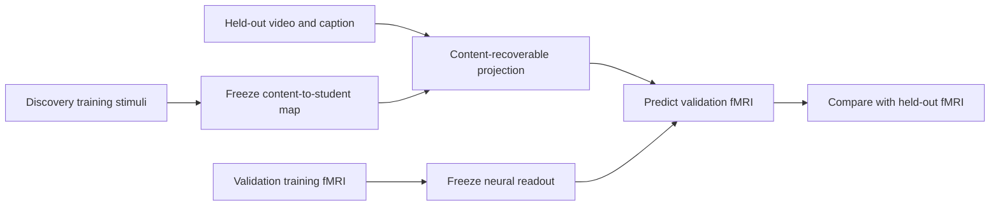

# EmoBrain 분석 보강: 실제 뇌–내용–정서 연결

_2026-10-06 · 사용자 승인된 보강 방향과 구현 권고를 구분한 설계 amendment · 실험 결과 아님_

---

## 📋 1. 결정과 현재 상태

사용자는 2026-10-06 대화에서 Analysis 1의 내용–정서 설명력 비교와 Analysis 2의 독립적인 뇌 검증을 강화하도록 승인했고, 후속 요청에서 affect-neighborhood content retrieval을 Analysis 2의 보조 분석에 포함하도록 승인했다. 이 승인은 세부 통계, ROI, rank, split, primary family 또는 서버 본실험 실행을 자동 동결한 것이 아니다.

| 항목 | 상태 | 배치 |
|---|---|---|
| 내용과 정서의 실제 뇌 설명력 비교 | 보강 방향 승인 | Analysis 1b |
| 모델에서 발견한 관계의 독립 뇌 검증 | 보강 방향 승인 | Analysis 2d |
| 정서 프로필 이웃 내 content retrieval | 채택 승인, 평가 규칙 미동결 | Analysis 2 보조 |
| Affect-output-only probe | 위 retrieval의 필수 비교로 명시 | Analysis 2 보조 |
| 새로운 Analysis 4·5 | 추가하지 않음 | 세 단계 유지 |
| 기존 teacher/student 입력·loss·독립 target | 변경 없음 | 기존 계약 유지 |

과학적 충분성의 조건은 서로 다른 종류의 근거가 같은 관계를 지지하는 것이다. 반례는 내용 encoding과 affect decoding은 각각 성공하지만 실제 뇌에서 연결되는 부분이 다르거나, 모델의 content retrieval이 affect profile의 재표현으로 설명되는 경우다. 이런 결과도 보고하며 설계 성공 조건을 사후 바꾸지 않는다.

이 문서는 2026-10-04 전달본을 보강한다. 기존 preregistration의 실제 등록 여부와 test 노출 이력은 서버에서 확인해야 하며, 기존 등록을 소급 수정하지 않는다. 새 분석이 이미 본 결과에서 유래했으면 amendment/exploratory로 구분한다.

## 🎯 2. 세 분석의 연결

| 분석 | 핵심 질문 | 증거의 대상 |
|---|---|---|
| 1a | 장면 내용이 실제 뇌 반응을 설명하는가? | 측정된 fMRI |
| 1b | 내용과 정서 주석의 뇌 설명력이 겹치고 구별되는가? | 측정된 fMRI |
| 2a–c | Teacher의 뇌 의존성, student의 내용, 모델 내 사용은 무엇인가? | 학습된 모델 |
| 2d | 발견한 내용 관련 표현이 독립 뇌 자료와도 대응하는가? | 모델에서 도출한 가설의 뇌 검증 |
| 3 | 같은 모델의 정서 readout과 참가자 간 재현은 어떠한가? | Normative prediction·재현 범위 |

```mermaid
flowchart LR
    accTitle: Strengthened brain content study logic
    accDescr: Direct neural encoding and content-affect comparison precede model interpretation, independent neural validation, and affect readout. Arrows indicate evidential sequence, not biological causality.
    neural_content["1a: Brain–content correspondence"] --> content_affect["1b: Content–affect predictive overlap"]
    content_affect --> model_relations["2a–c: Learned content and use"]
    model_relations --> neural_validation["2d: Independent neural validation"]
    neural_validation --> affect_readout["3: Affect readout and replication"]
```



Teacher–student 학습은 2·3의 공통 실험 기반이다. 도식의 순서는 논증 순서이며, Analysis 2 이후에 별개의 decoding architecture를 새로 만드는 일정이 아니다.

## 📊 3. Analysis 1b: 내용과 정서의 실제 뇌 설명력

### 여섯 질문 rationale

1. **과학적 질문:** 측정된 fMRI에서 content representation과 normative affect annotation이 공유하는 예측 성분 및 조건부 증분은 무엇인가?
2. **없을 때의 대안 설명:** Analysis 1a는 일반적인 장면 처리만 설명하고, 모델의 정서 성과는 별개일 수 있다. 두 encoding의 성능 순위만으로 같은 신호를 설명하는지 알 수 없다.
3. **근거:** 시각 feature 모델의 공유·고유 설명력을 비교한 Lescroart et al.의 variance partitioning과, emotion/visual/semantic encoding을 비교한 Horikawa et al.이 방법·자료 맥락의 선례다. 현 EmoBrain 데이터의 효과는 미확인이다.[^1][^2]
4. **선택 이유:** 기존 held-out encoding 틀과 뇌 target을 재사용한다. CKA, RSA, PCM을 모두 추가하는 대신 하나의 명확한 예측 비교를 수행한다.
5. **해석 변경 기준:** Shared 항이 불안정하거나 0과 구별되지 않으면 공유 구조를 확립했다고 쓰지 않는다. Affect 또는 content의 증분이 불명확하면 어느 쪽이 불필요하다고 단정하지 않는다.
6. **주장 한계:** 감정 생성의 인과적 매개, 감정 전체의 설명 비율, 순수 emotion code, 개인 주관 경험의 분해를 입증하지 않는다.

### 입력과 모델

B는 voxel/ROI fMRI response, C는 V와 S를 함께 사용하는 content block, E는 실제 normative affect profile이다. E는 teacher prediction이 아니다. L은 저수준 시각 feature다.

모든 모델에 동일한 nuisance 처리 규칙을 적용한다. 명시적 nuisance predictor N을 사용하는 경우 baseline G=[L,N], 사용하지 않는 경우 G=L로 표기한다. Onset/order nuisance는 확인 가능한 측정 변수만 사용하고 평가 label을 통해 고르지 않는다. Run one-hot처럼 새 test run에서 추정 불가능한 계수를 암묵적으로 요구하지 않는다.

| 모델 | 설명변수 | 예측 대상 |
|---|---|---|
| M0 | G | 동일한 B |
| MC | G+C | 동일한 B |
| ME | G+E | 동일한 B |
| MCE | G+C+E | 동일한 B |

Analysis 1a의 L, L+V, L+V+S 비교는 유지한다. 1b에서는 V와 S 사이의 모든 조합을 다시 확장하지 않고 C로 묶는다. 34-D와 14-D E를 따로 실행한다. VA/VAD의 1b 반복은 별도 질문·예산 승인 없이는 자동 확장하지 않는다.

E는 뇌 encoding의 설명변수로만 쓰이므로 target 간 공동학습이 아니다. 34-D/14-D 모델 성능의 차이를 정서 이론의 승패로 해석하지 않는다.

### 동일한 held-out score에 기반한 대비

프로토콜 권고는 동일 평가 행·voxel·가중치·분모를 사용하는 out-of-sample squared-error score Q다. 각 fold의 training mean을 사용하는 intercept-only 예측을 공통 기준으로 두어 Q(X)=1−SSE(X)/SSE(intercept)로 계산한다. Participant별 held-out SSE를 합한 뒤 공통 분모로 score를 산출할 수 있으나 fold·voxel·ROI 집계 방식은 동결한다. 분모가 0 또는 매우 작은 경우의 제외 규칙도 미리 정한다.

```text
content_increment = Q(G+C)   - Q(G)
affect_increment  = Q(G+E)   - Q(G)
joint_increment   = Q(G+C+E) - Q(G)

content_given_affect = Q(G+C+E) - Q(G+E)
affect_given_content = Q(G+C+E) - Q(G+C)

shared_predictive_component =
    Q(G+C) + Q(G+E) - Q(G+C+E) - Q(G)
```

이 식은 고정 score의 commonality-style 대비다. 정규화·유한 표본·suppressor 관계 때문에 항이 음수일 수 있다. 음수를 0으로 자르거나 모든 항을 양수 비율로 바꾸어 Venn/pie에 표시하지 않는다. 음수인 경우 모델 실패·추정 불안정·비가산 관계를 조사하고 signed predictive contrast로 보고한다. Pearson r 차이를 그대로 ‘설명 분산’이라 부르지 않는다.

각 모델은 동일 inner split과 비교 가능한 tuning 기회로 fit한다. 차원이 다른 block의 과적합은 train-only scaling/reduction과 group별 regularization으로 관리한다. 무조건 같은 차원으로 줄이는 것이 공정성을 보장하지 않으므로 rank-matched sensitivity 여부를 개발 단계에서 결정한다. Hyperparameter, feature와 ROI를 outer result로 고르지 않는다.

### 출력·검증·중단 규칙

- 저장: 네 모델의 held-out prediction, SSE와 공통 분모, 세 조건부/공유 대비, participant별 effect, ROI coverage, transforms와 split hash.
- 분석 단위: 참가자 일반화는 참가자 단위, 자극 일반화는 별도 estimand. Fold·voxel·ROI·seed를 독립 참가자로 세지 않는다.
- Synthetic QA: 독립 predictors, 동일 predictors, correlated predictors, target permutation 사례에서 산식·ID·scope를 검사한다. 유한 표본에서 shared 항이 반드시 정확히 0 또는 양수여야 한다는 test는 만들지 않는다.
- 실패 시: ‘정서가 내용으로 환원된다’ 또는 ‘내용과 정서가 무관하다’로 양분하지 않고 검출력·불확실성·feature 적합성을 보고한다.
- Primary family: 기존 두 contrast에 무조건 더하지 않는다. D09/D16에서 1a·1b의 primary와 secondary를 함께 재배치하고 다중성 계획을 동결한다. 보강 방향 승인과 confirmatory 규칙 승인은 다르다.

## 🔍 4. Analysis 2d: 모델 해석을 독립적인 뇌 측정으로 검증

### 여섯 질문 rationale

1. **과학적 질문:** 모델에서 도출한 content-related representation이 모델 입력을 재기술하는 수준을 넘어 독립 fMRI 관측과 대응하는가?
2. **없을 때의 대안 설명:** Decoder가 데이터의 content–affect 관계를 이용했을 뿐 인간 뇌와의 대응은 확인하지 못했거나, 동일 B와 f(B)의 공통 입력 효과를 발견했을 수 있다.
3. **근거:** Kragel et al.은 모델 출력과 별도 fMRI 측정의 관계를 검증했다. 독립 selection/evaluation의 필요성은 circular-analysis 문헌과 연결된다. 아래 구현안 자체가 해당 논문에서 검증된 방식이라는 뜻은 아니다.[^3][^4]
4. **선택 이유:** 입력 brain을 직접 되맞히는 latent→동일 brain 비교 대신, 검증 brain을 보지 않고 계산할 수 있는 frozen content-side predictor를 사용한다. 기존 encoding/probe 도구를 재사용한다.
5. **해석 변경 기준:** 독립 뇌 예측이 재현되지 않거나 control과 구별되지 않으면 모델 내부의 내용 학습까지만 주장한다. 원 content baseline과 동일하면 모델 고유의 설명 이득을 주장하지 않는다.
6. **주장 한계:** 모델과 뇌의 동일 계산, 인간 뇌 인과기제, 시간적 처리 순서, 개인 정서, 정보의 새 생성은 입증하지 않는다.

### 승인된 원칙과 구현 권고의 구분

승인된 것은 독립 뇌 검증을 포함하는 방향이다. 아래 content-side bridge는 이를 구체화한 구현 권고이며 D17의 개발 feasibility와 동결 절차를 거친다. 큰 새 network나 latent training loss를 추가하지 않는다.

단순히 target participant의 B_test로 student latent를 만든 뒤 그 B_test를 예측하는 절차는 independent neural validation으로 금지한다. 다른 참가자의 뇌에서 만든 latent를 비교하는 대안은 가능하지만 별도 alignment·공유 자극 순서 confound를 가져오므로 이번 기본 구현으로 동시에 추가하지 않는다.

### 최소 구현 권고: content-recoverable projection

D는 discovery cohort, R은 validation cohort, T는 development/training stimulus groups, H는 평가 stimulus groups다. 같은 canonical H는 D와 R 어느 쪽에서도 model/probe/selection/bridge/encoding 학습에 사용하지 않는다. R의 H 뇌 반응은 마지막 평가 target으로만 사용한다.

1. **Discovery:** D의 T에서만 teacher/student를 학습한다. Frozen student stage z에서 V/S가 읽히는지 기존 train-only probes로 확인한다. Stage·rank·표현 선택은 T 내부 validation 또는 외부 개발 자료에서 동결한다.
2. **Content-side bridge:** T에서 C=[V,S]로 해당 frozen z를 예측하는 작은 regularized linear map g를 fit한다. Rank reduction이 필요하면 T 내부에서만 fit한다. q_i=g(C_i)는 ‘내용으로 예측 가능한 student 표현’이며 실제 student latent와 동일하다고 부르지 않는다. Bridge fidelity는 T 내부 held-out 자료에서 검토한다. 각 outer fold의 하나의 reference student checkpoint에서 좌표를 정의하며 독립 seed/fold의 latent를 그대로 합치지 않는다. 동일 자극의 여러 discovery participant latent는 같은 checkpoint 좌표에서 동결한 equal-weight 집계로 stimulus-level target을 만들거나 동등한 weighting을 명시한다. 참가자별 특징까지 content로 복원한다고 해석하지 않는다.
3. **Independent neural map:** R의 T fMRI로 q→B_R의 regularized encoding map W_R를 fit하고 T 내부에서 tuning한다. R의 데이터는 발견한 stage/내용 이름/rank의 선택을 바꾸는 데 쓰지 않는다. W_R의 calibration 범위만 명시적으로 허용한다.
4. **Test:** H에서는 q_H=g(C_H), 예측 B_R,H=W_R(q_H)를 계산한다. 이 경로는 B_R,H 및 B_D,H와 E_H를 입력으로 받지 않는다. 마지막에 실제 B_R,H와 비교한다. T 내부에서 검증된 bridge fidelity가 H로 유지되는지 별도로 q_H 대 frozen student z_H를 보고할 수 있지만 이는 H의 discovery brain을 사용하는 평가 전용 진단이며, W_R 예측 입력이나 모델 선택으로 되돌리지 않는다.
5. **Controls:** 같은 baseline G, split, calibration 수와 비교 가능한 rank/budget으로 original C predictor, Direct-derived q, Full-derived q를 비교한다. Shuffled-derived q는 이미 학습된 control이 있을 때 제한된 보조 비교로 사용한다. 같은 뇌 자료로 ROI를 사후 고르지 않는다.



R의 T에서 W_R를 학습하므로 이는 zero-shot cross-cohort transfer가 아니다. ‘독립 참가자·held-out 자극의 뇌 검증, 별도 calibration 있음’이라고 쓴다. 공유 영상이면 새로운 stimulus distribution 일반화도 아니다. Cohort가 별도여도 stimulus split이 어긋나면 검증 독립성이 깨지므로 공통 H를 강제한다.

q는 C의 함수여서 C에 없던 정보를 만들지 않는다. q의 이득은 표현 선택·regularization·귀납 편향의 효과일 수 있다. Original C와 Direct 비교는 이 대안 설명 때문에 필요하다. 모든 양성 효과가 있어도 ‘모델이 인간 뇌의 계산을 그대로 재현했다’고 말하지 않는다.

Bridge가 z를 제대로 근사하지 못하면 q를 모델 내부 표상의 대표로 해석하지 않는다. 이 실패는 z에 정보가 없다는 증명도 아니다. 검증 실패/미실행 사실을 보고하며 ordinary content encoding으로 대체한 뒤 2d 성공이라고 부르지 않는다. 모든 layer × ROI × target의 거대한 새 탐색 대신 동결한 하나의 stage/표현 규칙과 제한된 ROI family로 시작한다.

### 공유 순서·안정성

기존 run/order/HRF QC와 caption robustness를 그대로 적용한다. 동일 자극 순서에서 나타나는 반응의 일관성이 곧 content 조직의 증거라고 가정하지 않는다. 참가자별·seed별 효과와 방향을 보고하며 raw latent axis는 rotation/sign 문제 때문에 임의 대응시키지 않는다. 비교는 공통 V/S 좌표의 probe output 또는 동일한 동결 reference를 사용한다.

## 💡 5. 채택된 보조 분석: 정서가 가까워도 내용은 구별되는가

### Affect-neighborhood content retrieval — 포함 승인, primary 승격 아님

**질문:** 정서 프로필이 비슷한 영상들 사이에서도 brain-only student가 각 영상의 시각·상황 내용을 구별하는가?

‘같은 감정’ label로 자극을 나누지 않는다. 각 자극의 전체 연속 34-D 또는 14-D profile을 유지하고, 그 공간에서 가까운 다른 자극을 retrieval의 어려운 후보로 사용한다. 두 공간은 별도 평가하며 새 공동학습이나 emotion threshold를 도입하지 않는다.

여섯 질문 rationale:

1. **질문:** Content retrieval 양성이 단순 affect-profile 유사성만 반영하는가, profile 근접 후보에서도 content 구별이 가능한가?
2. **대안 설명:** 모델이 정서 프로필만 예측해도 연관된 caption/video를 대략 찾을 수 있다.
3. **근거:** Probe 성과를 control task/비교 표현으로 해석해야 한다는 방법론이 동기다. 이 특정 affect-neighborhood 절차는 EmoBrain 설계 제안이며 현재 데이터에서 검증되지 않았다.[^5]
4. **선택 이유:** 기존 retrieval을 재사용하며 새 architecture, loss, 감정별 군집을 필요로 하지 않는다.
5. **반례·변경:** 이웃 후보 내 성과가 없거나 output-only baseline과 구별되지 않으면 content-specific 해석을 줄인다. 다만 어려워진 평가의 SNR·표본 수와 후보들의 실제 내용 차이도 함께 본다.
6. **한계:** 근접은 완전한 matching이나 조건부 독립이 아니다. 정서 영향 제거, 개인 경험 이질성, 뇌 인과관계를 증명하지 않는다.

### 실행 전 feasibility와 규칙

- Metric: train-fold에서 정한 scaling 후 전체 profile의 연속 거리. Pearson profile correlation만 쓰면 크기 차이를 무시할 수 있으므로 거리 선택을 사전 명시한다.
- Candidate set: 각 H query의 true candidate와, H의 다른 canonical stimuli 중 E 거리상 가까운 m개를 포함한다. m, tie, missing, duplicate와 후보 부족 규칙은 개발 자료에서 동결한다. 임의 happy threshold는 사용하지 않는다.
- Raw normative E_H는 평가용 candidate 생성기에만 허용한다. Prediction/model/probe fitting은 E_H와 candidate 선택을 받지 않는다. 학습 cache와 평가 cache를 구분한다.
- 같은 candidate set을 Direct/Full/Shuffled, raw/adapter brain, affect-output-only probe에 공통 적용한다. Ordinary retrieval도 유지하고 결과가 좋은 후보만 보여주지 않는다.
- Affect-output-only probe는 student의 예측 affect vector에서 V/S를 예측하는 같은 계열의 low-capacity readout이다. Train representation과 held-out representation 차이는 cross-fitting 또는 별도 probe training split로 점검하며 test target으로 probe를 fit하지 않는다.
- 반례를 더 엄격히 확인하려면 true normative E→content probe를 oracle diagnostic으로 둘 수 있으나 label을 쓰는 분석이지 brain-only 모델 성능이 아님을 분명히 한다. 자동 필수 추가하지 않는다.
- 후보 m+1개에서 1/(m+1)은 단순 무작위 선택 기준일 뿐 적절한 추론 검정이 아니다. 후보 graph와 query 의존성·run 구조를 보존하는 null을 별도 검토한다. 같은 자극이 여러 후보집합에 재사용된 pair를 독립 표본으로 세지 않는다.
- 실제 이웃의 profile 거리, 내용 유사성, coverage, participant별 유효 query 수를 먼저 점검한다. 지나친 후보 축소나 모두 비슷한 내용만 남는 경우 분석을 실행하지 않거나 제한적인 diagnostic으로 보고한다.
- 비용: 기존 frozen features와 predictions 재사용이 우선이다. 이를 이유로 전체 teacher/student를 다시 학습하지 않는다.
- 현재 상태: 후속 사용자 요청으로 분석 포함은 승인되었다. D18은 거리·후보 수·coverage·null 등 실행 규칙의 동결을 다룬다. 추가 oracle diagnostic과 primary 승격까지 승인된 것은 아니다.

## 🚫 6. 더 추가하지 않는 것과 주장 경계

| 후보 | 지금 추가하지 않는 이유 |
|---|---|
| RSA·PCM·CKA를 모두 primary로 확대 | 같은 대응을 중복 검정하며 핵심 대안 설명이 추가로 해결되지 않음 |
| 자동 기능적 connectivity/DCM/mediation | 현재 질문과 식별 가정이 다르고 인과적 해석 부담이 큼 |
| 모든 object/event별 새 network | source 차이와 construct 차이의 혼동 및 실험 수 증가 |
| 전체 모델·loss·seed 대규모 sweep | 생물학적 질문보다 성능 탐색이 중심이 됨 |
| 새로운 UMAP/SPoSE cluster를 독립 증거로 추가 | 축·군집의 해석과 검증 문제를 다시 만들며 시각적 인상에 의존 |
| 자극을 단일 emotion threshold로 분리 | 연속 mixed-profile 전제와 충돌 |

기존 brain-shortcut, caption masking, rank/capacity, split/order, noise/reliability, seed 안정성은 빼지 않는다. 이는 추가 headline analysis가 아니라 이미 계획된 타당성 조건이다.

## ✍️ 7. 작업·동결·보고

### 먼저 할 일

1. 서버의 결과 노출·현재 protocol을 조사한다. 본 amendment를 이미 동결된 계획으로 소급 표기하지 않는다.
2. P13b의 네 encoding 모델과 공통 score를 synthetic/development 자료에서 검증한다.
3. P19b의 discovery/calibration/test manifest와 content-side bridge feasibility를 점검한다.
4. P17b의 affect-neighborhood coverage를 먼저 조사하고, D18에서 실행 규칙을 동결한 뒤 채택된 보조 분석을 수행한다. 불가능하면 그 이유를 보고한다.
5. D09/D16–D18을 해결한 뒤 본실험을 진행한다. Small-n inference는 여전히 별도 미확정이다.

### 저장할 산출물

```text
analysis1b_model_manifest
analysis1b_oos_predictions
analysis1b_signed_contrasts
analysis2d_scope_manifest
analysis2d_bridge_fidelity
analysis2d_neural_validation
affect_neighborhood_feasibility
amendment_exposure_register
claim_evidence_table
```

모든 metric에 participant, stimulus IDs, target, scope, checkpoint/probe hash를 연결한다. 음성 결과·부적합·분석 불가도 산출물이다. 산출물 이름만 있다고 실행 완료로 세지 않는다.

### 그림 상태

2026-10-06 Nature-style overview v1은 이 보강 전 도안으로 보존하며 새 설계의 완성본으로 재배포하지 않는다. 이후 사용자 요청으로 [현재 Overview](../assets/study_overview.png)를 새로 생성해 README에 연결했다. 최신 수정은 상단 panel a를 연구의 개념적 틀로 두고, 아래 panel b–d에 분석 1·2·3을 배치한다. 1a/1b, 2a–d와 affect-neighborhood 질문, 독립 target과 재현성을 유지한다. Teacher–student 학습은 2 안의 보조 도구이며 3에서도 같은 student를 사용한다. 개인 기억·가치·신체 상태·주관 경험은 현재 측정 밖으로 구분하고 새로운 분석으로 추가하지 않았다. 2d bridge 구현은 검증·동결 전이다. [원본 논리·생성 프롬프트·검수 범위](../assets/study_overview.md)를 함께 관리하며, 이전 그림은 Git 이력에 보존한다. PNG 제작 완료는 분석 구현이나 실험 검증 완료를 뜻하지 않는다.

## 🔗 8. 근거와 검증 범위

[^1]: Lescroart, M. D., Stansbury, D. E., & Gallant, J. L. (2015). Fourier power, subjective distance, and object categories all provide plausible models of BOLD responses in scene-selective visual areas. Frontiers in Computational Neuroscience, 9, 135. https://doi.org/10.3389/fncom.2015.00135
[^2]: Horikawa, T., Cowen, A. S., Keltner, D., & Kamitani, Y. (2020). The neural representation of visually evoked emotion is high-dimensional, categorical, and distributed across transmodal brain regions. iScience, 23, 101060. https://doi.org/10.1016/j.isci.2020.101060
[^3]: Kragel, P. A., Reddan, M. C., LaBar, K. S., & Wager, T. D. (2019). Emotion schemas are embedded in the human visual system. Science Advances, 5, eaaw4358. https://doi.org/10.1126/sciadv.aaw4358
[^4]: Kriegeskorte, N., Simmons, W. K., Bellgowan, P. S. F., & Baker, C. I. (2009). Circular analysis in systems neuroscience: the dangers of double dipping. Nature Neuroscience, 12, 535–540. https://doi.org/10.1038/nn.2303
[^5]: Hewitt, J., & Liang, P. (2019). Designing and interpreting probes with control tasks. EMNLP-IJCNLP, 2733–2743. https://aclanthology.org/D19-1275/

확인 범위: 로컬 2026-10-04 설계와 현재 대화, Lescroart 논문 페이지의 encoding/분산 분할, Hewitt/ Liang의 control-probe 논지, Kriegeskorte의 인용·독립성 원칙을 확인했다. Kragel/Horikawa의 관련 연구 내용은 직전 검토와 기존 문헌 기록을 사용했다. 140편을 이번에 전부 재검토하지 않았고, 서버 데이터·학습 결과·새 분석의 실제 효과와 실행 가능성은 확인하지 않았다. Content-side bridge와 affect-neighborhood 평가는 프로젝트를 위한 새 권고이지 위 논문의 실증 결과가 아니다.
